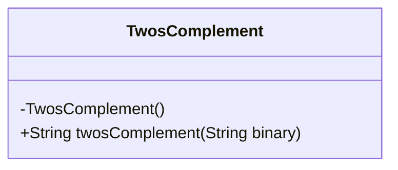
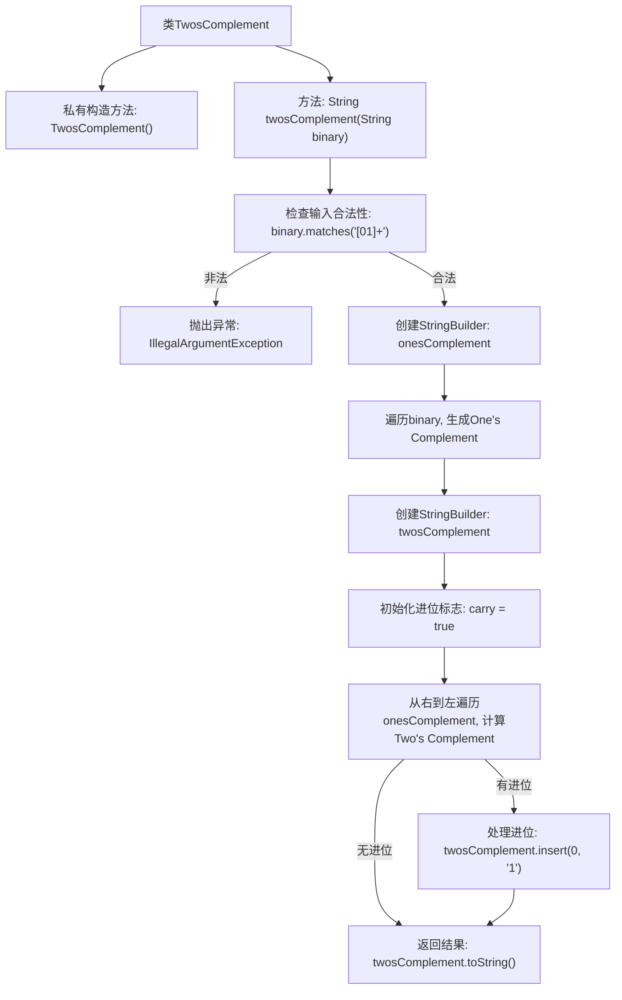

# 基础信息

|      |      |
|------|------|
| 名称 | TwosComplement |
| 编码语言 | .java |
| 代码路径 | Java/src/main/java/com/thealgorithms/bitmanipulation/TwosComplement.java |
| 包名 | com.thealgorithms.bitmanipulation |
| 依赖项 | [] |
| 概述说明 | 计算二进制补码：取反后加一，处理进位，返回结果。 |

# 说明

计算二进制字符串的补码的步骤如下：首先对字符串中的每一位进行取反操作，即0变为1，1变为0；然后在取反后的结果上加一，处理可能产生的进位；最后返回处理后的结果作为补码。

# 类列表 Class Summary

| 名称   | 类型  | 说明 |
|-------|------|-------------|
| TwosComplement | class | 计算二进制字符串的补码，先取反再加一，处理进位并返回结果。 |

## 类 TwosComplement

|      |      |
|------|------|
| 访问范围 | public final |
| 类型 | class |
| 名称 | TwosComplement |
| 说明 | 计算二进制字符串的补码，先取反再加一，处理进位并返回结果。 |

### UML类图

**描述：**  
`TwosComplement` 类是一个工具类，用于计算给定二进制字符串的二进制补码。该类包含一个私有构造函数，防止实例化，并提供了一个静态方法 `twosComplement`，该方法接收一个二进制字符串作为输入，返回其二进制补码。方法首先验证输入字符串是否只包含 '0' 和 '1'，然后计算其反码，并在反码的基础上加 1 得到补码。如果最终仍有进位，则在结果前添加 '1' 以处理溢出。

### 内部方法调用关系图

这段代码实现了计算二进制数的补码的功能。首先，它检查输入字符串是否仅包含'0'和'1'，否则抛出异常。接着，它生成二进制数的反码，然后通过从右到左遍历反码并处理进位来计算补码。如果最终仍有进位，则在结果前添加'1'。最后，返回计算得到的补码字符串。

### 字段列表 Field List

| 名称  | 类型  | 说明 |
|-------|-------|------|

### 方法列表 Method List

| 名称  | 类型  | 说明 |
|-------|-------|------|
| twosComplement | String | 该方法计算二进制数的补码，先取反再加一，处理进位并返回结果。 |

