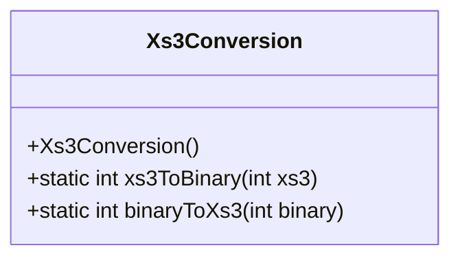
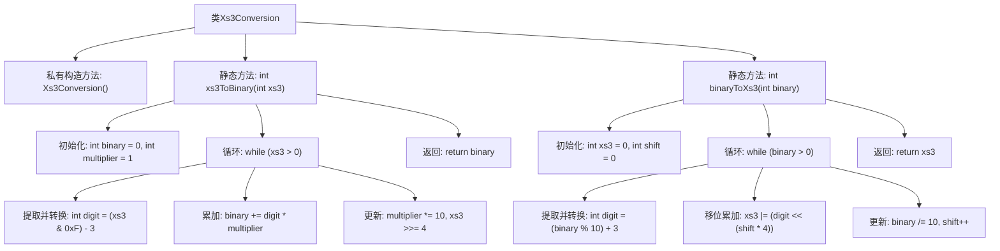

# 基础信息

|      |      |
|------|------|
| 名称 | Xs3Conversion |
| 编码语言 | .java |
| 代码路径 | Java/src/main/java/com/thealgorithms/bitmanipulation/Xs3Conversion.java |
| 包名 | com.thealgorithms.bitmanipulation |
| 依赖项 | [] |
| 概述说明 | XS-3与二进制互转工具类，提供双向转换方法。 |

# 说明

XS-3与二进制互转工具类提供了两个核心方法：xs3ToBinary和binaryToXs3。xs3ToBinary方法用于将XS-3编码转换为二进制格式，而binaryToXs3方法则实现相反的功能，将二进制数据转换为XS-3编码。这两个方法共同构成了一个完整的工具类，便于在XS-3和二进制之间进行高效、准确的转换。

# 类列表 Class Summary

| 名称   | 类型  | 说明 |
|-------|------|-------------|
| Xs3Conversion | class | XS-3与二进制互转工具类，包含xs3ToBinary和binaryToXs3方法。 |

## 类 Xs3Conversion

|      |      |
|------|------|
| 访问范围 | public final |
| 类型 | class |
| 名称 | Xs3Conversion |
| 说明 | XS-3与二进制互转工具类，包含xs3ToBinary和binaryToXs3方法。 |

### UML类图

**描述：**
`Xs3Conversion` 类提供了两个静态方法，用于在 XS-3（Excess-3）编码和二进制数之间进行转换。`xs3ToBinary` 方法将 XS-3 编码的数字转换为二进制数，而 `binaryToXs3` 方法则将二进制数转换为 XS-3 编码。这两个方法通过位操作和算术运算实现了编码的转换，适用于需要处理 XS-3 编码的场景。

### 内部方法调用关系图

这段代码定义了一个名为`Xs3Conversion`的类，包含两个静态方法：`xs3ToBinary`和`binaryToXs3`。`xs3ToBinary`方法将XS-3（Excess-3）编码的数字转换为二进制数，通过逐位提取并减去3来实现。`binaryToXs3`方法则将二进制数转换为XS-3编码，通过逐位提取并加上3来实现。两个方法都通过循环处理每一位，并最终返回转换后的结果。

### 字段列表 Field List

| 名称  | 类型  | 说明 |
|-------|-------|------|

### 方法列表 Method List

| 名称  | 类型  | 说明 |
|-------|-------|------|
| xs3ToBinary | int | 将XS-3码转换为二进制数的Java方法。 |
| binaryToXs3 | int | 将二进制数转换为XS-3码，逐位加3并移位累加。 |

