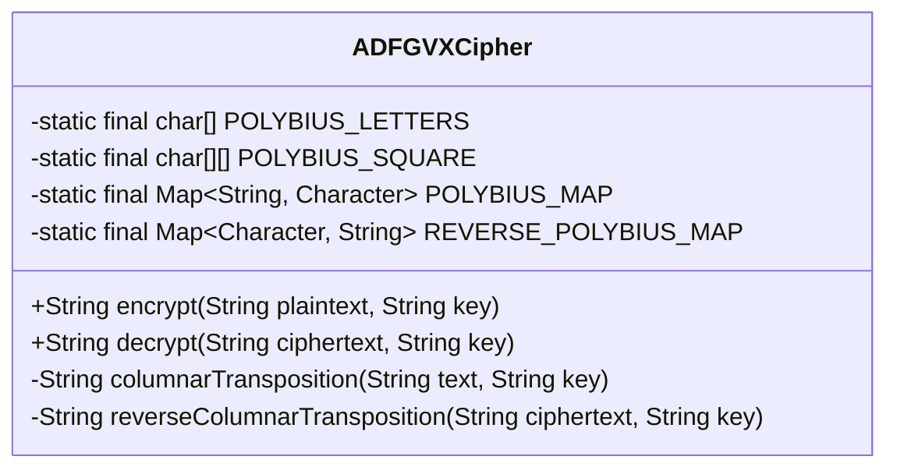
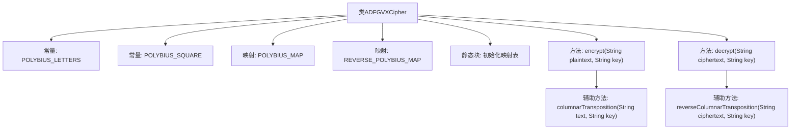

# 基础信息

|      |      |
|------|------|
| 名称 | ADFGVXCipher |
| 编码语言 | .java |
| 代码路径 | Java/src/main/java/com/thealgorithms/ciphers/ADFGVXCipher.java |
| 包名 | com.thealgorithms.ciphers |
| 依赖项 | ['java.util.Arrays', 'java.util.HashMap', 'java.util.Map'] |
| 概述说明 | ADFGVX密码类提供加密、解密及辅助功能。 |

# 说明

ADFGVX密码类是一个专门用于实现ADFGVX密码加密和解密功能的类。该类包含了用于加密和解密的核心方法，以及一些辅助方法，以确保密码处理过程的完整性和准确性。加密方法将明文转换为密文，而解密方法则将密文还原为明文。辅助方法可能包括密钥管理、字符转换和错误处理等功能，以确保加密解密过程的顺利进行。整体设计旨在提供一个高效、可靠的ADFGVX密码处理工具。

# 类列表 Class Summary

| 名称   | 类型  | 说明 |
|-------|------|-------------|
| ADFGVXCipher | class | ADFGVX密码类，包含加密解密及辅助方法。 |

## 类 ADFGVXCipher

|      |      |
|------|------|
| 访问范围 | public |
| 类型 | class |
| 名称 | ADFGVXCipher |
| 说明 | ADFGVX密码类，包含加密解密及辅助方法。 |

### UML类图

**描述：**
`ADFGVXCipher` 类实现了 ADFGVX 加密算法，该算法通过波利比奥斯方阵和列置换来加密和解密消息。类中包含两个静态映射表 `POLYBIUS_MAP` 和 `REVERSE_POLYBIUS_MAP`，用于快速查找字符与 ADFGVX 字母对之间的对应关系。`encrypt` 方法将明文转换为 ADFGVX 字母对，然后进行列置换生成密文；`decrypt` 方法则反向操作，先逆置换再转换为明文。`columnarTransposition` 和 `reverseColumnarTransposition` 是辅助方法，分别用于执行和逆置换操作。

### 内部方法调用关系图

**描述：**
该代码实现了ADFGVX密码的加密和解密功能。首先，通过静态块初始化Polybius方块的映射表。加密过程中，明文被替换为ADFGVX字母对，然后通过列转置进行加密。解密过程则相反，先反转列转置，再将ADFGVX字母对替换回明文。代码结构清晰，包含了必要的辅助方法来完成列转置及其反转操作。

### 字段列表 Field List

| 名称  | 类型  | 说明 |
|-------|-------|------|
| POLYBIUS_SQUARE = {{'N', 'A', '1', 'C', '3', 'H'}, {'8', 'T', 'B', '2', 'O', 'M'}, {'E', '5', 'W', 'R', 'P', 'D'}, {'4', 'F', '6', 'G', '7', 'I'}, {'9', 'J', '0', 'K', 'L', 'Q'}, {'S', 'U', 'V', 'X', 'Y', 'Z'}} | char[][] | 定义了一个6x6的波利比乌斯方阵，包含字母和数字。 |
| POLYBIUS_MAP = new HashMap<>() | Map<String, Character> | 定义静态常量POLYBIUS_MAP为HashMap类型，存储字符串与字符的映射。 |
| REVERSE_POLYBIUS_MAP = new HashMap<>() | Map<Character, String> | 定义私有静态常量REVERSE_POLYBIUS_MAP，类型为Map<Character, String>。 |
| POLYBIUS_LETTERS = {'A', 'D', 'F', 'G', 'V', 'X'} | char[] | 定义私有静态字符数组POLYBIUS_LETTERS，包含字母A、D、F、G、V、X。 |

### 方法列表 Method List

| 名称  | 类型  | 说明 |
|-------|-------|------|
| columnarTransposition | String | 列置换加密方法，按密钥顺序生成密文。 |
| encrypt | String | 加密方法：净化输入，转换字符，列置换加密。 |
| decrypt | String | 该方法解密密文，先逆向列置换，再按两字符映射为明文。 |
| reverseColumnarTransposition | String | 该方法通过排序密钥按列填充表格，再按行读取重构文本。 |

