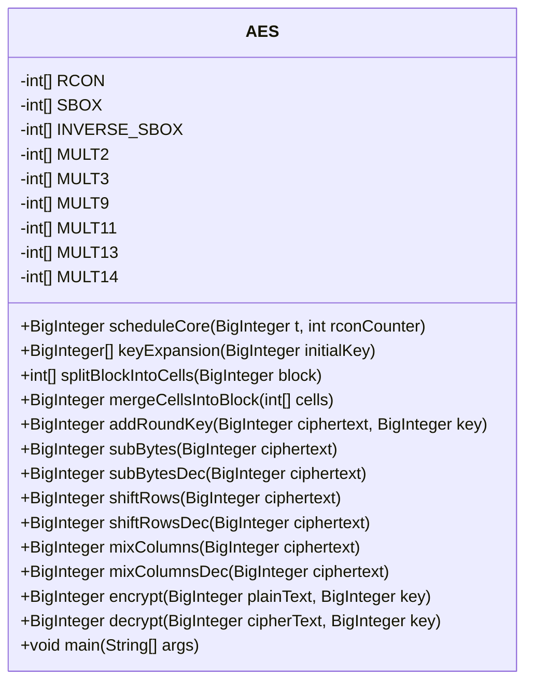

# 基础信息

|      |      |
|------|------|
| 名称 | AES |
| 编码语言 | .java |
| 代码路径 | Java/src/main/java/com/thealgorithms/ciphers/AES.java |
| 包名 | com.thealgorithms.ciphers |
| 依赖项 | ['java.math.BigInteger', 'java.util.Scanner'] |
| 概述说明 | AES加密解密类支持128位数据，含密钥扩展、字节替换、行移位、列混淆等操作。 |

# 说明

该AES加密解密类实现了高级加密标准（AES）的核心功能，包括密钥扩展、字节替换、行移位和列混淆等关键操作。该类专门设计用于处理128位数据的加密和解密，确保数据安全性和完整性。通过精确执行AES算法的各个步骤，该类能够有效地保护敏感信息，满足现代加密需求。

# 类列表 Class Summary

| 名称   | 类型  | 说明 |
|-------|------|-------------|
| AES | class | AES加密解密类，包含密钥扩展、字节替换、行移位、列混淆等操作，支持128位数据加密解密。 |

## 类 AES

|      |      |
|------|------|
| 访问范围 | public final |
| 类型 | class |
| 名称 | AES |
| 说明 | AES加密解密类，包含密钥扩展、字节替换、行移位、列混淆等操作，支持128位数据加密解密。 |

### UML类图

### 描述
`AES` 类实现了高级加密标准（AES）算法，提供了加密和解密功能。该类包含多个预计算的查找表（如 `RCON`、`SBOX`、`MULT2` 等），用于执行 AES 算法的各个步骤。`AES` 类提供了 `encrypt` 和 `decrypt` 方法，分别用于加密和解密 128 位的明文和密文。此外，类中还包含多个辅助方法，如 `keyExpansion` 用于生成轮密钥，`subBytes` 和 `shiftRows` 用于执行 AES 的字节替换和行移位操作。`main` 方法提供了一个简单的命令行界面，允许用户选择加密或解密操作，并输入相应的明文或密文以及密钥。

### 内部方法调用关系图

```mermaid
graph TD
    A["类AES"]
    B["属性: int[] RCON"]
    C["属性: int[] SBOX"]
    D["属性: int[] INVERSE_SBOX"]
    E["属性: int[] MULT2"]
    F["属性: int[] MULT3"]
    G["属性: int[] MULT9"]
    H["属性: int[] MULT11"]
    I["属性: int[] MULT13"]
    J["属性: int[] MULT14"]
    K["方法: scheduleCore(BigInteger t, int rconCounter)"]
    L["方法: keyExpansion(BigInteger initialKey)"]
    M["方法: splitBlockIntoCells(BigInteger block)"]
    N["方法: mergeCellsIntoBlock(int[] cells)"]
    O["方法: addRoundKey(BigInteger ciphertext, BigInteger key)"]
    P["方法: subBytes(BigInteger ciphertext)"]
    Q["方法: subBytesDec(BigInteger ciphertext)"]
    R["方法: shiftRows(BigInteger ciphertext)"]
    S["方法: shiftRowsDec(BigInteger ciphertext)"]
    T["方法: mixColumns(BigInteger ciphertext)"]
    U["方法: mixColumnsDec(BigInteger ciphertext)"]
    V["方法: encrypt(BigInteger plainText, BigInteger key)"]
    W["方法: decrypt(BigInteger cipherText, BigInteger key)"]
    X["方法: main(String[] args)"]

    A --> B
    A --> C
    A --> D
    A --> E
    A --> F
    A --> G
    A --> H
    A --> I
    A --> J
    A --> K
    A --> L
    A --> M
    A --> N
    A --> O
    A --> P
    A --> Q
    A --> R
    A --> S
    A --> T
    A --> U
    A --> V
    A --> W
    A --> X
```

这段代码实现了一个AES加密和解密的类。它包含了多个预计算的查找表（如RCON、SBOX、INVERSE_SBOX等）以及多个方法用于执行AES算法的各个步骤，如密钥扩展、字节替换、行移位、列混淆等。`main`方法提供了用户交互界面，允许用户选择加密或解密操作，并输入相应的明文或密文以及密钥。代码通过BigInteger类处理大整数运算，确保AES算法的正确执行。

### 字段列表 Field List

| 名称  | 类型  | 说明 |
|-------|-------|------|
| SBOX = {        0x63,        0x7C,        0x77,        0x7B,        0xF2,        0x6B,        0x6F,        0xC5,        0x30,        0x01,        0x67,        0x2B,        0xFE,        0xD7,        0xAB,        0x76,        0xCA,        0x82,        0xC9,        0x7D,        0xFA,        0x59,        0x47,        0xF0,        0xAD,        0xD4,        0xA2,        0xAF,        0x9C,        0xA4,        0x72,        0xC0,        0xB7,        0xFD,        0x93,        0x26,        0x36,        0x3F,        0xF7,        0xCC,        0x34,        0xA5,        0xE5,        0xF1,        0x71,        0xD8,        0x31,        0x15,        0x04,        0xC7,        0x23,        0xC3,        0x18,        0x96,        0x05,        0x9A,        0x07,        0x12,        0x80,        0xE2,        0xEB,        0x27,        0xB2,        0x75,        0x09,        0x83,        0x2C,        0x1A,        0x1B,        0x6E,        0x5A,        0xA0,        0x52,        0x3B,        0xD6,        0xB3,        0x29,        0xE3,        0x2F,        0x84,        0x53,        0xD1,        0x00,        0xED,        0x20,        0xFC,        0xB1,        0x5B,        0x6A,        0xCB,        0xBE,        0x39,        0x4A,        0x4C,        0x58,        0xCF,        0xD0,        0xEF,        0xAA,        0xFB,        0x43,        0x4D,        0x33,        0x85,        0x45,        0xF9,        0x02,        0x7F,        0x50,        0x3C,        0x9F,        0xA8,        0x51,        0xA3,        0x40,        0x8F,        0x92,        0x9D,        0x38,        0xF5,        0xBC,        0xB6,        0xDA,        0x21,        0x10,        0xFF,        0xF3,        0xD2,        0xCD,        0x0C,        0x13,        0xEC,        0x5F,        0x97,        0x44,        0x17,        0xC4,        0xA7,        0x7E,        0x3D,        0x64,        0x5D,        0x19,        0x73,        0x60,        0x81,        0x4F,        0xDC,        0x22,        0x2A,        0x90,        0x88,        0x46,        0xEE,        0xB8,        0x14,        0xDE,        0x5E,        0x0B,        0xDB,        0xE0,        0x32,        0x3A,        0x0A,        0x49,        0x06,        0x24,        0x5C,        0xC2,        0xD3,        0xAC,        0x62,        0x91,        0x95,        0xE4,        0x79,        0xE7,        0xC8,        0x37,        0x6D,        0x8D,        0xD5,        0x4E,        0xA9,        0x6C,        0x56,        0xF4,        0xEA,        0x65,        0x7A,        0xAE,        0x08,        0xBA,        0x78,        0x25,        0x2E,        0x1C,        0xA6,        0xB4,        0xC6,        0xE8,        0xDD,        0x74,        0x1F,        0x4B,        0xBD,        0x8B,        0x8A,        0x70,        0x3E,        0xB5,        0x66,        0x48,        0x03,        0xF6,        0x0E,        0x61,        0x35,        0x57,        0xB9,        0x86,        0xC1,        0x1D,        0x9E,        0xE1,        0xF8,        0x98,        0x11,        0x69,        0xD9,        0x8E,        0x94,        0x9B,        0x1E,        0x87,        0xE9,        0xCE,        0x55,        0x28,        0xDF,        0x8C,        0xA1,        0x89,        0x0D,        0xBF,        0xE6,        0x42,        0x68,        0x41,        0x99,        0x2D,        0x0F,        0xB0,        0x54,        0xBB,        0x16,    } | int[] | AES加密算法中的S盒定义。 |
| MULT9 = {        0x00,        0x09,        0x12,        0x1b,        0x24,        0x2d,        0x36,        0x3f,        0x48,        0x41,        0x5a,        0x53,        0x6c,        0x65,        0x7e,        0x77,        0x90,        0x99,        0x82,        0x8b,        0xb4,        0xbd,        0xa6,        0xaf,        0xd8,        0xd1,        0xca,        0xc3,        0xfc,        0xf5,        0xee,        0xe7,        0x3b,        0x32,        0x29,        0x20,        0x1f,        0x16,        0x0d,        0x04,        0x73,        0x7a,        0x61,        0x68,        0x57,        0x5e,        0x45,        0x4c,        0xab,        0xa2,        0xb9,        0xb0,        0x8f,        0x86,        0x9d,        0x94,        0xe3,        0xea,        0xf1,        0xf8,        0xc7,        0xce,        0xd5,        0xdc,        0x76,        0x7f,        0x64,        0x6d,        0x52,        0x5b,        0x40,        0x49,        0x3e,        0x37,        0x2c,        0x25,        0x1a,        0x13,        0x08,        0x01,        0xe6,        0xef,        0xf4,        0xfd,        0xc2,        0xcb,        0xd0,        0xd9,        0xae,        0xa7,        0xbc,        0xb5,        0x8a,        0x83,        0x98,        0x91,        0x4d,        0x44,        0x5f,        0x56,        0x69,        0x60,        0x7b,        0x72,        0x05,        0x0c,        0x17,        0x1e,        0x21,        0x28,        0x33,        0x3a,        0xdd,        0xd4,        0xcf,        0xc6,        0xf9,        0xf0,        0xeb,        0xe2,        0x95,        0x9c,        0x87,        0x8e,        0xb1,        0xb8,        0xa3,        0xaa,        0xec,        0xe5,        0xfe,        0xf7,        0xc8,        0xc1,        0xda,        0xd3,        0xa4,        0xad,        0xb6,        0xbf,        0x80,        0x89,        0x92,        0x9b,        0x7c,        0x75,        0x6e,        0x67,        0x58,        0x51,        0x4a,        0x43,        0x34,        0x3d,        0x26,        0x2f,        0x10,        0x19,        0x02,        0x0b,        0xd7,        0xde,        0xc5,        0xcc,        0xf3,        0xfa,        0xe1,        0xe8,        0x9f,        0x96,        0x8d,        0x84,        0xbb,        0xb2,        0xa9,        0xa0,        0x47,        0x4e,        0x55,        0x5c,        0x63,        0x6a,        0x71,        0x78,        0x0f,        0x06,        0x1d,        0x14,        0x2b,        0x22,        0x39,        0x30,        0x9a,        0x93,        0x88,        0x81,        0xbe,        0xb7,        0xac,        0xa5,        0xd2,        0xdb,        0xc0,        0xc9,        0xf6,        0xff,        0xe4,        0xed,        0x0a,        0x03,        0x18,        0x11,        0x2e,        0x27,        0x3c,        0x35,        0x42,        0x4b,        0x50,        0x59,        0x66,        0x6f,        0x74,        0x7d,        0xa1,        0xa8,        0xb3,        0xba,        0x85,        0x8c,        0x97,        0x9e,        0xe9,        0xe0,        0xfb,        0xf2,        0xcd,        0xc4,        0xdf,        0xd6,        0x31,        0x38,        0x23,        0x2a,        0x15,        0x1c,        0x07,        0x0e,        0x79,        0x70,        0x6b,        0x62,        0x5d,        0x54,        0x4f,        0x46,    } | int[] | 定义了包含256个十六进制整数的静态数组MULT9。 |
| MULT13 = {        0x00,        0x0d,        0x1a,        0x17,        0x34,        0x39,        0x2e,        0x23,        0x68,        0x65,        0x72,        0x7f,        0x5c,        0x51,        0x46,        0x4b,        0xd0,        0xdd,        0xca,        0xc7,        0xe4,        0xe9,        0xfe,        0xf3,        0xb8,        0xb5,        0xa2,        0xaf,        0x8c,        0x81,        0x96,        0x9b,        0xbb,        0xb6,        0xa1,        0xac,        0x8f,        0x82,        0x95,        0x98,        0xd3,        0xde,        0xc9,        0xc4,        0xe7,        0xea,        0xfd,        0xf0,        0x6b,        0x66,        0x71,        0x7c,        0x5f,        0x52,        0x45,        0x48,        0x03,        0x0e,        0x19,        0x14,        0x37,        0x3a,        0x2d,        0x20,        0x6d,        0x60,        0x77,        0x7a,        0x59,        0x54,        0x43,        0x4e,        0x05,        0x08,        0x1f,        0x12,        0x31,        0x3c,        0x2b,        0x26,        0xbd,        0xb0,        0xa7,        0xaa,        0x89,        0x84,        0x93,        0x9e,        0xd5,        0xd8,        0xcf,        0xc2,        0xe1,        0xec,        0xfb,        0xf6,        0xd6,        0xdb,        0xcc,        0xc1,        0xe2,        0xef,        0xf8,        0xf5,        0xbe,        0xb3,        0xa4,        0xa9,        0x8a,        0x87,        0x90,        0x9d,        0x06,        0x0b,        0x1c,        0x11,        0x32,        0x3f,        0x28,        0x25,        0x6e,        0x63,        0x74,        0x79,        0x5a,        0x57,        0x40,        0x4d,        0xda,        0xd7,        0xc0,        0xcd,        0xee,        0xe3,        0xf4,        0xf9,        0xb2,        0xbf,        0xa8,        0xa5,        0x86,        0x8b,        0x9c,        0x91,        0x0a,        0x07,        0x10,        0x1d,        0x3e,        0x33,        0x24,        0x29,        0x62,        0x6f,        0x78,        0x75,        0x56,        0x5b,        0x4c,        0x41,        0x61,        0x6c,        0x7b,        0x76,        0x55,        0x58,        0x4f,        0x42,        0x09,        0x04,        0x13,        0x1e,        0x3d,        0x30,        0x27,        0x2a,        0xb1,        0xbc,        0xab,        0xa6,        0x85,        0x88,        0x9f,        0x92,        0xd9,        0xd4,        0xc3,        0xce,        0xed,        0xe0,        0xf7,        0xfa,        0xb7,        0xba,        0xad,        0xa0,        0x83,        0x8e,        0x99,        0x94,        0xdf,        0xd2,        0xc5,        0xc8,        0xeb,        0xe6,        0xf1,        0xfc,        0x67,        0x6a,        0x7d,        0x70,        0x53,        0x5e,        0x49,        0x44,        0x0f,        0x02,        0x15,        0x18,        0x3b,        0x36,        0x21,        0x2c,        0x0c,        0x01,        0x16,        0x1b,        0x38,        0x35,        0x22,        0x2f,        0x64,        0x69,        0x7e,        0x73,        0x50,        0x5d,        0x4a,        0x47,        0xdc,        0xd1,        0xc6,        0xcb,        0xe8,        0xe5,        0xf2,        0xff,        0xb4,        0xb9,        0xae,        0xa3,        0x80,        0x8d,        0x9a,        0x97,    } | int[] | 定义了包含256个十六进制值的整型数组MULT13。 |
| RCON = {        0x8d,        0x01,        0x02,        0x04,        0x08,        0x10,        0x20,        0x40,        0x80,        0x1b,        0x36,        0x6c,        0xd8,        0xab,        0x4d,        0x9a,        0x2f,        0x5e,        0xbc,        0x63,        0xc6,        0x97,        0x35,        0x6a,        0xd4,        0xb3,        0x7d,        0xfa,        0xef,        0xc5,        0x91,        0x39,        0x72,        0xe4,        0xd3,        0xbd,        0x61,        0xc2,        0x9f,        0x25,        0x4a,        0x94,        0x33,        0x66,        0xcc,        0x83,        0x1d,        0x3a,        0x74,        0xe8,        0xcb,        0x8d,        0x01,        0x02,        0x04,        0x08,        0x10,        0x20,        0x40,        0x80,        0x1b,        0x36,        0x6c,        0xd8,        0xab,        0x4d,        0x9a,        0x2f,        0x5e,        0xbc,        0x63,        0xc6,        0x97,        0x35,        0x6a,        0xd4,        0xb3,        0x7d,        0xfa,        0xef,        0xc5,        0x91,        0x39,        0x72,        0xe4,        0xd3,        0xbd,        0x61,        0xc2,        0x9f,        0x25,        0x4a,        0x94,        0x33,        0x66,        0xcc,        0x83,        0x1d,        0x3a,        0x74,        0xe8,        0xcb,        0x8d,        0x01,        0x02,        0x04,        0x08,        0x10,        0x20,        0x40,        0x80,        0x1b,        0x36,        0x6c,        0xd8,        0xab,        0x4d,        0x9a,        0x2f,        0x5e,        0xbc,        0x63,        0xc6,        0x97,        0x35,        0x6a,        0xd4,        0xb3,        0x7d,        0xfa,        0xef,        0xc5,        0x91,        0x39,        0x72,        0xe4,        0xd3,        0xbd,        0x61,        0xc2,        0x9f,        0x25,        0x4a,        0x94,        0x33,        0x66,        0xcc,        0x83,        0x1d,        0x3a,        0x74,        0xe8,        0xcb,        0x8d,        0x01,        0x02,        0x04,        0x08,        0x10,        0x20,        0x40,        0x80,        0x1b,        0x36,        0x6c,        0xd8,        0xab,        0x4d,        0x9a,        0x2f,        0x5e,        0xbc,        0x63,        0xc6,        0x97,        0x35,        0x6a,        0xd4,        0xb3,        0x7d,        0xfa,        0xef,        0xc5,        0x91,        0x39,        0x72,        0xe4,        0xd3,        0xbd,        0x61,        0xc2,        0x9f,        0x25,        0x4a,        0x94,        0x33,        0x66,        0xcc,        0x83,        0x1d,        0x3a,        0x74,        0xe8,        0xcb,        0x8d,        0x01,        0x02,        0x04,        0x08,        0x10,        0x20,        0x40,        0x80,        0x1b,        0x36,        0x6c,        0xd8,        0xab,        0x4d,        0x9a,        0x2f,        0x5e,        0xbc,        0x63,        0xc6,        0x97,        0x35,        0x6a,        0xd4,        0xb3,        0x7d,        0xfa,        0xef,        0xc5,        0x91,        0x39,        0x72,        0xe4,        0xd3,        0xbd,        0x61,        0xc2,        0x9f,        0x25,        0x4a,        0x94,        0x33,        0x66,        0xcc,        0x83,        0x1d,        0x3a,        0x74,        0xe8,        0xcb,        0x8d,    } | int[] | AES加密算法中的RCON轮常量数组。 |
| MULT3 = {        0x00,        0x03,        0x06,        0x05,        0x0c,        0x0f,        0x0a,        0x09,        0x18,        0x1b,        0x1e,        0x1d,        0x14,        0x17,        0x12,        0x11,        0x30,        0x33,        0x36,        0x35,        0x3c,        0x3f,        0x3a,        0x39,        0x28,        0x2b,        0x2e,        0x2d,        0x24,        0x27,        0x22,        0x21,        0x60,        0x63,        0x66,        0x65,        0x6c,        0x6f,        0x6a,        0x69,        0x78,        0x7b,        0x7e,        0x7d,        0x74,        0x77,        0x72,        0x71,        0x50,        0x53,        0x56,        0x55,        0x5c,        0x5f,        0x5a,        0x59,        0x48,        0x4b,        0x4e,        0x4d,        0x44,        0x47,        0x42,        0x41,        0xc0,        0xc3,        0xc6,        0xc5,        0xcc,        0xcf,        0xca,        0xc9,        0xd8,        0xdb,        0xde,        0xdd,        0xd4,        0xd7,        0xd2,        0xd1,        0xf0,        0xf3,        0xf6,        0xf5,        0xfc,        0xff,        0xfa,        0xf9,        0xe8,        0xeb,        0xee,        0xed,        0xe4,        0xe7,        0xe2,        0xe1,        0xa0,        0xa3,        0xa6,        0xa5,        0xac,        0xaf,        0xaa,        0xa9,        0xb8,        0xbb,        0xbe,        0xbd,        0xb4,        0xb7,        0xb2,        0xb1,        0x90,        0x93,        0x96,        0x95,        0x9c,        0x9f,        0x9a,        0x99,        0x88,        0x8b,        0x8e,        0x8d,        0x84,        0x87,        0x82,        0x81,        0x9b,        0x98,        0x9d,        0x9e,        0x97,        0x94,        0x91,        0x92,        0x83,        0x80,        0x85,        0x86,        0x8f,        0x8c,        0x89,        0x8a,        0xab,        0xa8,        0xad,        0xae,        0xa7,        0xa4,        0xa1,        0xa2,        0xb3,        0xb0,        0xb5,        0xb6,        0xbf,        0xbc,        0xb9,        0xba,        0xfb,        0xf8,        0xfd,        0xfe,        0xf7,        0xf4,        0xf1,        0xf2,        0xe3,        0xe0,        0xe5,        0xe6,        0xef,        0xec,        0xe9,        0xea,        0xcb,        0xc8,        0xcd,        0xce,        0xc7,        0xc4,        0xc1,        0xc2,        0xd3,        0xd0,        0xd5,        0xd6,        0xdf,        0xdc,        0xd9,        0xda,        0x5b,        0x58,        0x5d,        0x5e,        0x57,        0x54,        0x51,        0x52,        0x43,        0x40,        0x45,        0x46,        0x4f,        0x4c,        0x49,        0x4a,        0x6b,        0x68,        0x6d,        0x6e,        0x67,        0x64,        0x61,        0x62,        0x73,        0x70,        0x75,        0x76,        0x7f,        0x7c,        0x79,        0x7a,        0x3b,        0x38,        0x3d,        0x3e,        0x37,        0x34,        0x31,        0x32,        0x23,        0x20,        0x25,        0x26,        0x2f,        0x2c,        0x29,        0x2a,        0x0b,        0x08,        0x0d,        0x0e,        0x07,        0x04,        0x01,        0x02,        0x13,        0x10,        0x15,        0x16,        0x1f,        0x1c,        0x19,        0x1a,    } | int[] | 静态数组MULT3包含256个十六进制数值。 |
| MULT11 = {        0x00,        0x0b,        0x16,        0x1d,        0x2c,        0x27,        0x3a,        0x31,        0x58,        0x53,        0x4e,        0x45,        0x74,        0x7f,        0x62,        0x69,        0xb0,        0xbb,        0xa6,        0xad,        0x9c,        0x97,        0x8a,        0x81,        0xe8,        0xe3,        0xfe,        0xf5,        0xc4,        0xcf,        0xd2,        0xd9,        0x7b,        0x70,        0x6d,        0x66,        0x57,        0x5c,        0x41,        0x4a,        0x23,        0x28,        0x35,        0x3e,        0x0f,        0x04,        0x19,        0x12,        0xcb,        0xc0,        0xdd,        0xd6,        0xe7,        0xec,        0xf1,        0xfa,        0x93,        0x98,        0x85,        0x8e,        0xbf,        0xb4,        0xa9,        0xa2,        0xf6,        0xfd,        0xe0,        0xeb,        0xda,        0xd1,        0xcc,        0xc7,        0xae,        0xa5,        0xb8,        0xb3,        0x82,        0x89,        0x94,        0x9f,        0x46,        0x4d,        0x50,        0x5b,        0x6a,        0x61,        0x7c,        0x77,        0x1e,        0x15,        0x08,        0x03,        0x32,        0x39,        0x24,        0x2f,        0x8d,        0x86,        0x9b,        0x90,        0xa1,        0xaa,        0xb7,        0xbc,        0xd5,        0xde,        0xc3,        0xc8,        0xf9,        0xf2,        0xef,        0xe4,        0x3d,        0x36,        0x2b,        0x20,        0x11,        0x1a,        0x07,        0x0c,        0x65,        0x6e,        0x73,        0x78,        0x49,        0x42,        0x5f,        0x54,        0xf7,        0xfc,        0xe1,        0xea,        0xdb,        0xd0,        0xcd,        0xc6,        0xaf,        0xa4,        0xb9,        0xb2,        0x83,        0x88,        0x95,        0x9e,        0x47,        0x4c,        0x51,        0x5a,        0x6b,        0x60,        0x7d,        0x76,        0x1f,        0x14,        0x09,        0x02,        0x33,        0x38,        0x25,        0x2e,        0x8c,        0x87,        0x9a,        0x91,        0xa0,        0xab,        0xb6,        0xbd,        0xd4,        0xdf,        0xc2,        0xc9,        0xf8,        0xf3,        0xee,        0xe5,        0x3c,        0x37,        0x2a,        0x21,        0x10,        0x1b,        0x06,        0x0d,        0x64,        0x6f,        0x72,        0x79,        0x48,        0x43,        0x5e,        0x55,        0x01,        0x0a,        0x17,        0x1c,        0x2d,        0x26,        0x3b,        0x30,        0x59,        0x52,        0x4f,        0x44,        0x75,        0x7e,        0x63,        0x68,        0xb1,        0xba,        0xa7,        0xac,        0x9d,        0x96,        0x8b,        0x80,        0xe9,        0xe2,        0xff,        0xf4,        0xc5,        0xce,        0xd3,        0xd8,        0x7a,        0x71,        0x6c,        0x67,        0x56,        0x5d,        0x40,        0x4b,        0x22,        0x29,        0x34,        0x3f,        0x0e,        0x05,        0x18,        0x13,        0xca,        0xc1,        0xdc,        0xd7,        0xe6,        0xed,        0xf0,        0xfb,        0x92,        0x99,        0x84,        0x8f,        0xbe,        0xb5,        0xa8,        0xa3,    } | int[] | 定义了一个包含256个十六进制整数的静态数组MULT11。 |
| MULT14 = {        0x00,        0x0e,        0x1c,        0x12,        0x38,        0x36,        0x24,        0x2a,        0x70,        0x7e,        0x6c,        0x62,        0x48,        0x46,        0x54,        0x5a,        0xe0,        0xee,        0xfc,        0xf2,        0xd8,        0xd6,        0xc4,        0xca,        0x90,        0x9e,        0x8c,        0x82,        0xa8,        0xa6,        0xb4,        0xba,        0xdb,        0xd5,        0xc7,        0xc9,        0xe3,        0xed,        0xff,        0xf1,        0xab,        0xa5,        0xb7,        0xb9,        0x93,        0x9d,        0x8f,        0x81,        0x3b,        0x35,        0x27,        0x29,        0x03,        0x0d,        0x1f,        0x11,        0x4b,        0x45,        0x57,        0x59,        0x73,        0x7d,        0x6f,        0x61,        0xad,        0xa3,        0xb1,        0xbf,        0x95,        0x9b,        0x89,        0x87,        0xdd,        0xd3,        0xc1,        0xcf,        0xe5,        0xeb,        0xf9,        0xf7,        0x4d,        0x43,        0x51,        0x5f,        0x75,        0x7b,        0x69,        0x67,        0x3d,        0x33,        0x21,        0x2f,        0x05,        0x0b,        0x19,        0x17,        0x76,        0x78,        0x6a,        0x64,        0x4e,        0x40,        0x52,        0x5c,        0x06,        0x08,        0x1a,        0x14,        0x3e,        0x30,        0x22,        0x2c,        0x96,        0x98,        0x8a,        0x84,        0xae,        0xa0,        0xb2,        0xbc,        0xe6,        0xe8,        0xfa,        0xf4,        0xde,        0xd0,        0xc2,        0xcc,        0x41,        0x4f,        0x5d,        0x53,        0x79,        0x77,        0x65,        0x6b,        0x31,        0x3f,        0x2d,        0x23,        0x09,        0x07,        0x15,        0x1b,        0xa1,        0xaf,        0xbd,        0xb3,        0x99,        0x97,        0x85,        0x8b,        0xd1,        0xdf,        0xcd,        0xc3,        0xe9,        0xe7,        0xf5,        0xfb,        0x9a,        0x94,        0x86,        0x88,        0xa2,        0xac,        0xbe,        0xb0,        0xea,        0xe4,        0xf6,        0xf8,        0xd2,        0xdc,        0xce,        0xc0,        0x7a,        0x74,        0x66,        0x68,        0x42,        0x4c,        0x5e,        0x50,        0x0a,        0x04,        0x16,        0x18,        0x32,        0x3c,        0x2e,        0x20,        0xec,        0xe2,        0xf0,        0xfe,        0xd4,        0xda,        0xc8,        0xc6,        0x9c,        0x92,        0x80,        0x8e,        0xa4,        0xaa,        0xb8,        0xb6,        0x0c,        0x02,        0x10,        0x1e,        0x34,        0x3a,        0x28,        0x26,        0x7c,        0x72,        0x60,        0x6e,        0x44,        0x4a,        0x58,        0x56,        0x37,        0x39,        0x2b,        0x25,        0x0f,        0x01,        0x13,        0x1d,        0x47,        0x49,        0x5b,        0x55,        0x7f,        0x71,        0x63,        0x6d,        0xd7,        0xd9,        0xcb,        0xc5,        0xef,        0xe1,        0xf3,        0xfd,        0xa7,        0xa9,        0xbb,        0xb5,        0x9f,        0x91,        0x83,        0x8d,    } | int[] | 定义了一个包含256个十六进制值的静态整型数组MULT14。 |
| MULT2 = {        0x00,        0x02,        0x04,        0x06,        0x08,        0x0a,        0x0c,        0x0e,        0x10,        0x12,        0x14,        0x16,        0x18,        0x1a,        0x1c,        0x1e,        0x20,        0x22,        0x24,        0x26,        0x28,        0x2a,        0x2c,        0x2e,        0x30,        0x32,        0x34,        0x36,        0x38,        0x3a,        0x3c,        0x3e,        0x40,        0x42,        0x44,        0x46,        0x48,        0x4a,        0x4c,        0x4e,        0x50,        0x52,        0x54,        0x56,        0x58,        0x5a,        0x5c,        0x5e,        0x60,        0x62,        0x64,        0x66,        0x68,        0x6a,        0x6c,        0x6e,        0x70,        0x72,        0x74,        0x76,        0x78,        0x7a,        0x7c,        0x7e,        0x80,        0x82,        0x84,        0x86,        0x88,        0x8a,        0x8c,        0x8e,        0x90,        0x92,        0x94,        0x96,        0x98,        0x9a,        0x9c,        0x9e,        0xa0,        0xa2,        0xa4,        0xa6,        0xa8,        0xaa,        0xac,        0xae,        0xb0,        0xb2,        0xb4,        0xb6,        0xb8,        0xba,        0xbc,        0xbe,        0xc0,        0xc2,        0xc4,        0xc6,        0xc8,        0xca,        0xcc,        0xce,        0xd0,        0xd2,        0xd4,        0xd6,        0xd8,        0xda,        0xdc,        0xde,        0xe0,        0xe2,        0xe4,        0xe6,        0xe8,        0xea,        0xec,        0xee,        0xf0,        0xf2,        0xf4,        0xf6,        0xf8,        0xfa,        0xfc,        0xfe,        0x1b,        0x19,        0x1f,        0x1d,        0x13,        0x11,        0x17,        0x15,        0x0b,        0x09,        0x0f,        0x0d,        0x03,        0x01,        0x07,        0x05,        0x3b,        0x39,        0x3f,        0x3d,        0x33,        0x31,        0x37,        0x35,        0x2b,        0x29,        0x2f,        0x2d,        0x23,        0x21,        0x27,        0x25,        0x5b,        0x59,        0x5f,        0x5d,        0x53,        0x51,        0x57,        0x55,        0x4b,        0x49,        0x4f,        0x4d,        0x43,        0x41,        0x47,        0x45,        0x7b,        0x79,        0x7f,        0x7d,        0x73,        0x71,        0x77,        0x75,        0x6b,        0x69,        0x6f,        0x6d,        0x63,        0x61,        0x67,        0x65,        0x9b,        0x99,        0x9f,        0x9d,        0x93,        0x91,        0x97,        0x95,        0x8b,        0x89,        0x8f,        0x8d,        0x83,        0x81,        0x87,        0x85,        0xbb,        0xb9,        0xbf,        0xbd,        0xb3,        0xb1,        0xb7,        0xb5,        0xab,        0xa9,        0xaf,        0xad,        0xa3,        0xa1,        0xa7,        0xa5,        0xdb,        0xd9,        0xdf,        0xdd,        0xd3,        0xd1,        0xd7,        0xd5,        0xcb,        0xc9,        0xcf,        0xcd,        0xc3,        0xc1,        0xc7,        0xc5,        0xfb,        0xf9,        0xff,        0xfd,        0xf3,        0xf1,        0xf7,        0xf5,        0xeb,        0xe9,        0xef,        0xed,        0xe3,        0xe1,        0xe7,        0xe5,    } | int[] | MULT2数组包含256个十六进制值，用于特定计算。 |
| INVERSE_SBOX = {        0x52,        0x09,        0x6A,        0xD5,        0x30,        0x36,        0xA5,        0x38,        0xBF,        0x40,        0xA3,        0x9E,        0x81,        0xF3,        0xD7,        0xFB,        0x7C,        0xE3,        0x39,        0x82,        0x9B,        0x2F,        0xFF,        0x87,        0x34,        0x8E,        0x43,        0x44,        0xC4,        0xDE,        0xE9,        0xCB,        0x54,        0x7B,        0x94,        0x32,        0xA6,        0xC2,        0x23,        0x3D,        0xEE,        0x4C,        0x95,        0x0B,        0x42,        0xFA,        0xC3,        0x4E,        0x08,        0x2E,        0xA1,        0x66,        0x28,        0xD9,        0x24,        0xB2,        0x76,        0x5B,        0xA2,        0x49,        0x6D,        0x8B,        0xD1,        0x25,        0x72,        0xF8,        0xF6,        0x64,        0x86,        0x68,        0x98,        0x16,        0xD4,        0xA4,        0x5C,        0xCC,        0x5D,        0x65,        0xB6,        0x92,        0x6C,        0x70,        0x48,        0x50,        0xFD,        0xED,        0xB9,        0xDA,        0x5E,        0x15,        0x46,        0x57,        0xA7,        0x8D,        0x9D,        0x84,        0x90,        0xD8,        0xAB,        0x00,        0x8C,        0xBC,        0xD3,        0x0A,        0xF7,        0xE4,        0x58,        0x05,        0xB8,        0xB3,        0x45,        0x06,        0xD0,        0x2C,        0x1E,        0x8F,        0xCA,        0x3F,        0x0F,        0x02,        0xC1,        0xAF,        0xBD,        0x03,        0x01,        0x13,        0x8A,        0x6B,        0x3A,        0x91,        0x11,        0x41,        0x4F,        0x67,        0xDC,        0xEA,        0x97,        0xF2,        0xCF,        0xCE,        0xF0,        0xB4,        0xE6,        0x73,        0x96,        0xAC,        0x74,        0x22,        0xE7,        0xAD,        0x35,        0x85,        0xE2,        0xF9,        0x37,        0xE8,        0x1C,        0x75,        0xDF,        0x6E,        0x47,        0xF1,        0x1A,        0x71,        0x1D,        0x29,        0xC5,        0x89,        0x6F,        0xB7,        0x62,        0x0E,        0xAA,        0x18,        0xBE,        0x1B,        0xFC,        0x56,        0x3E,        0x4B,        0xC6,        0xD2,        0x79,        0x20,        0x9A,        0xDB,        0xC0,        0xFE,        0x78,        0xCD,        0x5A,        0xF4,        0x1F,        0xDD,        0xA8,        0x33,        0x88,        0x07,        0xC7,        0x31,        0xB1,        0x12,        0x10,        0x59,        0x27,        0x80,        0xEC,        0x5F,        0x60,        0x51,        0x7F,        0xA9,        0x19,        0xB5,        0x4A,        0x0D,        0x2D,        0xE5,        0x7A,        0x9F,        0x93,        0xC9,        0x9C,        0xEF,        0xA0,        0xE0,        0x3B,        0x4D,        0xAE,        0x2A,        0xF5,        0xB0,        0xC8,        0xEB,        0xBB,        0x3C,        0x83,        0x53,        0x99,        0x61,        0x17,        0x2B,        0x04,        0x7E,        0xBA,        0x77,        0xD6,        0x26,        0xE1,        0x69,        0x14,        0x63,        0x55,        0x21,        0x0C,        0x7D,    } | int[] | 定义了一个包含256个十六进制值的逆S盒数组。 |

### 方法列表 Method List

| 名称  | 类型  | 说明 |
|-------|-------|------|
| shiftRows | BigInteger | 对密文进行行移位操作，首行不变，其余行分别后移1、2、3个单元格。 |
| mixColumns | BigInteger | 混合列操作，对密文分块处理并重新组合。 |
| mixColumnsDec | BigInteger | 实现AES解密中的列混淆操作，通过矩阵乘法生成输出块。 |
| subBytes | BigInteger | 该方法对密文分块，通过SBOX替换，再合并返回。 |
| subBytesDec | BigInteger | 将密文分割为16单元，通过逆S盒转换后合并返回。 |
| keyExpansion | BigInteger[] | 生成扩展密钥，使用初始密钥和轮常数进行迭代计算。 |
| mergeCellsIntoBlock | BigInteger | 将16个8位整数的二进制串合并为一个128位大整数。 |
| encrypt | BigInteger | 实现AES加密算法，包括初始轮、主轮和最终轮操作。 |
| main | void | Java程序提供加密解密功能，用户输入选择、密钥及文本，输出加密或解密结果。 |
| decrypt | BigInteger | 解密函数通过逆序轮密钥、逆字节替换、逆行移位和逆列混淆操作还原密文。 |
| scheduleCore | BigInteger | 方法将BigInteger处理为16进制，旋转前16位，应用S-Box并添加RCON值。 |
| splitBlockIntoCells | int[] | 将128位大整数分割为16个8位整数的数组。 |
| shiftRowsDec | BigInteger | 该方法对输入的密文进行行移位操作，第一行不变，第二行左移一位，第三行左移两位，第四行左移三位。 |
| addRoundKey | BigInteger | 静态方法实现密文与密钥的异或操作。 |

