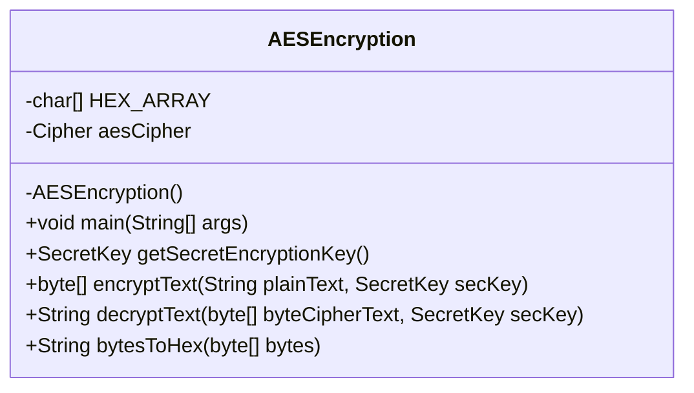
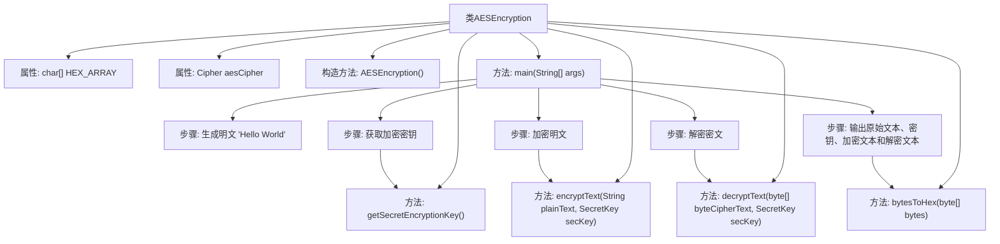

# 基础信息

|      |      |
|------|------|
| 名称 | AESEncryption |
| 编码语言 | .java |
| 代码路径 | Java/src/main/java/com/thealgorithms/ciphers/AESEncryption.java |
| 包名 | com.thealgorithms.ciphers |
| 依赖项 | ['java.security.InvalidAlgorithmParameterException', 'java.security.InvalidKeyException', 'java.security.NoSuchAlgorithmException', 'javax.crypto.BadPaddingException', 'javax.crypto.Cipher', 'javax.crypto.IllegalBlockSizeException', 'javax.crypto.KeyGenerator', 'javax.crypto.NoSuchPaddingException', 'javax.crypto.SecretKey', 'javax.crypto.spec.GCMParameterSpec'] |
| 概述说明 | AES加密类提供密钥生成、加密、解密及字节转十六进制功能。 |

# 说明

AES加密类是一个功能全面的工具，主要用于实现高级加密标准（AES）的相关操作。该类包含生成密钥的功能，能够创建用于加密和解密的密钥。此外，该类还提供了加密功能，可以将明文数据转换为密文，确保数据的安全性。解密功能则用于将密文还原为原始明文，以便于数据的读取和使用。同时，该类还具备字节转十六进制的功能，能够将字节数据转换为十六进制字符串，便于数据的展示和传输。这些功能共同构成了一个完整的AES加密解决方案，适用于需要数据加密保护的场景。

# 类列表 Class Summary

| 名称   | 类型  | 说明 |
|-------|------|-------------|
| AESEncryption | class | AES加密类，包含生成密钥、加密、解密及字节转十六进制功能。 |

## 类 AESEncryption

|      |      |
|------|------|
| 访问范围 | public final |
| 类型 | class |
| 名称 | AESEncryption |
| 说明 | AES加密类，包含生成密钥、加密、解密及字节转十六进制功能。 |

### UML类图

该代码定义了一个名为 `AESEncryption` 的类，用于实现AES加密和解密功能。类中包含私有的字符数组 `HEX_ARRAY` 和 `Cipher` 对象 `aesCipher`，以及私有的构造函数 `AESEncryption()`。公有方法包括 `main()` 用于测试加密解密流程，`getSecretEncryptionKey()` 用于生成AES密钥，`encryptText()` 用于加密文本，`decryptText()` 用于解密文本，`bytesToHex()` 用于将字节数组转换为十六进制字符串。该类实现了AES加密和解密的核心功能，并提供了密钥生成和十六进制转换的辅助方法。

### 内部方法调用关系图

这段代码实现了AES加密和解密功能。首先，生成一个明文，然后获取加密密钥，接着使用该密钥对明文进行加密，再对加密后的文本进行解密，最后输出原始文本、密钥、加密文本和解密文本。代码中包含了获取密钥、加密、解密以及将字节数组转换为十六进制字符串的方法。

### 字段列表 Field List

| 名称  | 类型  | 说明 |
|-------|-------|------|
| aesCipher | Cipher | 定义了一个私有的静态Cipher变量aesCipher。 |
| HEX_ARRAY = "0123456789ABCDEF".toCharArray() | char[] | 定义包含十六进制字符的静态字符数组HEX_ARRAY。 |

### 方法列表 Method List

| 名称  | 类型  | 说明 |
|-------|-------|------|
| getSecretEncryptionKey | SecretKey | 生成128位AES加密密钥的方法。 |
| main | void | Java代码示例：使用AES加密解密字符串并输出结果。 |
| bytesToHex | String | 将字节数组转换为十六进制字符串的静态方法。 |
| decryptText | String | 使用AES/GCM模式解密字节数组并返回明文字符串。 |
| encryptText | byte[] | Java方法使用AES/GCM/NoPadding加密文本并返回字节数组。 |

