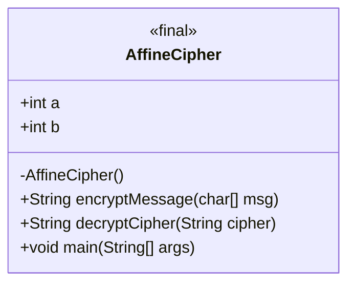
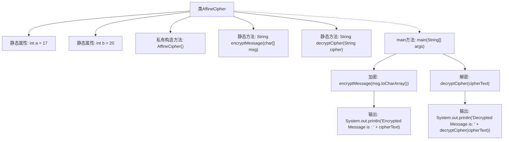

# 基础信息

|      |      |
|------|------|
| 名称 | AffineCipher |
| 编码语言 | .java |
| 代码路径 | Java/src/main/java/com/thealgorithms/ciphers/AffineCipher.java |
| 包名 | com.thealgorithms.ciphers |
| 依赖项 | [] |
| 概述说明 | AffineCipher类实现A-Z字母加密解密，参数a=17，b=20。 |

# 说明

AffineCipher类实现了加密和解密功能，采用a=17和b=20作为参数，仅支持大写字母A-Z。该类通过Affine密码算法对文本进行加密和解密操作，确保数据的安全性和保密性。

# 类列表 Class Summary

| 名称   | 类型  | 说明 |
|-------|------|-------------|
| AffineCipher | class | AffineCipher类实现加密解密，使用a=17和b=20，支持字母A-Z。 |

## 类 AffineCipher

|      |      |
|------|------|
| 访问范围 | final |
| 类型 | class |
| 名称 | AffineCipher |
| 说明 | AffineCipher类实现加密解密，使用a=17和b=20，支持字母A-Z。 |

### UML类图

**类图描述：**  
`AffineCipher` 是一个不可继承的最终类，包含两个静态整型成员 `a` 和 `b`，分别用于加密和解密过程中的密钥计算。类中提供了两个核心方法：`encryptMessage` 用于加密消息，`decryptCipher` 用于解密消息。`main` 方法是程序的入口，展示了如何使用这两个方法进行加密和解密操作。类图清晰地展示了类的结构和方法之间的关系。

### 内部方法调用关系图

这段代码定义了一个`AffineCipher`类，实现了Affine密码的加密和解密功能。代码包含两个静态方法`encryptMessage`和`decryptCipher`，分别用于加密和解密消息。`main`方法演示了如何使用这两个方法，首先对消息进行加密，然后对加密后的消息进行解密，并输出结果。代码通过静态属性`a`和`b`定义了加密和解密所需的参数。

### 字段列表 Field List

| 名称  | 类型  | 说明 |
|-------|-------|------|
| a = 17 | int | 静态整型变量a初始化为17。 |
| b = 20 | int | 定义静态整型变量b，初始值为20。 |

### 方法列表 Method List

| 名称  | 类型  | 说明 |
|-------|-------|------|
| main | void | Java主函数实现AFFINE CIPHER加密解密，输出结果。 |
| decryptCipher | String | 解密算法通过求逆元和模运算解密字符串。 |
| encryptMessage | String | 加密函数使用公式(a * x + b) % 26加密字符，忽略空格。 |

