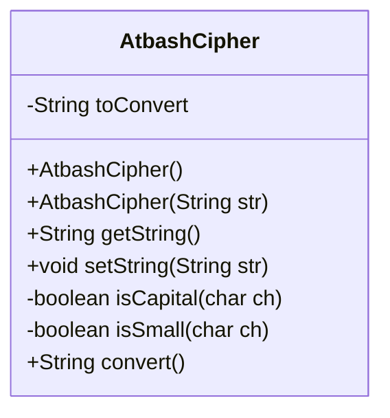
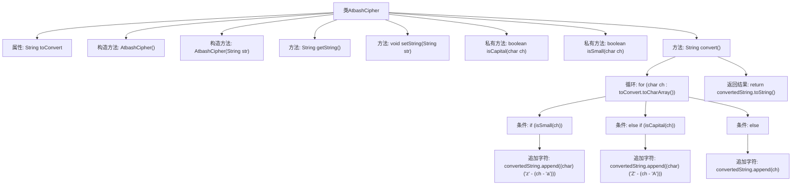

# 基础信息

|      |      |
|------|------|
| 名称 | AtbashCipher |
| 编码语言 | .java |
| 代码路径 | Java/src/main/java/com/thealgorithms/ciphers/AtbashCipher.java |
| 包名 | com.thealgorithms.ciphers |
| 依赖项 | [] |
| 概述说明 | AtbashCipher类实现Atbash加密，支持字符串转换和大小写检测。 |

# 说明

AtbashCipher类实现了Atbash加密算法，该算法通过将字母表中的每个字母映射为其对应的反向字母来进行加密。该类支持对输入字符串进行加密转换，并具备检测字符大小写的功能，确保加密过程中大小写字符的处理正确无误。通过这一实现，用户可以轻松地对文本进行Atbash加密操作。

# 类列表 Class Summary

| 名称   | 类型  | 说明 |
|-------|------|-------------|
| AtbashCipher | class | AtbashCipher类实现Atbash加密，支持字符串转换与大小写字符检测。 |

## 类 AtbashCipher

|      |      |
|------|------|
| 访问范围 | public |
| 类型 | class |
| 名称 | AtbashCipher |
| 说明 | AtbashCipher类实现Atbash加密，支持字符串转换与大小写字符检测。 |

### UML类图

这段代码定义了一个 `AtbashCipher` 类，用于实现 Atbash 密码的转换。Atbash 密码是一种简单的替换密码，它将字母表中的每个字母替换为与之对应的字母（A ↔ Z，B ↔ Y，依此类推）。类中包含了一个私有字符串 `toConvert`，用于存储待转换的字符串。类提供了构造方法、获取和设置字符串的方法，以及判断字符大小写的私有方法。`convert` 方法用于执行实际的转换操作，返回转换后的字符串。

### 内部方法调用关系图

这段代码定义了一个名为 `AtbashCipher` 的类，用于实现Atbash密码的转换。类中包含两个构造方法、获取和设置字符串的方法、判断字符大小写的私有方法，以及执行Atbash转换的核心方法 `convert()`。`convert()` 方法通过遍历字符串中的每个字符，判断其大小写并进行相应的转换，最终返回转换后的字符串。

### 字段列表 Field List

| 名称  | 类型  | 说明 |
|-------|-------|------|
| toConvert | String | 私有字符串变量toConvert用于存储待转换的数据。 |

### 方法列表 Method List

| 名称  | 类型  | 说明 |
|-------|-------|------|
| getString | String | 该方法返回一个字符串类型的变量toConvert。 |
| isSmall | boolean | 判断字符是否为小写字母。 |
| isCapital | boolean | 判断字符是否为大写字母。 |
| convert | String | 该方法将字符串中的小写和大写字母反转，其他字符保持不变。 |
| setString | void | 设置字符串方法，将输入字符串赋值给类变量。 |

