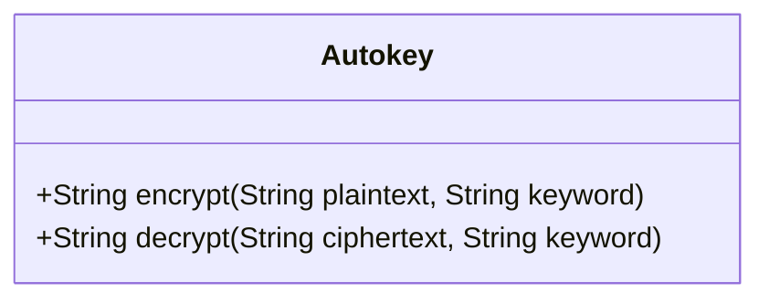
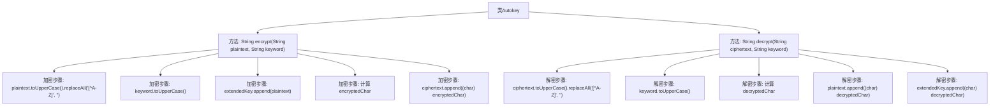

# 基础信息

|      |      |
|------|------|
| 名称 | Autokey |
| 编码语言 | .java |
| 代码路径 | Java/src/main/java/com/thealgorithms/ciphers/Autokey.java |
| 包名 | com.thealgorithms.ciphers |
| 依赖项 | [] |
| 概述说明 | Autokey类实现加密解密，支持自动密钥扩展。 |

# 说明

Autokey类实现了加密和解密功能，其核心特点是支持自动密钥扩展。该类通过动态扩展密钥，增强了加密的安全性。自动密钥扩展机制确保密钥长度与明文长度匹配，提高了加密过程的灵活性和安全性。该类适用于需要高安全性和动态密钥管理的场景。

# 类列表 Class Summary

| 名称   | 类型  | 说明 |
|-------|------|-------------|
| Autokey | class | Autokey类实现加密解密功能，支持自动密钥扩展。 |

## 类 Autokey

|      |      |
|------|------|
| 访问范围 | public |
| 类型 | class |
| 名称 | Autokey |
| 说明 | Autokey类实现加密解密功能，支持自动密钥扩展。 |

### UML类图

**描述：**  
`Autokey`类实现了自动密钥密码算法，提供了加密和解密功能。加密方法`encrypt`通过将明文与扩展密钥结合生成密文，解密方法`decrypt`则通过逆向操作将密文还原为明文。类中的方法处理输入时，会自动将字符转换为大写并移除非字母字符，确保算法正确执行。扩展密钥在加密和解密过程中动态更新，以增强安全性。

### 内部方法调用关系图

这段代码实现了一个Autokey加密和解密算法。`encrypt`方法首先对明文和关键字进行大写化和过滤非字母字符的处理，然后通过将明文附加到关键字中来扩展密钥，最后逐字符加密生成密文。`decrypt`方法则对密文进行类似的处理，并逐字符解密生成明文，同时将解密后的字符附加到扩展密钥中。整个过程确保了加密和解密的正确性和一致性。

### 字段列表 Field List

| 名称  | 类型  | 说明 |
|-------|-------|------|

### 方法列表 Method List

| 名称  | 类型  | 说明 |
|-------|-------|------|
| decrypt | String | 解密方法：处理输入，扩展密钥，逐字符解密，返回明文。 |
| encrypt | String | 该方法将明文和关键词转换为大写并过滤非字母字符，扩展关键词后通过字符位移加密生成密文。 |

