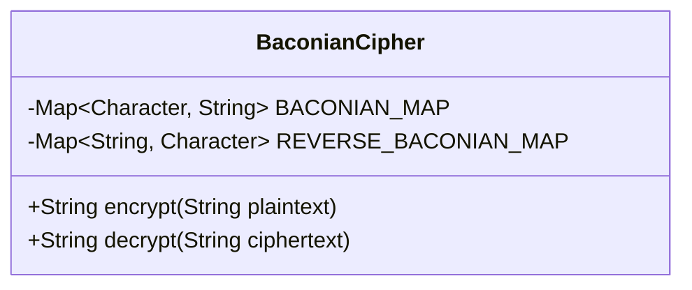
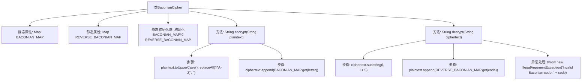

# 基础信息

|      |      |
|------|------|
| 名称 | BaconianCipher |
| 编码语言 | .java |
| 代码路径 | Java/src/main/java/com/thealgorithms/ciphers/BaconianCipher.java |
| 包名 | com.thealgorithms.ciphers |
| 依赖项 | ['java.util.HashMap', 'java.util.Map'] |
| 概述说明 | BaconianCipher类实现培根密码加密解密，采用A/B序列映射字母。 |

# 说明

BaconianCipher类实现了培根密码的加密与解密功能。该类利用A/B序列来映射字母，通过特定的序列组合来表示不同的字母，从而实现信息的加密与解密。培根密码是一种隐写术，通过两种不同的符号或形式来隐藏信息，常用于文本中的秘密通信。该类的主要功能是将普通文本转换为培根密码序列，以及将培根密码序列还原为原始文本。

# 类列表 Class Summary

| 名称   | 类型  | 说明 |
|-------|------|-------------|
| BaconianCipher | class | BaconianCipher类实现培根密码的加密与解密功能，使用A/B序列映射字母。 |

## 类 BaconianCipher

|      |      |
|------|------|
| 访问范围 | public |
| 类型 | class |
| 名称 | BaconianCipher |
| 说明 | BaconianCipher类实现培根密码的加密与解密功能，使用A/B序列映射字母。 |

### UML类图

**描述：**  
`BaconianCipher` 类实现了培根密码的加密和解密功能。它包含两个静态的 `Map` 成员变量：`BACONIAN_MAP` 用于存储字符到培根码的映射，`REVERSE_BACONIAN_MAP` 用于存储培根码到字符的映射。`encrypt` 方法将输入的明文字符串转换为培根码，`decrypt` 方法将培根码转换回明文字符串。类初始化时，通过静态代码块初始化了培根码的映射表，并处理了字母 `I` 和 `J` 的特殊情况。

### 内部方法调用关系图

这段代码实现了一个BaconianCipher类，用于加密和解密文本。类中包含两个静态属性BACONIAN_MAP和REVERSE_BACONIAN_MAP，分别用于存储字符到Baconian码的映射和反向映射。静态初始化块用于初始化这两个映射，并处理I和J的特殊情况。encrypt方法用于将明文转换为Baconian码，decrypt方法用于将Baconian码转换回明文。流程图展示了类的结构和方法之间的调用关系。

### 字段列表 Field List

| 名称  | 类型  | 说明 |
|-------|-------|------|
| REVERSE_BACONIAN_MAP = new HashMap<>() | Map<String, Character> | 定义了私有静态常量REVERSE_BACONIAN_MAP，类型为Map<String, Character>。 |
| BACONIAN_MAP = new HashMap<>() | Map<Character, String> | 定义了一个静态常量映射，键为字符，值为字符串。 |

### 方法列表 Method List

| 名称  | 类型  | 说明 |
|-------|-------|------|
| decrypt | String | 解密方法：每5字符为一段，通过反向映射表转换为明文，无效代码抛出异常。 |
| encrypt | String | 该方法将明文转换为大写并去除非字母字符，然后使用BACONIAN_MAP加密成密文。 |

