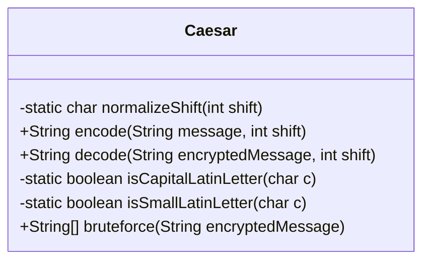
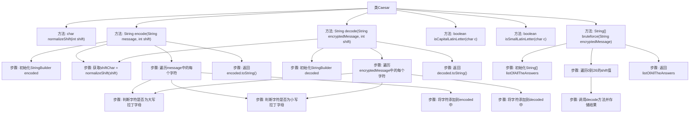

# 基础信息

|      |      |
|------|------|
| 名称 | Caesar |
| 编码语言 | .java |
| 代码路径 | Java/src/main/java/com/thealgorithms/ciphers/Caesar.java |
| 包名 | com.thealgorithms.ciphers |
| 依赖项 | [] |
| 概述说明 | Caesar类实现凯撒加密解密，支持大小写字母，含暴力破解功能。 |

# 说明

Caesar类实现了凯撒加密和解密功能，支持对大小写拉丁字母进行加密和解密操作。该类还提供了暴力破解功能，能够尝试所有可能的密钥组合以破解密文。通过该实现，用户可以方便地进行凯撒密码的加密、解密以及针对密文的暴力破解操作，适用于需要简单加密和解密的场景。

# 类列表 Class Summary

| 名称   | 类型  | 说明 |
|-------|------|-------------|
| Caesar | class | Caesar类实现凯撒加密解密，支持大小写拉丁字母，提供暴力破解功能。 |

## 类 Caesar

|      |      |
|------|------|
| 访问范围 | public |
| 类型 | class |
| 名称 | Caesar |
| 说明 | Caesar类实现凯撒加密解密，支持大小写拉丁字母，提供暴力破解功能。 |

### UML类图

**描述：**  
`Caesar` 类实现了一个简单的凯撒加密和解密算法。它提供了 `encode` 方法用于将输入的字符串进行加密，`decode` 方法用于将加密后的字符串进行解密，`bruteforce` 方法用于尝试所有可能的偏移量来解密字符串。`normalizeShift` 方法用于将偏移量归一化到 0-25 的范围内，`isCapitalLatinLetter` 和 `isSmallLatinLetter` 方法用于判断字符是否为大写或小写拉丁字母。

### 内部方法调用关系图

**流程图描述：**  
该流程图展示了Caesar类的主要方法和执行流程。`encode`方法通过`normalizeShift`获取移位字符，遍历输入消息并根据字符类型进行加密处理，最后返回加密后的字符串。`decode`方法类似，但执行相反的操作以解密消息。`bruteforce`方法通过遍历所有可能的移位值，调用`decode`方法生成所有可能的解密结果。整个流程清晰地展示了字符处理和加密解密的逻辑。

### 字段列表 Field List

| 名称  | 类型  | 说明 |
|-------|-------|------|

### 方法列表 Method List

| 名称  | 类型  | 说明 |
|-------|-------|------|
| normalizeShift | char | 方法normalizeShift将整数shift模26后转为字符。 |
| isCapitalLatinLetter | boolean | 该方法用于判断字符是否为大写拉丁字母。 |
| isSmallLatinLetter | boolean | 该方法检查字符是否为小写拉丁字母。 |
| decode | String | 解码方法通过移位解密字符串，处理大小写字母，保留其他字符。 |
| encode | String | 该方法通过字符位移对消息进行编码，支持大小写拉丁字母，超出范围则循环处理。 |
| bruteforce | String[] | 暴力破解加密消息，生成27种可能解码结果。 |

