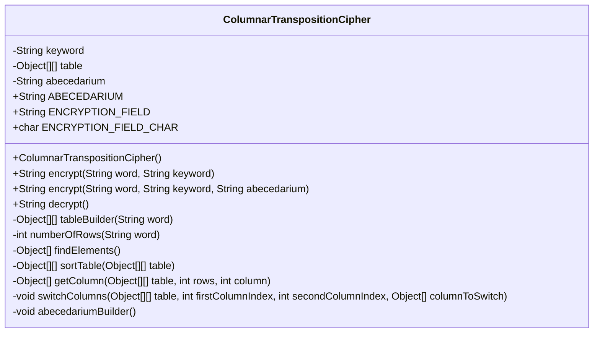
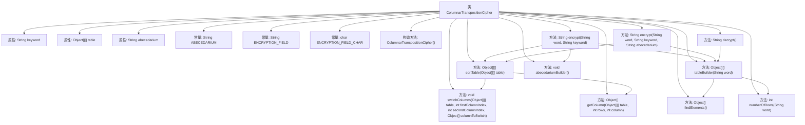

# 基础信息

|      |      |
|------|------|
| 名称 | ColumnarTranspositionCipher |
| 编码语言 | .java |
| 代码路径 | Java/src/main/java/com/thealgorithms/ciphers/ColumnarTranspositionCipher.java |
| 包名 | com.thealgorithms.ciphers |
| 依赖项 | ['java.util.Objects'] |
| 概述说明 | 列转置加密类支持自定义字母表，通过排序表实现加解密。 |

# 说明

列转置加密类是一种提供加密和解密功能的工具，支持用户自定义字母表。该加密方法通过构建排序表来实现加密过程，具体步骤包括对输入文本进行列排列，然后根据排序表重新排列列的顺序，从而实现加密。解密过程则相反，通过逆向操作恢复原始文本。该方法灵活性强，用户可根据需求自定义字母表，增强加密的安全性。

# 类列表 Class Summary

| 名称   | 类型  | 说明 |
|-------|------|-------------|
| ColumnarTranspositionCipher | class | 列转置加密类，提供加密解密功能，支持自定义字母表，通过构建排序表实现加密。 |

## 类 ColumnarTranspositionCipher

|      |      |
|------|------|
| 访问范围 | public final |
| 类型 | class |
| 名称 | ColumnarTranspositionCipher |
| 说明 | 列转置加密类，提供加密解密功能，支持自定义字母表，通过构建排序表实现加密。 |

### UML类图

这段代码实现了一个列置换密码（Columnar Transposition Cipher）的加密和解密功能。`ColumnarTranspositionCipher`类包含多个静态方法，用于构建加密表、排序表、加密和解密字符串。类中的私有方法用于辅助完成这些功能，如`tableBuilder`用于构建加密表，`sortTable`用于对表进行排序，`abecedariumBuilder`用于生成字符集。该类通过静态方法提供加密和解密功能，并且支持自定义字符集。

### 内部方法调用关系图

### 描述
该流程图展示了`ColumnarTranspositionCipher`类的结构及其内部方法之间的调用关系。类中包含多个属性和常量，用于实现列转置加密算法。主要方法包括`encrypt`、`decrypt`、`tableBuilder`、`numberOfRows`、`findElements`、`sortTable`、`getColumn`、`switchColumns`和`abecedariumBuilder`。这些方法相互协作，通过构建表格、排序列、获取列和切换列等操作，最终实现加密和解密功能。

### 字段列表 Field List

| 名称  | 类型  | 说明 |
|-------|-------|------|
| keyword | String | 定义了一个私有的静态字符串变量keyword。 |
| table | Object[][] | 私有静态二维对象数组table定义。 |
| ENCRYPTION_FIELD_CHAR = '≈' | char | 定义常量字符用于加密字段，值为'≈'。 |
| ABECEDARIUM = "abcdefghijklmnopqrstuvwxyzABCDEFG"        + "HIJKLMNOPQRSTUVWXYZ0123456789,.;:-@" | String | ABECEDARIUM包含字母、数字及符号的字符串常量。 |
| abecedarium | String | 定义了一个私有的静态字符串变量abecedarium。 |
| ENCRYPTION_FIELD = "≈" | String | 定义常量字符串ENCRYPTION_FIELD，值为"≈"。 |

### 方法列表 Method List

| 名称  | 类型  | 说明 |
|-------|-------|------|
| switchColumns | void | 交换二维数组表格中两列数据。 |
| getColumn | Object[] | 从二维数组中提取指定列并返回一维数组。 |
| tableBuilder | Object[][] | 构建二维数组表，填充字符和加密字段。 |
| decrypt | String | 静态方法decrypt解密数据，返回处理后的字符串。 |
| abecedariumBuilder | void | 静态方法生成包含0到255字符的字符串。 |
| numberOfRows | int | 计算字符串按关键字长度分割后的行数。 |
| encrypt | String | 使用关键词对单词进行列置换加密。 |
| findElements | Object[] | 该方法遍历关键字字符，返回其在字母表中的索引数组，未找到则返回null。 |
| sortTable | Object[][] | 该方法对二维数组按首行数值升序排序，返回排序后的数组。 |
| encrypt | String | 静态方法加密字符串，使用关键字和字母表生成转置表并排序后拼接成密文。 |

