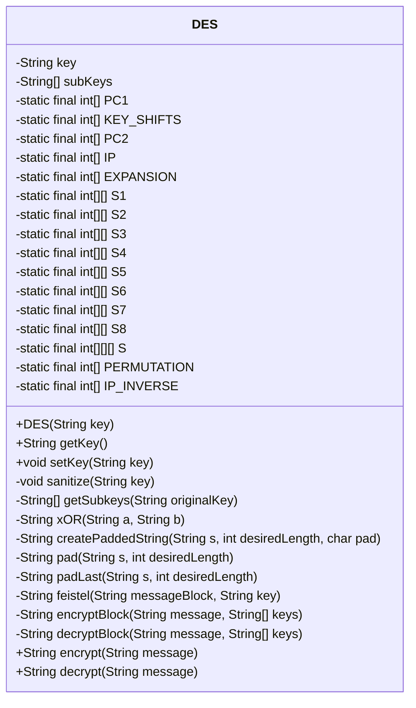
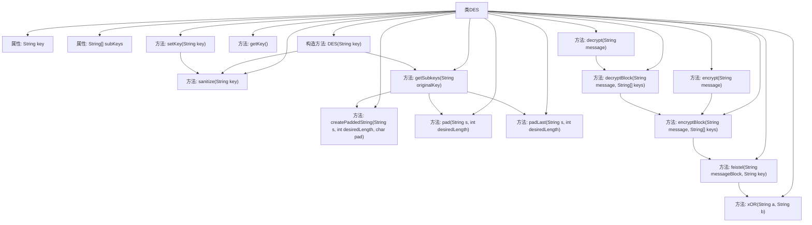

# 基础信息

|      |      |
|------|------|
| 名称 | DES |
| 编码语言 | .java |
| 代码路径 | Java/src/main/java/com/thealgorithms/ciphers/DES.java |
| 包名 | com.thealgorithms.ciphers |
| 依赖项 | [] |
| 概述说明 | DES加密类，支持密钥验证、子密钥生成及加密解密功能。 |

# 说明

DES加密类是一个实现数据加密标准（DES）算法的工具，具备密钥验证、子密钥生成、加密和解密功能。密钥验证确保输入的密钥符合DES算法的要求，子密钥生成过程通过特定算法从主密钥派生出一组子密钥，用于后续的加密和解密操作。加密功能将明文转换为密文，而解密功能则将密文恢复为原始明文。该类全面支持DES算法的核心流程，确保数据的安全性和完整性。

# 类列表 Class Summary

| 名称   | 类型  | 说明 |
|-------|------|-------------|
| DES | class | DES加密类，包含密钥验证、子密钥生成、加密解密功能。 |

## 类 DES

|      |      |
|------|------|
| 访问范围 | public |
| 类型 | class |
| 名称 | DES |
| 说明 | DES加密类，包含密钥验证、子密钥生成、加密解密功能。 |

### UML类图

**描述：**
`DES` 类实现了数据加密标准（DES）算法，用于对数据进行加密和解密。该类包含多个静态常量数组，用于定义DES算法中的置换表、扩展表、S盒等。主要方法包括 `encrypt` 和 `decrypt`，分别用于加密和解密数据。`getSubkeys` 方法用于生成子密钥，`feistel` 方法实现了Feistel网络的核心逻辑。`encryptBlock` 和 `decryptBlock` 方法分别用于加密和解密单个数据块。该类通过严格的输入验证和密钥管理，确保了加密过程的安全性和正确性。

### 内部方法调用关系图

这段代码实现了一个DES加密算法，包含了密钥的生成、加密和解密功能。流程图展示了类DES的主要方法和属性之间的调用关系。`sanitize`方法用于验证密钥的长度，`getSubkeys`方法生成子密钥，`encrypt`和`decrypt`方法分别用于加密和解密数据。Feistel函数在加密过程中用于混淆和扩散数据，确保加密的安全性。

### 字段列表 Field List

| 名称  | 类型  | 说明 |
|-------|-------|------|
| key | String | 声明了一个私有字符串类型的变量key。 |
| subKeys | String[] | 定义了一个私有的不可变字符串数组subKeys。 |
| EXPANSION = {32, 1, 2, 3, 4, 5, 4, 5, 6, 7, 8, 9, 8, 9, 10, 11, 12, 13, 12, 13, 14, 15, 16, 17, 16, 17, 18, 19, 20, 21, 20, 21, 22, 23, 24, 25, 24, 25, 26, 27, 28, 29, 28, 29, 30, 31, 32, 1} | int[] | 定义了一个包含48个整数的扩展数组。 |
| PC2 = {14, 17, 11, 24, 1, 5, 3, 28, 15, 6, 21, 10, 23, 19, 12, 4, 26, 8, 16, 7, 27, 20, 13, 2, 41, 52, 31, 37, 47, 55, 30, 40, 51, 45, 33, 48, 44, 49, 39, 56, 34, 53, 46, 42, 50, 36, 29, 32} | int[] | PC2为DES算法中的置换表，包含48个元素。 |
| KEY_SHIFTS = {1, 1, 2, 2, 2, 2, 2, 2, 1, 2, 2, 2, 2, 2, 2, 1} | int[] | 定义了16个元素的整型数组，表示密钥移位模式。 |
| IP_INVERSE = {40, 8, 48, 16, 56, 24, 64, 32, 39, 7, 47, 15, 55, 23, 63, 31, 38, 6, 46, 14, 54, 22, 62, 30, 37, 5, 45, 13, 53, 21, 61, 29, 36, 4, 44, 12, 52, 20, 60, 28, 35, 3, 43, 11, 51, 19, 59, 27, 34, 2, 42, 10, 50, 18, 58, 26, 33, 1, 41, 9, 49, 17, 57, 25} | int[] | IP_INVERSE数组定义了64个逆序排列的整数值。 |
| PC1 = {57, 49, 41, 33, 25, 17, 9, 1, 58, 50, 42, 34, 26, 18, 10, 2, 59, 51, 43, 35, 27, 19, 11, 3, 60, 52, 44, 36, 63, 55, 47, 39, 31, 23, 15, 7, 62, 54, 46, 38, 30, 22, 14, 6, 61, 53, 45, 37, 29, 21, 13, 5, 28, 20, 12, 4} | int[] | PC1数组包含56个整数，用于DES算法的初始密钥置换。 |
| IP = {58, 50, 42, 34, 26, 18, 10, 2, 60, 52, 44, 36, 28, 20, 12, 4, 62, 54, 46, 38, 30, 22, 14, 6, 64, 56, 48, 40, 32, 24, 16, 8, 57, 49, 41, 33, 25, 17, 9, 1, 59, 51, 43, 35, 27, 19, 11, 3, 61, 53, 45, 37, 29, 21, 13, 5, 63, 55, 47, 39, 31, 23, 15, 7} | int[] | 定义了一个包含64个整数的IP数组。 |
| S6 = {{12, 1, 10, 15, 9, 2, 6, 8, 0, 13, 3, 4, 14, 7, 5, 11}, {10, 15, 4, 2, 7, 12, 9, 5, 6, 1, 13, 14, 0, 11, 3, 8}, {9, 14, 15, 5, 2, 8, 12, 3, 7, 0, 4, 10, 1, 13, 11, 6}, {4, 3, 2, 12, 9, 5, 15, 10, 11, 14, 1, 7, 6, 0, 8, 13}} | int[][] | S6是一个4x16的二维整型数组，用于存储特定值。 |
| S3 = {{10, 0, 9, 14, 6, 3, 15, 5, 1, 13, 12, 7, 11, 4, 2, 8}, {13, 7, 0, 9, 3, 4, 6, 10, 2, 8, 5, 14, 12, 11, 15, 1}, {13, 6, 4, 9, 8, 15, 3, 0, 11, 1, 2, 12, 5, 10, 14, 7}, {1, 10, 13, 0, 6, 9, 8, 7, 4, 15, 14, 3, 11, 5, 2, 12}} | int[][] | 定义了一个4x16的二维整型数组S3，包含预置数值。 |
| S4 = {{7, 13, 14, 3, 0, 6, 9, 10, 1, 2, 8, 5, 11, 12, 4, 15}, {13, 8, 11, 5, 6, 15, 0, 3, 4, 7, 2, 12, 1, 10, 14, 9}, {10, 6, 9, 0, 12, 11, 7, 13, 15, 1, 3, 14, 5, 2, 8, 4}, {3, 15, 0, 6, 10, 1, 13, 8, 9, 4, 5, 11, 12, 7, 2, 14}} | int[][] | 定义了一个4x16的二维整型数组S4，包含4组16个整数值。 |
| S5 = {{2, 12, 4, 1, 7, 10, 11, 6, 8, 5, 3, 15, 13, 0, 14, 9}, {14, 11, 2, 12, 4, 7, 13, 1, 5, 0, 15, 10, 3, 9, 8, 6}, {4, 2, 1, 11, 10, 13, 7, 8, 15, 9, 12, 5, 6, 3, 0, 14}, {11, 8, 12, 7, 1, 14, 2, 13, 6, 15, 0, 9, 10, 4, 5, 3}} | int[][] | S5是一个4x16的二维整型数组，用于特定算法映射。 |
| S = {S1, S2, S3, S4, S5, S6, S7, S8} | int[][][] | 定义了一个私有的静态三维整型数组S，包含S1到S8八个元素。 |
| S8 = {{13, 2, 8, 4, 6, 15, 11, 1, 10, 9, 3, 14, 5, 0, 12, 7}, {1, 15, 13, 8, 10, 3, 7, 4, 12, 5, 6, 11, 0, 14, 9, 2}, {7, 11, 4, 1, 9, 12, 14, 2, 0, 6, 10, 13, 15, 3, 5, 8}, {2, 1, 14, 7, 4, 10, 8, 13, 15, 12, 9, 0, 3, 5, 6, 11}} | int[][] | 定义了一个私有静态二维整型数组S8，包含4行16列的数值。 |
| S1 = {{14, 4, 13, 1, 2, 15, 11, 8, 3, 10, 6, 12, 5, 9, 0, 7}, {0, 15, 7, 4, 14, 2, 13, 1, 10, 6, 12, 11, 9, 5, 3, 8}, {4, 1, 14, 8, 13, 6, 2, 11, 15, 12, 9, 7, 3, 10, 5, 0}, {15, 12, 8, 2, 4, 9, 1, 7, 5, 11, 3, 14, 10, 0, 6, 13}} | int[][] | 定义了一个4x16的静态二维整型数组S1。 |
| PERMUTATION = {16, 7, 20, 21, 29, 12, 28, 17, 1, 15, 23, 26, 5, 18, 31, 10, 2, 8, 24, 14, 32, 27, 3, 9, 19, 13, 30, 6, 22, 11, 4, 25} | int[] | 定义了一个包含32个整数的静态不可变数组PERMUTATION。 |
| S2 = {{15, 1, 8, 14, 6, 11, 3, 4, 9, 7, 2, 13, 12, 0, 5, 10}, {3, 13, 4, 7, 15, 2, 8, 14, 12, 0, 1, 10, 6, 9, 11, 5}, {0, 14, 7, 11, 10, 4, 13, 1, 5, 8, 12, 6, 9, 3, 2, 15}, {13, 8, 10, 1, 3, 15, 4, 2, 11, 6, 7, 12, 0, 5, 14, 9}} | int[][] | S2为4x16的二维整型数组，包含固定数值。 |
| S7 = {{4, 11, 2, 14, 15, 0, 8, 13, 3, 12, 9, 7, 5, 10, 6, 1}, {13, 0, 11, 7, 4, 9, 1, 10, 14, 3, 5, 12, 2, 15, 8, 6}, {1, 4, 11, 13, 12, 3, 7, 14, 10, 15, 6, 8, 0, 5, 9, 2}, {6, 11, 13, 8, 1, 4, 10, 7, 9, 5, 0, 15, 14, 2, 3, 12}} | int[][] | S7为4x16的二维整型数组，包含4行16列的固定数值。 |

### 方法列表 Method List

| 名称  | 类型  | 说明 |
|-------|-------|------|
| getKey | String | 获取当前对象的键值。 |
| setKey | void | 设置并清理键值。 |
| sanitize | void | 检查字符串长度是否为64，否则抛出异常。 |
| createPaddedString | String | 方法生成指定长度填充字符的字符串。 |
| xOR | String | 该方法实现两个字符串的按位异或操作，返回结果字符串。 |
| padLast | String | 该方法在字符串末尾填充空字符至指定长度。 |
| getSubkeys | String[] | 该方法通过PC1和PC2置换生成16个48位子密钥。 |
| pad | String | 该方法用零填充字符串至指定长度，并返回填充后的字符串。 |
| decrypt | String | 解密方法，检查消息长度是否为64的倍数，按块解密并去除填充的空字节。 |
| feistel | String | Feistel函数通过扩展、混合、替换和置换处理消息块和密钥。 |
| encryptBlock | String | 加密方法通过置换和16轮Feistel网络处理64位消息块，最终返回加密结果。 |
| encrypt | String | 该方法对消息进行加密，确保长度是8的倍数，将消息分块后转换为二进制并加密。 |
| decryptBlock | String | 解密块方法通过反转密钥数组并调用加密块方法实现解密。 |

