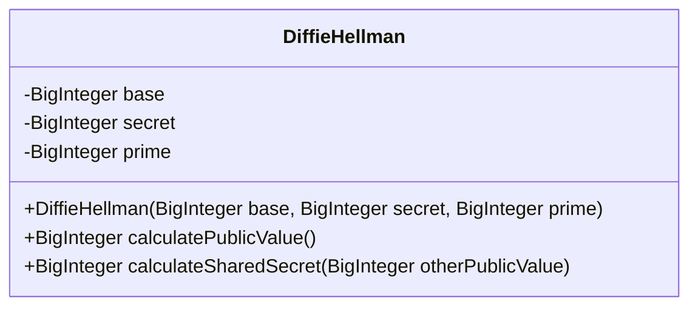
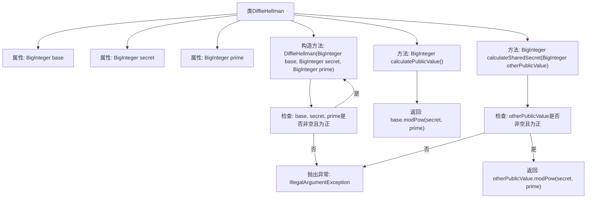

# 基础信息

|      |      |
|------|------|
| 名称 | DiffieHellman |
| 编码语言 | .java |
| 代码路径 | Java/src/main/java/com/thealgorithms/ciphers/DiffieHellman.java |
| 包名 | com.thealgorithms.ciphers |
| 依赖项 | ['java.math.BigInteger'] |
| 概述说明 | DiffieHellman类实现密钥交换，含构造方法和公钥、共享密钥计算。 |

# 说明

DiffieHellman类用于实现密钥交换功能，主要包括构造方法和两个关键方法：计算公钥和共享密钥。构造方法用于初始化类实例，计算公钥方法生成用于交换的公钥，共享密钥方法则根据对方公钥生成共享密钥，确保双方能够安全地协商出相同的密钥。该类实现了Diffie-Hellman密钥交换协议的核心功能。

# 类列表 Class Summary

| 名称   | 类型  | 说明 |
|-------|------|-------------|
| DiffieHellman | class | DiffieHellman类实现密钥交换，包含构造方法和计算公钥、共享密钥的方法。 |

## 类 DiffieHellman

|      |      |
|------|------|
| 访问范围 | public final |
| 类型 | class |
| 名称 | DiffieHellman |
| 说明 | DiffieHellman类实现密钥交换，包含构造方法和计算公钥、共享密钥的方法。 |

### UML类图

这段代码定义了一个 `DiffieHellman` 类，用于实现Diffie-Hellman密钥交换算法。该类包含三个私有成员变量：`base`、`secret` 和 `prime`，分别表示基值、私钥和大素数。构造函数用于初始化这些变量，并检查它们是否为正数且非空。`calculatePublicValue` 方法用于计算公钥（即 `g^x mod p`），而 `calculateSharedSecret` 方法用于计算共享密钥（即 `otherPublic^secret mod p`）。这两个方法都依赖于 `BigInteger` 的 `modPow` 方法来进行模幂运算。

### 内部方法调用关系图

这段代码定义了一个 `DiffieHellman` 类，用于实现 Diffie-Hellman 密钥交换算法。类中包含三个属性：`base`、`secret` 和 `prime`，分别表示基数、私钥和大素数。构造方法用于初始化这些属性，并在输入值非法时抛出异常。`calculatePublicValue` 方法计算并返回公钥，`calculateSharedSecret` 方法计算并返回共享密钥。流程图展示了类的结构、方法调用关系以及异常处理逻辑。

### 字段列表 Field List

| 名称  | 类型  | 说明 |
|-------|-------|------|
| secret | BigInteger | 声明一个不可变的BigInteger类型私有变量secret。 |
| base | BigInteger | 私有不可变的BigInteger类型变量base。 |
| prime | BigInteger | 声明一个私有的不可变大整数变量prime。 |

### 方法列表 Method List

| 名称  | 类型  | 说明 |
|-------|-------|------|
| calculatePublicValue | BigInteger | 计算公钥值，返回g的x次方模p的结果。 |
| calculateSharedSecret | BigInteger | 计算共享密钥，需输入非空正数，返回模幂结果。 |

