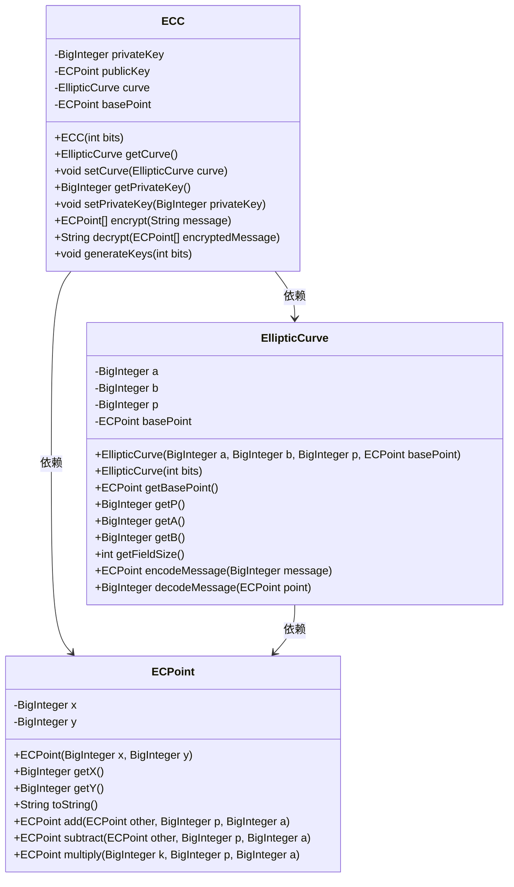

# 基础信息

|      |      |
|------|------|
| 名称 | ECC |
| 编码语言 | .java |
| 代码路径 | Java/src/main/java/com/thealgorithms/ciphers/ECC.java |
| 包名 | com.thealgorithms.ciphers |
| 依赖项 | ['java.math.BigInteger', 'java.security.SecureRandom'] |
| 概述说明 | ECC实现椭圆曲线加密，生成密钥对并支持消息加解密。 |

# 说明

ECC类实现了椭圆曲线加密算法，主要用于生成密钥对并支持消息的加密和解密操作。该类的核心功能包括生成公钥和私钥，以及利用这些密钥对消息进行加密和解密，确保数据传输的安全性。通过椭圆曲线加密技术，ECC类提供了高效且安全的加密解决方案，适用于需要高安全性和低计算开销的场景。

# 类列表 Class Summary

| 名称   | 类型  | 说明 |
|-------|------|-------------|
| ECC | class | ECC类实现椭圆曲线加密，生成密钥对并支持消息加解密。 |

## 类 ECC

|      |      |
|------|------|
| 访问范围 | public |
| 类型 | class |
| 名称 | ECC |
| 说明 | ECC类实现椭圆曲线加密，生成密钥对并支持消息加解密。 |

### UML类图

这段代码定义了一个基于椭圆曲线加密（ECC）的加密系统。`ECC`类负责生成公钥和私钥，并提供加密和解密功能。`EllipticCurve`类表示椭圆曲线的数学结构，包括曲线参数和基点。`ECPoint`类表示椭圆曲线上的点，并提供了点的加法、减法和乘法操作。整个系统通过这些类的协作实现加密和解密功能，确保了数据的安全性和完整性。

### 内部方法调用关系图

```mermaid
graph TD
    A["类ECC"]
    B["属性: BigInteger privateKey"]
    C["属性: ECPoint publicKey"]
    D["属性: EllipticCurve curve"]
    E["属性: ECPoint basePoint"]
    F["构造方法: ECC(int bits)"]
    G["方法: EllipticCurve getCurve()"]
    H["方法: void setCurve(EllipticCurve curve)"]
    I["方法: BigInteger getPrivateKey()"]
    J["方法: void setPrivateKey(BigInteger privateKey)"]
    K["方法: ECPoint[] encrypt(String message)"]
    L["方法: String decrypt(ECPoint[] encryptedMessage)"]
    M["方法: final void generateKeys(int bits)"]
    N["内部类: EllipticCurve"]
    O["内部类: ECPoint"]

    A --> B
    A --> C
    A --> D
    A --> E
    A --> F
    A --> G
    A --> H
    A --> I
    A --> J
    A --> K
    A --> L
    A --> M
    A -.-> N
    A -.-> O

    N --> P["属性: BigInteger a"]
    N --> Q["属性: BigInteger b"]
    N --> R["属性: BigInteger p"]
    N --> S["属性: ECPoint basePoint"]
    N --> T["构造方法: EllipticCurve(BigInteger a, BigInteger b, BigInteger p, ECPoint basePoint)"]
    N --> U["构造方法: EllipticCurve(int bits)"]
    N --> V["方法: ECPoint getBasePoint()"]
    N --> W["方法: BigInteger getP()"]
    N --> X["方法: BigInteger getA()"]
    N --> Y["方法: BigInteger getB()"]
    N --> Z["方法: int getFieldSize()"]
    N --> AA["方法: ECPoint encodeMessage(BigInteger message)"]
    N --> AB["方法: BigInteger decodeMessage(ECPoint point)"]

    O --> AC["属性: BigInteger x"]
    O --> AD["属性: BigInteger y"]
    O --> AE["构造方法: ECPoint(BigInteger x, BigInteger y)"]
    O --> AF["方法: BigInteger getX()"]
    O --> AG["方法: BigInteger getY()"]
    O --> AH["重写方法: String toString()"]
    O --> AI["方法: ECPoint add(ECPoint other, BigInteger p, BigInteger a)"]
    O --> AJ["方法: ECPoint subtract(ECPoint other, BigInteger p, BigInteger a)"]
    O --> AK["方法: ECPoint multiply(BigInteger k, BigInteger p, BigInteger a)"]
```

这段代码实现了一个基于椭圆曲线密码学（ECC）的加密和解密系统。类`ECC`包含生成密钥对、加密和解密消息的功能，内部类`EllipticCurve`和`ECPoint`分别表示椭圆曲线和曲线上的点。`ECC`类通过调用`generateKeys`方法生成公钥和私钥，`encrypt`方法使用公钥加密消息，`decrypt`方法使用私钥解密消息。内部类`EllipticCurve`定义了椭圆曲线的参数和操作，`ECPoint`类实现了椭圆曲线上点的加法、减法和乘法操作。

### 字段列表 Field List

| 名称  | 类型  | 说明 |
|-------|-------|------|
| privateKey | BigInteger | 声明了一个私有的BigInteger类型变量privateKey。 |
| basePoint | ECPoint | 私有的椭圆曲线基点变量声明。 |
| publicKey | ECPoint | 私有变量publicKey，类型为ECPoint。 |
| curve | EllipticCurve | 定义私有椭圆曲线变量curve。 |

### 方法列表 Method List

| 名称  | 类型  | 说明 |
|-------|-------|------|
| getCurve | EllipticCurve | 获取并返回当前椭圆曲线对象。 |
| getPrivateKey | BigInteger | 获取私钥的方法，返回BigInteger类型。 |
| generateKeys | void | 生成椭圆曲线密钥对，包括私钥和公钥。 |
| encrypt | ECPoint[] | 使用椭圆曲线加密算法将消息转换为两个加密点。 |
| setCurve | void | 设置椭圆曲线参数。 |
| decrypt | String | 解密方法：使用私钥对密文进行解密并转换为字符串。 |
| setPrivateKey | void | 设置私有密钥方法，参数为BigInteger类型。 |

