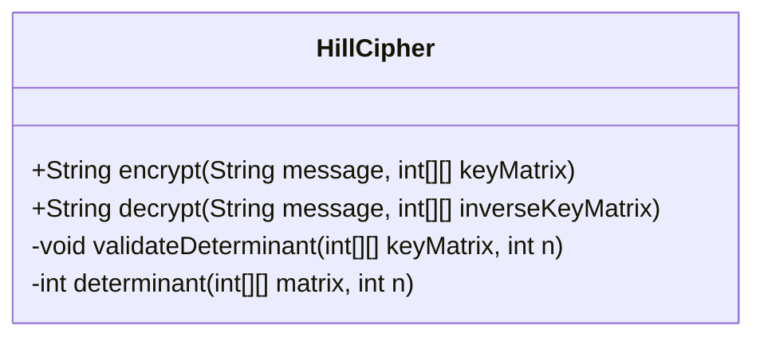
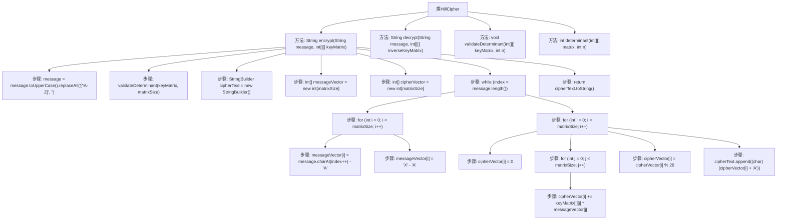

# 基础信息

|      |      |
|------|------|
| 名称 | HillCipher |
| 编码语言 | .java |
| 代码路径 | Java/src/main/java/com/thealgorithms/ciphers/HillCipher.java |
| 包名 | com.thealgorithms.ciphers |
| 依赖项 | [] |
| 概述说明 | HillCipher类实现加密解密，验证矩阵行列式并计算其值。 |

# 说明

HillCipher类实现了加密和解密功能，主要用于处理文本的加密和解密操作。在加密和解密过程中，该类会验证所使用的矩阵的行列式，并计算其值以确保矩阵的有效性和可逆性。行列式的计算是确保矩阵能够用于加密和解密的关键步骤，因为只有行列式不为零的矩阵才能进行逆矩阵的计算，从而保证解密过程的正确性。

# 类列表 Class Summary

| 名称   | 类型  | 说明 |
|-------|------|-------------|
| HillCipher | class | HillCipher类实现加密解密功能，验证矩阵行列式并计算其值。 |

## 类 HillCipher

|      |      |
|------|------|
| 访问范围 | public |
| 类型 | class |
| 名称 | HillCipher |
| 说明 | HillCipher类实现加密解密功能，验证矩阵行列式并计算其值。 |

### UML类图

**描述：**  
`HillCipher` 类实现了希尔密码算法，提供了加密和解密功能。`encrypt` 方法使用密钥矩阵对消息进行加密，`decrypt` 方法使用逆密钥矩阵对消息进行解密。`validateDeterminant` 方法用于验证密钥矩阵的行列式是否为零模26，而 `determinant` 方法递归计算矩阵的行列式。该类确保了加密和解密过程的安全性和正确性。

### 内部方法调用关系图

**描述：**  
该流程图展示了 `HillCipher` 类的加密和解密过程。加密方法 `encrypt` 首先将消息转换为大写并移除非字母字符，然后验证密钥矩阵的行列式是否为零。接着，它通过循环处理消息的每个字符，将其转换为向量并与密钥矩阵相乘，最终生成加密文本。解密方法 `decrypt` 的过程与加密类似，但使用逆密钥矩阵。`validateDeterminant` 方法用于验证矩阵的行列式，`determinant` 方法递归计算矩阵的行列式。

### 字段列表 Field List

| 名称  | 类型  | 说明 |
|-------|-------|------|

### 方法列表 Method List

| 名称  | 类型  | 说明 |
|-------|-------|------|
| validateDeterminant | void | 验证矩阵行列式非零，否则抛出异常。 |
| determinant | int | 递归计算矩阵行列式，通过子矩阵展开法实现。 |
| decrypt | String | 解密方法：使用逆矩阵解密大写字母消息，不足部分填充'X'。 |
| encrypt | String | 使用矩阵加密消息，填充X，返回密文。 |

