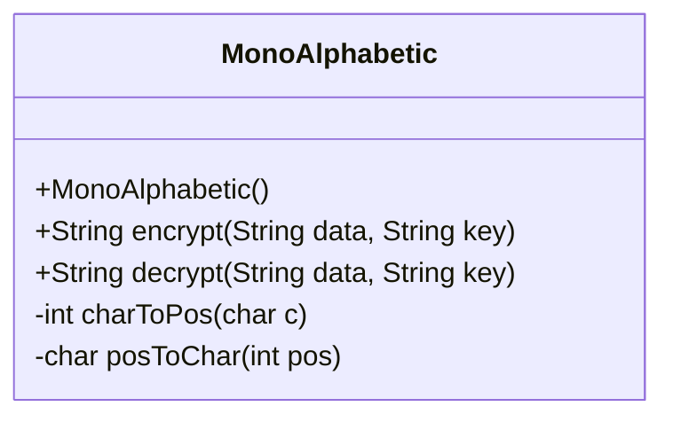
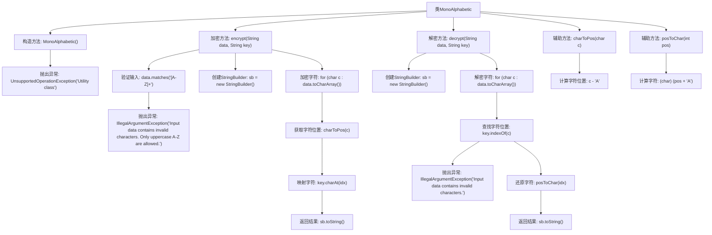

# 基础信息

|      |      |
|------|------|
| 名称 | MonoAlphabetic |
| 编码语言 | .java |
| 代码路径 | Java/src/main/java/com/thealgorithms/ciphers/MonoAlphabetic.java |
| 包名 | com.thealgorithms.ciphers |
| 依赖项 | [] |
| 概述说明 | MonoAlphabetic类实现大写字母加密解密，基于密钥字符映射。 |

# 说明

MonoAlphabetic类是一个用于加密和解密功能的工具，专门支持大写字母的处理。该类通过使用密钥来映射字符，从而实现加密和解密操作。其核心机制是利用密钥对字符进行一对一映射，确保加密后的字符能够通过相同的密钥进行解密。该类设计简洁，专注于大写字母的加密解密需求，适用于需要基本加密功能的场景。

# 类列表 Class Summary

| 名称   | 类型  | 说明 |
|-------|------|-------------|
| MonoAlphabetic | class | MonoAlphabetic类提供加密解密功能，支持大写字母，使用密钥映射字符。 |

## 类 MonoAlphabetic

|      |      |
|------|------|
| 访问范围 | public final |
| 类型 | class |
| 名称 | MonoAlphabetic |
| 说明 | MonoAlphabetic类提供加密解密功能，支持大写字母，使用密钥映射字符。 |

### UML类图

**描述：**  
`MonoAlphabetic` 是一个工具类，提供了加密和解密功能。加密方法 `encrypt` 将输入的字符串 `data` 中的每个字符映射到 `key` 中的对应字符，而解密方法 `decrypt` 则相反，将 `data` 中的字符通过 `key` 还原为原始字符。该类还包含两个私有辅助方法 `charToPos` 和 `posToChar`，分别用于将字符转换为字母表中的位置和将位置转换回字符。由于这是一个工具类，构造函数被私有化，并抛出 `UnsupportedOperationException` 以防止实例化。

### 内部方法调用关系图

这段代码实现了一个简单的单字母替换加密和解密工具。类 `MonoAlphabetic` 提供了 `encrypt` 和 `decrypt` 方法，分别用于对输入的大写字母字符串进行加密和解密。加密过程中，每个字符被映射到密钥中的对应字符；解密过程则相反，将加密字符还原为原始字符。辅助方法 `charToPos` 和 `posToChar` 用于字符与字母表中位置的转换。

### 字段列表 Field List

| 名称  | 类型  | 说明 |
|-------|-------|------|

### 方法列表 Method List

| 名称  | 类型  | 说明 |
|-------|-------|------|
| posToChar | char | 将整数位置转换为对应字符，起始于'A'。 |
| encrypt | String | 加密方法：仅允许大写字母，将字符映射到密钥对应位置并加密。 |
| decrypt | String | 静态方法解密字符串，通过密钥将字符转换回原始字符，若字符无效则抛出异常。 |
| charToPos | int | 将字符转换为位置索引，A对应0，B对应1，依此类推。 |

