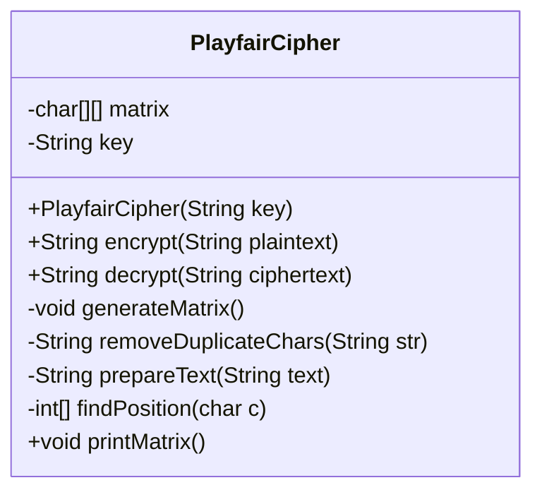
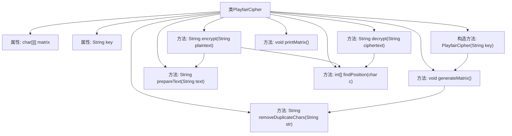

# 基础信息

|      |      |
|------|------|
| 名称 | PlayfairCipher |
| 编码语言 | .java |
| 代码路径 | Java/src/main/java/com/thealgorithms/ciphers/PlayfairCipher.java |
| 包名 | com.thealgorithms.ciphers |
| 依赖项 | [] |
| 概述说明 | PlayfairCipher类通过5x5矩阵实现文本加密解密。 |

# 说明

PlayfairCipher类实现了加密和解密功能，通过使用5x5矩阵来处理文本。该矩阵用于转换明文和密文，确保数据的安全性和保密性。

# 类列表 Class Summary

| 名称   | 类型  | 说明 |
|-------|------|-------------|
| PlayfairCipher | class | PlayfairCipher类实现加密解密功能，使用5x5矩阵处理文本。 |

## 类 PlayfairCipher

|      |      |
|------|------|
| 访问范围 | public |
| 类型 | class |
| 名称 | PlayfairCipher |
| 说明 | PlayfairCipher类实现加密解密功能，使用5x5矩阵处理文本。 |

### UML类图

### 描述
`PlayfairCipher` 类实现了Playfair密码算法，用于加密和解密文本。它通过构造函数初始化密钥并生成一个5x5的矩阵。加密方法 `encrypt` 对明文进行处理，生成密文；解密方法 `decrypt` 则对密文进行反向操作，恢复明文。私有方法 `generateMatrix` 用于生成密码矩阵，`removeDuplicateChars` 移除重复字符，`prepareText` 预处理文本，`findPosition` 查找字符在矩阵中的位置，`printMatrix` 打印矩阵。

### 内部方法调用关系图

该流程图展示了PlayfairCipher类的结构及其内部方法之间的调用关系。PlayfairCipher类包含两个属性：matrix和key，以及多个方法用于加密、解密、生成矩阵、去除重复字符、准备文本、查找字符位置和打印矩阵。构造方法PlayfairCipher在初始化时调用generateMatrix方法，而encrypt和decrypt方法则依赖于prepareText和findPosition方法。generateMatrix方法进一步调用removeDuplicateChars方法来生成唯一的密钥矩阵。

### 字段列表 Field List

| 名称  | 类型  | 说明 |
|-------|-------|------|
| matrix | char[][] | 私有二维字符数组变量matrix。 |
| key | String | 声明了一个私有的字符串类型变量key。 |

### 方法列表 Method List

| 名称  | 类型  | 说明 |
|-------|-------|------|
| findPosition | int[] | 查找字符在5x5矩阵中的位置并返回坐标。 |
| prepareText | String | 方法将文本转为大写并去除非字母字符，处理重复字符后确保长度为偶数。 |
| decrypt | String | 解密方法通过遍历密文，根据字符位置矩阵进行解密，生成明文。 |
| encrypt | String | 加密方法：替换J为I，按矩阵规则加密每对字符。 |
| removeDuplicateChars | String | 该方法移除字符串中的重复字符，返回无重复字符的新字符串。 |
| generateMatrix | void | 生成5x5矩阵，填充去重后的密钥和字母。 |
| printMatrix | void | 打印5x5 Playfair密码矩阵。 |

