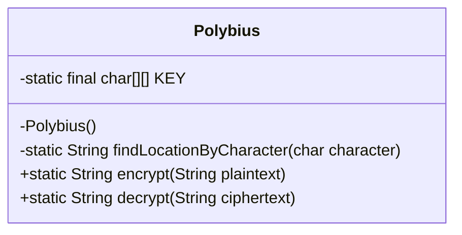
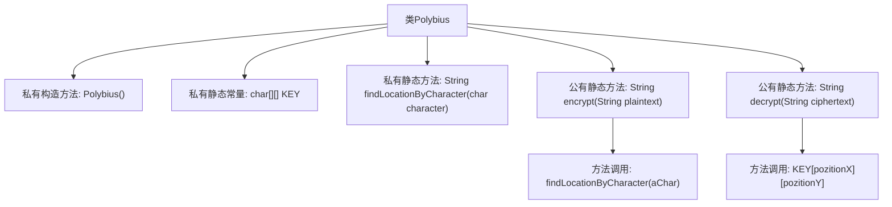

# 基础信息

|      |      |
|------|------|
| 名称 | Polybius |
| 编码语言 | .java |
| 代码路径 | Java/src/main/java/com/thealgorithms/ciphers/Polybius.java |
| 包名 | com.thealgorithms.ciphers |
| 依赖项 | [] |
| 概述说明 | Polybius类实现加密解密，5x5矩阵映射字符与坐标。 |

# 说明

Polybius类实现了加密和解密功能，采用5x5矩阵将字符与坐标进行映射。通过这种矩阵结构，每个字符对应一个唯一的坐标对，从而实现字符的加密和解密操作。该设计确保了字符与坐标之间的双向映射，使得加密过程可逆，解密时能够准确还原原始字符。

# 类列表 Class Summary

| 名称   | 类型  | 说明 |
|-------|------|-------------|
| Polybius | class | Polybius类实现加密解密功能，使用5x5矩阵映射字符与坐标。 |

## 类 Polybius

|      |      |
|------|------|
| 访问范围 | public final |
| 类型 | class |
| 名称 | Polybius |
| 说明 | Polybius类实现加密解密功能，使用5x5矩阵映射字符与坐标。 |

### UML类图

这段代码定义了一个名为 `Polybius` 的最终类，该类实现了基于 Polybius 方阵的加密和解密功能。`Polybius` 类包含一个私有的二维字符数组 `KEY`，用于存储加密和解密所需的字符映射。类中提供了两个公有静态方法 `encrypt` 和 `decrypt`，分别用于对明文进行加密和对密文进行解密。此外，类中还包含一个私有的静态方法 `findLocationByCharacter`，用于查找字符在 `KEY` 中的位置。`Polybius` 类的构造函数是私有的，防止外部实例化该类。

### 内部方法调用关系图

这段代码定义了一个名为 `Polybius` 的类，用于实现波利比奥斯方阵的加密和解密功能。类中包含一个私有的二维字符数组 `KEY`，用于存储波利比奥斯方阵的字符。`findLocationByCharacter` 方法用于查找字符在方阵中的位置，`encrypt` 方法将明文字符串转换为密文，`decrypt` 方法则将密文转换回明文。流程图展示了类的主要结构和方法的调用关系。

### 字段列表 Field List

| 名称  | 类型  | 说明 |
|-------|-------|------|
| KEY = {        //         0    1    2    3    4        /* 0 */ {'A', 'B', 'C', 'D', 'E'},        /* 1 */ {'F', 'G', 'H', 'I', 'J'},        /* 2 */ {'K', 'L', 'M', 'N', 'O'},        /* 3 */ {'P', 'Q', 'R', 'S', 'T'},        /* 4 */ {'V', 'W', 'X', 'Y', 'Z'},    } | char[][] | 定义一个5x5的二维字符数组KEY，包含字母A到Z。 |

### 方法列表 Method List

| 名称  | 类型  | 说明 |
|-------|-------|------|
| encrypt | String | 加密方法将明文字符转为大写并逐个查找位置，生成密文。 |
| decrypt | String | 静态方法decrypt解密字符串，每两个字符转换为KEY数组坐标，拼接结果返回。 |
| findLocationByCharacter | String | 该方法通过遍历二维数组KEY，查找指定字符的位置并返回其坐标。 |

