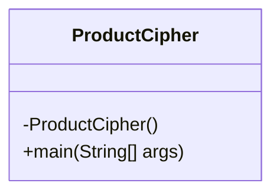
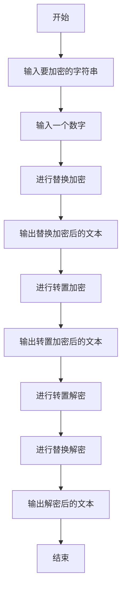
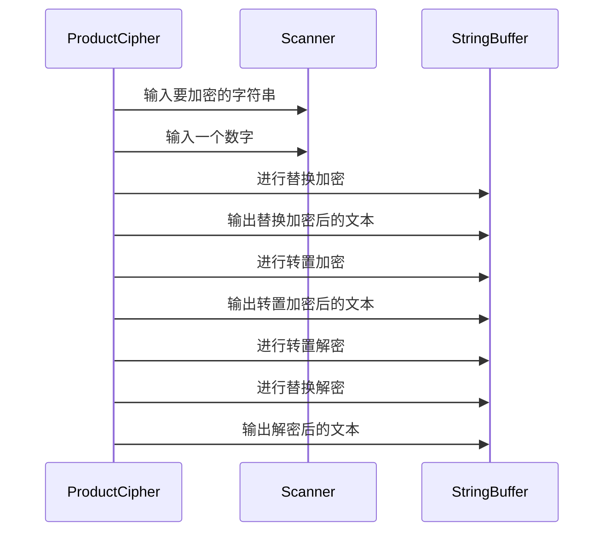

# 基础信息

|      |      |
|------|------|
| 名称 | ProductCipher |
| 编码语言 | .java |
| 代码路径 | Java/src/main/java/com/thealgorithms/ciphers/ProductCipher.java |
| 包名 | com.thealgorithms.ciphers |
| 依赖项 | ['java.util.Scanner'] |
| 概述说明 | 代码实现产品密码，含替换、转置加密及解密功能。 |

# 说明

该代码实现了一个产品密码系统，包含替换加密和转置加密两种加密方法及其对应的解密过程。替换加密通过将字符替换为其他字符来实现加密，而转置加密则通过重新排列字符顺序来达到加密效果。解密过程则分别对应这两种加密方法，通过逆向操作恢复原始信息。整个系统旨在提供一种安全的产品密码保护机制。

# 类列表 Class Summary

| 名称   | 类型  | 说明 |
|-------|------|-------------|
| ProductCipher | class | 该代码实现了一个产品密码，包含替换加密、转置加密及其解密过程。 |

## 类 ProductCipher

|      |      |
|------|------|
| 访问范围 | final |
| 类型 | class |
| 名称 | ProductCipher |
| 说明 | 该代码实现了一个产品密码，包含替换加密、转置加密及其解密过程。 |

### UML类图

**描述：** `ProductCipher` 类实现了一个简单的加密和解密过程。它首先通过替换加密对输入字符串进行加密，然后通过转置加密进一步处理。解密过程则逆向进行，先进行转置解密，再进行替换解密。整个流程通过 `main` 方法控制，用户输入要加密的字符串和一个数字，程序输出加密和解密后的结果。

### 内部方法调用关系图

```mermaid
graph TD
    A["类ProductCipher"]
    B["私有构造方法: ProductCipher()"]
    C["main方法: main(String[] args)"]
    D["创建Scanner对象: Scanner sc = new Scanner(System.in)"]
    E["输出: 'Enter the input to be encrypted: '"]
    F["读取输入: String substitutionInput = sc.nextLine()"]
    G["输出: 'Enter a number: '"]
    H["读取数字: int n = sc.nextInt()"]
    I["初始化StringBuffer: StringBuffer substitutionOutput = new StringBuffer()"]
    J["循环加密: for (int i = 0; i < substitutionInput.length(); i++)"]
    K["获取字符: char c = substitutionInput.charAt(i)"]
    L["加密字符: substitutionOutput.append((char) (c + 5))"]
    M["输出: 'Substituted text: '"]
    N["输出: substitutionOutput"]
    O["初始化String: String transpositionInput = substitutionOutput.toString()"]
    P["计算模数: int modulus = transpositionInput.length() % n"]
    Q["判断模数: if (modulus != 0)"]
    R["补充字符: for (; modulus != 0; modulus--) transpositionInput += '/'"]
    S["初始化StringBuffer: StringBuffer transpositionOutput = new StringBuffer()"]
    T["输出: 'Transposition Matrix: '"]
    U["循环生成矩阵: for (int i = 0; i < n; i++)"]
    V["循环生成矩阵行: for (int j = 0; j < transpositionInput.length() / n; j++)"]
    W["获取字符: char c = transpositionInput.charAt(i + (j * n))"]
    X["输出字符: System.out.print(c)"]
    Y["追加字符: transpositionOutput.append(c)"]
    Z["输出: 'Final encrypted text: '"]
    AA["输出: transpositionOutput"]
    AB["计算n: n = transpositionOutput.length() / n"]
    AC["初始化StringBuffer: StringBuffer transpositionPlaintext = new StringBuffer()"]
    AD["循环解密: for (int i = 0; i < n; i++)"]
    AE["循环解密行: for (int j = 0; j < transpositionOutput.length() / n; j++)"]
    AF["获取字符: char c = transpositionOutput.charAt(i + (j * n))"]
    AG["追加字符: transpositionPlaintext.append(c)"]
    AH["初始化StringBuffer: StringBuffer plaintext = new StringBuffer()"]
    AI["循环解密: for (int i = 0; i < transpositionPlaintext.length(); i++)"]
    AJ["获取字符: char c = transpositionPlaintext.charAt(i)"]
    AK["解密字符: plaintext.append((char) (c - 5))"]
    AL["输出: 'Plaintext: '"]
    AM["输出: plaintext"]

    A --> B
    A --> C
    C --> D
    D --> E
    E --> F
    F --> G
    G --> H
    H --> I
    I --> J
    J --> K
    K --> L
    L --> M
    M --> N
    N --> O
    O --> P
    P --> Q
    Q --> R
    R --> S
    S --> T
    T --> U
    U --> V
    V --> W
    W --> X
    X --> Y
    Y --> Z
    Z --> AA
    AA --> AB
    AB --> AC
    AC --> AD
    AD --> AE
    AE --> AF
    AF --> AG
    AG --> AH
    AH --> AI
    AI --> AJ
    AJ --> AK
    AK --> AL
    AL --> AM
```

这段代码实现了一个简单的加密和解密过程。首先，用户输入一段文本和一个数字，程序通过替换加密对文本进行加密，然后通过转置加密进一步加密。最后，程序逆向操作，先进行转置解密，再进行替换解密，最终输出原始文本。整个过程展示了加密和解密的基本原理。

### 字段列表 Field List

| 名称  | 类型  | 说明 |
|-------|-------|------|

### 方法列表 Method List

| 名称  | 类型  | 说明 |
|-------|-------|------|
| main | void | Java程序实现输入加密解密，包括替换和转置算法。 |

