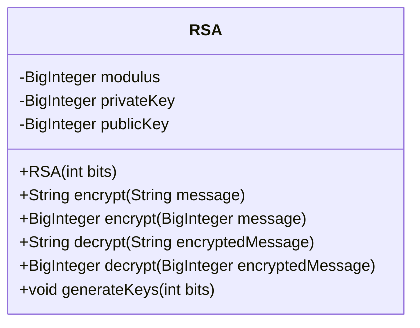
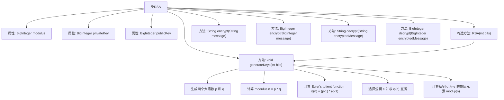

# 基础信息

|      |      |
|------|------|
| 名称 | RSA |
| 编码语言 | .java |
| 代码路径 | Java/src/main/java/com/thealgorithms/ciphers/RSA.java |
| 包名 | com.thealgorithms.ciphers |
| 依赖项 | ['java.math.BigInteger', 'java.security.SecureRandom'] |
| 概述说明 | RSA生成密钥对，支持字符串和BigInteger的加密解密操作。 |

# 说明

RSA类用于生成密钥对，并提供加密和解密功能。它支持对字符串和BigInteger类型的数据进行操作，能够灵活处理不同格式的输入，确保数据的安全性和完整性。通过生成公钥和私钥，RSA类实现了非对称加密，广泛应用于数据传输和存储的安全保护。

# 类列表 Class Summary

| 名称   | 类型  | 说明 |
|-------|------|-------------|
| RSA | class | RSA类生成密钥对，提供加密解密功能，支持字符串和BigInteger操作。 |

## 类 RSA

|      |      |
|------|------|
| 访问范围 | public |
| 类型 | class |
| 名称 | RSA |
| 说明 | RSA类生成密钥对，提供加密解密功能，支持字符串和BigInteger操作。 |

### UML类图

类图描述：`RSA`类实现了RSA加密算法的核心功能。它包含私有的`modulus`、`privateKey`和`publicKey`成员变量，分别用于存储模数、私钥和公钥。构造函数`RSA(int bits)`用于生成指定长度的RSA密钥对。`encrypt`方法提供了对字符串和`BigInteger`类型的加密功能，而`decrypt`方法则用于解密相应的加密消息。`generateKeys`方法负责生成RSA密钥对，包括选择公钥和计算私钥。

### 内部方法调用关系图

这段代码定义了一个RSA加密类，包含生成密钥、加密和解密的功能。流程图中展示了类的属性、构造方法和主要方法之间的关系，特别是`generateKeys`方法中生成RSA密钥对的详细步骤。该流程图清晰地展示了RSA算法的核心逻辑，包括生成素数、计算模数、选择公钥和计算私钥的过程。

### 字段列表 Field List

| 名称  | 类型  | 说明 |
|-------|-------|------|
| modulus | BigInteger | 声明一个私有的BigInteger类型变量modulus。 |
| privateKey | BigInteger | 声明一个私有的大整数类型变量privateKey。 |
| publicKey | BigInteger | 声明一个名为publicKey的私有BigInteger变量。 |

### 方法列表 Method List

| 名称  | 类型  | 说明 |
|-------|-------|------|
| decrypt | BigInteger | 该方法使用私钥和模数对加密消息进行解密。 |
| encrypt | BigInteger | 同步方法使用公钥和模数加密大整数消息。 |
| generateKeys | void | 生成RSA密钥对，包括模数、公钥和私钥。 |
| encrypt | String | 同步方法加密非空字符串，使用公钥和模数进行模幂运算。 |
| decrypt | String | 同步方法解密消息，若为空则抛异常，否则使用私钥和模数解密。 |

