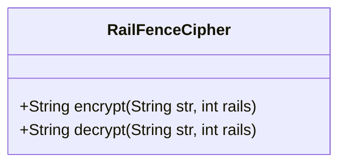
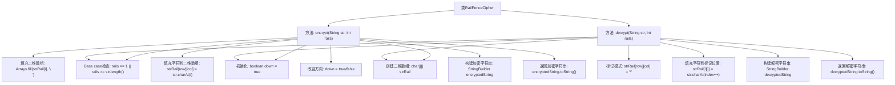

# 基础信息

|      |      |
|------|------|
| 名称 | RailFenceCipher |
| 编码语言 | .java |
| 代码路径 | Java/src/main/java/com/thealgorithms/ciphers/RailFenceCipher.java |
| 包名 | com.thealgorithms.ciphers |
| 依赖项 | ['java.util.Arrays'] |
| 概述说明 | RailFenceCipher类提供栅栏密码的加密与解密功能。 |

# 说明

RailFenceCipher类是一个用于实现栅栏密码加密和解密功能的工具。栅栏密码是一种经典的转置密码，通过将明文按特定行数排列成栅栏形状，然后按行读取密文。该类提供了加密和解密两种主要功能，能够处理用户输入的明文或密文，并根据指定的行数进行相应的转换。加密功能将明文转换为密文，而解密功能则将密文还原为原始明文。该类的设计旨在简化栅栏密码的实现过程，确保用户能够轻松地进行加密和解密操作。

# 类列表 Class Summary

| 名称   | 类型  | 说明 |
|-------|------|-------------|
| RailFenceCipher | class | RailFenceCipher类实现栅栏密码加密解密功能。 |

## 类 RailFenceCipher

|      |      |
|------|------|
| 访问范围 | public |
| 类型 | class |
| 名称 | RailFenceCipher |
| 说明 | RailFenceCipher类实现栅栏密码加密解密功能。 |

### UML类图

**描述：**
`RailFenceCipher` 类实现了栅栏密码的加密和解密功能。加密方法 `encrypt` 通过将字符串字符按栅栏模式填充到二维数组中，然后按行读取生成密文。解密方法 `decrypt` 则通过逆向操作，根据栅栏模式将密文字符重新排列回原始字符串。该类处理了单轨或轨数超过字符串长度的特殊情况，确保代码的健壮性。

### 内部方法调用关系图

这段代码实现了Rail Fence Cipher（栅栏密码）的加密和解密功能。加密方法通过将字符按特定模式填充到二维数组中，然后按行读取生成加密字符串；解密方法则通过标记字符位置并按相同模式填充字符，最终按行读取生成解密字符串。代码通过布尔标志`down`控制字符在二维数组中的移动方向，确保加密和解密过程的正确性。

### 字段列表 Field List

| 名称  | 类型  | 说明 |
|-------|-------|------|

### 方法列表 Method List

| 名称  | 类型  | 说明 |
|-------|-------|------|
| encrypt | String | 实现字符串的栅栏加密算法。 |
| decrypt | String | 解密字符串，使用Z字形算法，根据轨道数重构原始字符串。 |

