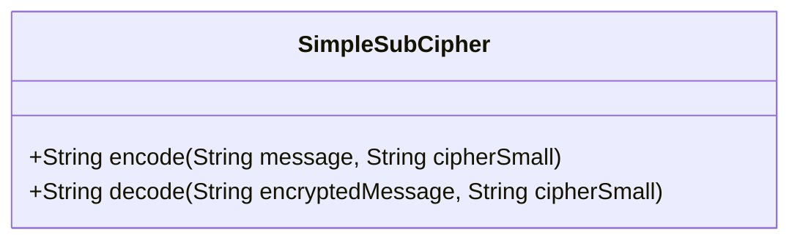
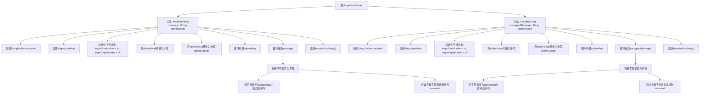

# 基础信息

|      |      |
|------|------|
| 名称 | SimpleSubCipher |
| 编码语言 | .java |
| 代码路径 | Java/src/main/java/com/thealgorithms/ciphers/SimpleSubCipher.java |
| 包名 | com.thealgorithms.ciphers |
| 依赖项 | ['java.util.HashMap', 'java.util.Map'] |
| 概述说明 | SimpleSubCipher类提供字符替换加密与解密功能。 |

# 说明

SimpleSubCipher类设计用于实现字符替换加密和解密功能。该类通过替换字符的方式对文本进行加密，确保信息的安全性。同时，它也支持解密操作，能够将加密后的文本恢复为原始内容。这种加密方法基于简单的字符替换规则，适用于基本的加密需求。

# 类列表 Class Summary

| 名称   | 类型  | 说明 |
|-------|------|-------------|
| SimpleSubCipher | class | SimpleSubCipher类实现字符替换加密和解密功能。 |

## 类 SimpleSubCipher

|      |      |
|------|------|
| 访问范围 | public |
| 类型 | class |
| 名称 | SimpleSubCipher |
| 说明 | SimpleSubCipher类实现字符替换加密和解密功能。 |

### UML类图

**描述：**  
`SimpleSubCipher` 类提供了两个主要方法：`encode` 和 `decode`，用于加密和解密消息。加密方法通过将每个字母替换为 `cipherSmall` 参数中对应的字符来实现加密，而解密方法则通过反向映射将加密后的消息还原为原始消息。该类使用 `HashMap` 来存储字符映射关系，支持大小写字母的处理，并保留非字母字符不变。

### 内部方法调用关系图

**描述：**  
这段代码实现了一个简单的替换密码算法，包含加密和解密两个方法。加密方法`encode`通过构建一个字符映射表`cipherMap`，将输入消息中的每个字母替换为对应的密文字符，非字母字符保持不变。解密方法`decode`则通过逆向映射表将密文还原为原始消息。代码处理了大小写字母的映射，并使用了`StringBuilder`来高效地构建结果字符串。

### 字段列表 Field List

| 名称  | 类型  | 说明 |
|-------|-------|------|

### 方法列表 Method List

| 名称  | 类型  | 说明 |
|-------|-------|------|
| encode | String | 该方法使用映射表将消息中的字母按指定规则编码，保留非字母字符。 |
| decode | String | 该方法使用映射表解密加密消息，保留非字母字符不变。 |

