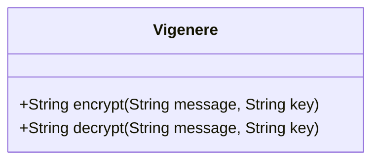
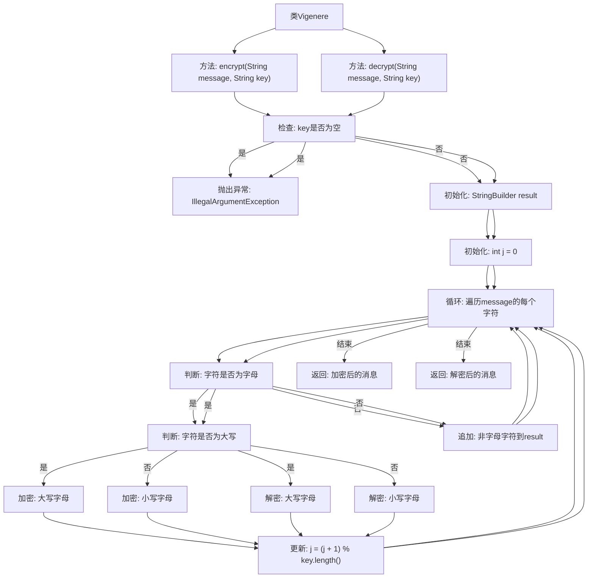

# 基础信息

|      |      |
|------|------|
| 名称 | Vigenere |
| 编码语言 | .java |
| 代码路径 | Java/src/main/java/com/thealgorithms/ciphers/Vigenere.java |
| 包名 | com.thealgorithms.ciphers |
| 依赖项 | [] |
| 概述说明 | Vigenère类实现加密解密，支持大小写字母和非字母字符保留，密钥循环使用。 |

# 说明

Vigenère类实现了加密和解密功能，支持处理大小写字母，并保留非字母字符不变。密钥在加密和解密过程中循环使用，确保与输入文本长度匹配。该设计适用于需要保留原始格式的文本加密场景，同时提供了灵活的密钥管理机制。

# 类列表 Class Summary

| 名称   | 类型  | 说明 |
|-------|------|-------------|
| Vigenere | class | Vigenère类实现加密解密功能，支持大小写字母和保留非字母字符，密钥循环使用。 |

## 类 Vigenere

|      |      |
|------|------|
| 访问范围 | public |
| 类型 | class |
| 名称 | Vigenere |
| 说明 | Vigenère类实现加密解密功能，支持大小写字母和保留非字母字符，密钥循环使用。 |

### UML类图

### 描述
`Vigenere` 类实现了维吉尼亚密码的加密和解密功能。该类包含两个公有方法：`encrypt` 和 `decrypt`，分别用于对消息进行加密和解密。加密过程中，每个字母根据密钥中的对应字符进行移位，同时保留字母的大小写和非字母字符。解密过程则是加密的逆过程，将字母移回原始位置。密钥为空时会抛出 `IllegalArgumentException` 异常。

### 内部方法调用关系图

该流程图描述了Vigenere类中的加密和解密方法。加密方法首先检查密钥是否为空，若为空则抛出异常，否则初始化StringBuilder和计数器j，然后遍历消息的每个字符，根据字符的大小写进行加密，并更新计数器j。解密方法类似，只是加密操作变为解密操作。最终，方法返回加密或解密后的消息。

### 字段列表 Field List

| 名称  | 类型  | 说明 |
|-------|-------|------|

### 方法列表 Method List

| 名称  | 类型  | 说明 |
|-------|-------|------|
| encrypt | String | 加密方法：根据密钥对消息进行加密，密钥不能为空。 |
| decrypt | String | 解密字符串，使用密钥进行字母位移，非字母字符保留原样。 |

