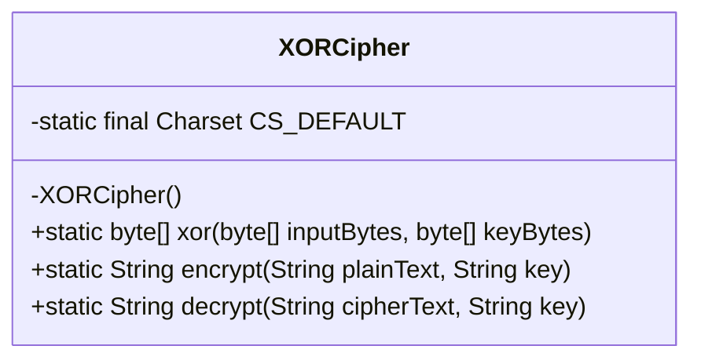
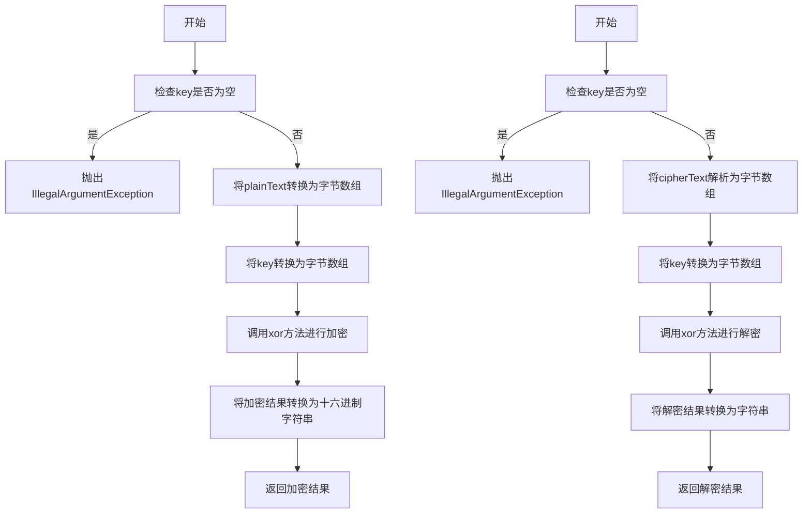
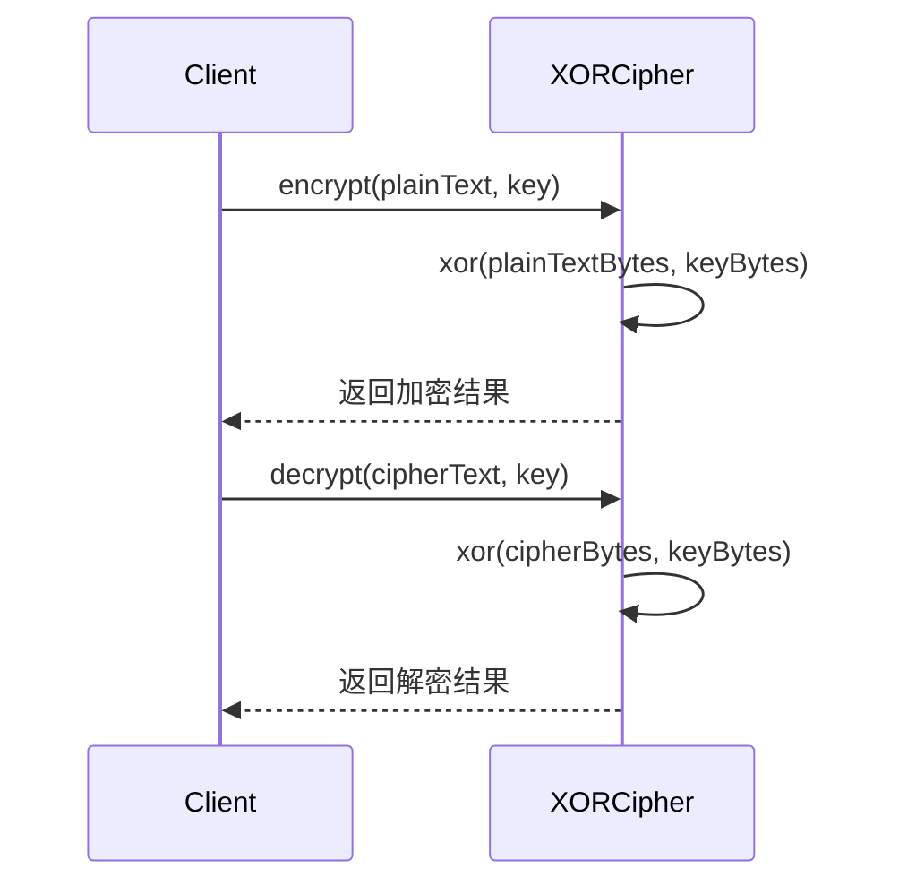
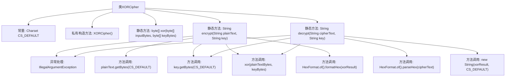

# 基础信息

|      |      |
|------|------|
| 名称 | XORCipher |
| 编码语言 | .java |
| 代码路径 | Java/src/main/java/com/thealgorithms/ciphers/XORCipher.java |
| 包名 | com.thealgorithms.ciphers |
| 依赖项 | ['java.nio.charset.Charset', 'java.nio.charset.StandardCharsets', 'java.util.HexFormat'] |
| 概述说明 | XORCipher类实现UTF-8加密解密，密钥循环，结果十六进制表示。 |

# 说明

XORCipher类实现了加密和解密功能，支持UTF-8编码，确保处理多语言字符集。密钥在加密过程中循环使用，以匹配输入数据的长度。加密和解密的结果以十六进制形式表示，便于存储和传输。该方法简单高效，适用于需要快速加密的场景。

# 类列表 Class Summary

| 名称   | 类型  | 说明 |
|-------|------|-------------|
| XORCipher | class | XORCipher类实现加密解密，支持UTF-8编码，密钥循环使用，结果以十六进制表示。 |

## 类 XORCipher

|      |      |
|------|------|
| 访问范围 | public final |
| 类型 | class |
| 名称 | XORCipher |
| 说明 | XORCipher类实现加密解密，支持UTF-8编码，密钥循环使用，结果以十六进制表示。 |

### UML类图

**描述：**  
`XORCipher` 类实现了一个简单的异或加密算法，提供了加密和解密功能。加密时，将明文和密钥转换为字节数组，通过异或操作生成密文，并将结果转换为十六进制字符串。解密时，将十六进制密文解析为字节数组，再与密钥进行异或操作，最终恢复为原始明文。类中所有方法均为静态，且构造函数私有化，确保无法实例化。

### 内部方法调用关系图

这段代码实现了一个简单的XOR加密解密工具。`XORCipher`类包含三个主要方法：`xor`用于执行字节数组的异或操作，`encrypt`用于将明文加密为十六进制字符串，`decrypt`用于将十六进制字符串解密为明文。代码通过循环使用密钥字节来实现异或操作，并处理了密钥为空的情况。

### 字段列表 Field List

| 名称  | 类型  | 说明 |
|-------|-------|------|
| CS_DEFAULT = StandardCharsets.UTF_8 | Charset | 定义默认字符集为UTF-8。 |

### 方法列表 Method List

| 名称  | 类型  | 说明 |
|-------|-------|------|
| xor | byte[] | 该方法对输入字节数组和密钥字节数组进行异或操作，返回结果字节数组。 |
| encrypt | String | 加密方法：输入文本和密钥，进行异或运算后返回十六进制结果。 |
| decrypt | String | 解密方法：检查空密钥，解析密文，异或操作，返回解密结果。 |

