# 基础信息

|      |      |
|------|------|
| 名称 | ciphers |
| 编码语言 | .java |
| 代码路径 | Java/src/main/java/com/thealgorithms/ciphers |
| 包名 | Java.src.main.java.com.thealgorithms.ciphers |
| 概述说明 | 多种加密算法类实现，涵盖AES、RSA、DES等，支持加密解密操作，确保数据安全性和完整性。 |

# 说明

## 概述
该代码模块主要实现了多种经典的加密算法，涵盖了对称加密、非对称加密、流密码、替换密码、转置密码等多种加密技术。模块中的各个类分别实现了不同的加密算法，包括但不限于Playfair密码、椭圆曲线加密（ECC）、Blowfish、Hill密码、Polybius密码、Affine密码、自动密钥加密（Autokey）、AES、栅栏密码（Rail Fence）、XOR密码、Atbash密码、列转置密码、单字母替换密码（MonoAlphabetic）、A5/1流密码、培根密码（Baconian）、ADFGVX密码、简单替换密码（SimpleSub）、Diffie-Hellman密钥交换、DES、RSA、凯撒密码（Caesar）和Vigenère密码等。这些算法广泛应用于数据加密、信息安全、通信保护等领域，提供了多样化的加密解决方案。

## 主要业务场景
1. **数据加密与解密**：模块中的大多数类都实现了加密和解密功能，能够对文本、消息或其他数据进行加密，确保数据在传输或存储过程中的安全性。例如，AES、DES、RSA等类提供了高级的加密标准，适用于对敏感数据的保护。
2. **密钥管理与交换**：DiffieHellman类实现了密钥交换协议，确保双方能够安全地协商出相同的密钥。RSA类则支持非对称加密，生成公钥和私钥对，广泛应用于数据传输和存储的安全保护。
3. **流密码与伪随机序列生成**：A5/1流密码模块通过线性反馈移位寄存器（LFSR）生成伪随机序列，并结合会话密钥和帧计数器动态生成密钥流，适用于通信领域中对数据机密性要求较高的场景。
4. **替换与转置密码**：模块中的多个类实现了替换密码和转置密码，如Caesar、Vigenère、Rail Fence、Columnar Transposition等，适用于需要简单加密或特定格式加密的场景。
5. **隐写术与特殊加密**：BaconianCipher类实现了培根密码，通过A/B序列映射字母，适用于文本中的秘密通信。AtbashCipher类则通过字母表反向映射进行加密，适用于简单的字符替换加密。
6. **高效加密与低计算开销**：ECC类通过椭圆曲线加密技术提供了高效且安全的加密解决方案，适用于需要高安全性和低计算开销的场景。XORCipher类则通过简单的异或操作实现快速加密，适用于需要快速加密的场景。

该模块适用于多种加密需求，涵盖了从基础到高级的加密技术，能够满足不同场景下的数据安全保护需求。

### 包内部结构视图

```mermaid
graph TD
    ciphers --> PlayfairCipher.java
    ciphers --> ECC.java
    ciphers --> Blowfish.java
    ciphers --> HillCipher.java
    ciphers --> Polybius.java
    ciphers --> AffineCipher.java
    ciphers --> Autokey.java
    ciphers --> ProductCipher.java
    ciphers --> AESEncryption.java
    ciphers --> RailFenceCipher.java
    ciphers --> XORCipher.java
    ciphers --> AtbashCipher.java
    ciphers --> ColumnarTranspositionCipher.java
    ciphers --> MonoAlphabetic.java
    ciphers --> a5
    ciphers --> BaconianCipher.java
    ciphers --> ADFGVXCipher.java
    ciphers --> AES.java
    ciphers --> SimpleSubCipher.java
    ciphers --> DiffieHellman.java
    ciphers --> DES.java
    ciphers --> RSA.java
    ciphers --> Caesar.java
    ciphers --> Vigenere.java
    a5 --> Utils.java
    a5 --> A5Cipher.java
    a5 --> BaseLFSR.java
    a5 --> LFSR.java
    a5 --> CompositeLFSR.java
    a5 --> A5KeyStreamGenerator.java
```

该流程图展示了`ciphers`文件夹及其子文件夹`a5`中的所有文件层级关系。`ciphers`文件夹下包含了多种加密算法的实现文件，如`PlayfairCipher.java`、`AES.java`等，而`a5`文件夹则包含了与A5加密算法相关的文件，如`A5Cipher.java`和`BaseLFSR.java`等。

# 文件列表 File List

| 名称   | 类型  | 说明 |
|-------|------|-------------|
| [BaconianCipher.java](BaconianCipher.md) | file | BaconianCipher类实现培根密码加密解密，采用A/B序列映射字母。 |
| [AtbashCipher.java](AtbashCipher.md) | file | AtbashCipher类实现Atbash加密，支持字符串转换和大小写检测。 |
| [ProductCipher.java](ProductCipher.md) | file | 代码实现产品密码，含替换、转置加密及解密功能。 |
| [Blowfish.java](Blowfish.md) | file | Blowfish算法类含S盒、子密钥及加解密方法。 |
| [Vigenere.java](Vigenere.md) | file | Vigenère类实现加密解密，支持大小写字母和非字母字符保留，密钥循环使用。 |
| [Caesar.java](Caesar.md) | file | Caesar类实现凯撒加密解密，支持大小写字母，含暴力破解功能。 |
| [RSA.java](RSA.md) | file | RSA生成密钥对，支持字符串和BigInteger的加密解密操作。 |
| [DES.java](DES.md) | file | DES加密类，支持密钥验证、子密钥生成及加密解密功能。 |
| [DiffieHellman.java](DiffieHellman.md) | file | DiffieHellman类实现密钥交换，含构造方法和公钥、共享密钥计算。 |
| [SimpleSubCipher.java](SimpleSubCipher.md) | file | SimpleSubCipher类提供字符替换加密与解密功能。 |
| [AES.java](AES.md) | file | AES加密解密类支持128位数据，含密钥扩展、字节替换、行移位、列混淆等操作。 |
| [ADFGVXCipher.java](ADFGVXCipher.md) | file | ADFGVX密码类提供加密、解密及辅助功能。 |
| [MonoAlphabetic.java](MonoAlphabetic.md) | file | MonoAlphabetic类实现大写字母加密解密，基于密钥字符映射。 |
| [ColumnarTranspositionCipher.java](ColumnarTranspositionCipher.md) | file | 列转置加密类支持自定义字母表，通过排序表实现加解密。 |
| [XORCipher.java](XORCipher.md) | file | XORCipher类实现UTF-8加密解密，密钥循环，结果十六进制表示。 |
| [RailFenceCipher.java](RailFenceCipher.md) | file | RailFenceCipher类提供栅栏密码的加密与解密功能。 |
| [AESEncryption.java](AESEncryption.md) | file | AES加密类提供密钥生成、加密、解密及字节转十六进制功能。 |
| [Autokey.java](Autokey.md) | file | Autokey类实现加密解密，支持自动密钥扩展。 |
| [AffineCipher.java](AffineCipher.md) | file | AffineCipher类实现A-Z字母加密解密，参数a=17，b=20。 |
| [Polybius.java](Polybius.md) | file | Polybius类实现加密解密，5x5矩阵映射字符与坐标。 |
| [HillCipher.java](HillCipher.md) | file | HillCipher类实现加密解密，验证矩阵行列式并计算其值。 |
| [ECC.java](ECC.md) | file | ECC实现椭圆曲线加密，生成密钥对并支持消息加解密。 |
| [PlayfairCipher.java](PlayfairCipher.md) | file | PlayfairCipher类通过5x5矩阵实现文本加密解密。 |
| [a5](a5/_module.md) | package | Utils类实现BitSet递增，A5Cipher类实现A5/1加密，LFSR类实现线性反馈移位寄存器，CompositeLFSR类实现时钟操作，A5KeyStreamGenerator类生成密钥流。 |

