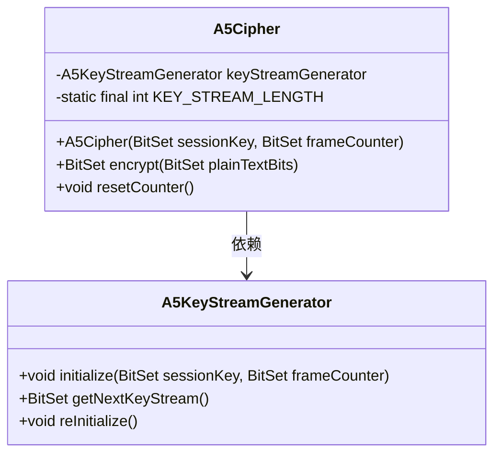
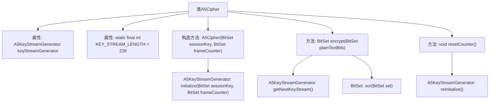

# 基础信息

|      |      |
|------|------|
| 名称 | A5Cipher |
| 编码语言 | .java |
| 代码路径 | Java/src/main/java/com/thealgorithms/ciphers/a5/A5Cipher.java |
| 包名 | com.thealgorithms.ciphers.a5 |
| 依赖项 | ['java.util.BitSet'] |
| 概述说明 | A5Cipher类实现A5/1算法，使用会话密钥和帧计数器生成密钥流，加密明文。 |

# 说明

A5Cipher类实现了A5/1加密算法，该算法通过会话密钥和帧计数器生成密钥流。生成的密钥流用于对明文进行加密，确保数据的安全性。A5/1是一种流密码算法，广泛应用于通信领域，特别是GSM网络中，以保护语音和数据传输的机密性。通过结合会话密钥和帧计数器，A5Cipher类能够动态生成密钥流，增强加密的强度和灵活性。

# 类列表 Class Summary

| 名称   | 类型  | 说明 |
|-------|------|-------------|
| A5Cipher | class | A5Cipher类实现A5/1加密算法，通过会话密钥和帧计数器生成密钥流，用于加密明文。 |

## 类 A5Cipher

|      |      |
|------|------|
| 访问范围 | public |
| 类型 | class |
| 名称 | A5Cipher |
| 说明 | A5Cipher类实现A5/1加密算法，通过会话密钥和帧计数器生成密钥流，用于加密明文。 |

### UML类图

**描述：**
`A5Cipher` 类用于实现 A5/1 加密算法，它依赖于 `A5KeyStreamGenerator` 类来生成密钥流。`A5Cipher` 的构造函数接收会话密钥和帧计数器，用于初始化密钥流生成器。`encrypt` 方法通过将明文与密钥流进行异或操作来生成密文。`resetCounter` 方法用于重置密钥流生成器的内部状态，以便重新生成密钥流。

### 内部方法调用关系图

这段代码定义了一个A5Cipher类，用于实现A5/1加密算法。类中包含一个A5KeyStreamGenerator对象用于生成密钥流，以及一个常量KEY_STREAM_LENGTH表示密钥流的长度。构造方法初始化密钥流生成器，encrypt方法通过生成密钥流并与明文进行异或操作来加密数据，resetCounter方法用于重置密钥流生成器的计数器。流程图展示了类内部的属性和方法调用关系，以及密钥流生成器的初始化、密钥流获取和重置过程。

### 字段列表 Field List

| 名称  | 类型  | 说明 |
|-------|-------|------|
| keyStreamGenerator | A5KeyStreamGenerator | 私有A5密钥流生成器实例。 |
| KEY_STREAM_LENGTH = 228 | int | 定义常量KEY_STREAM_LENGTH，值为228。 |

### 方法列表 Method List

| 名称  | 类型  | 说明 |
|-------|-------|------|
| encrypt | BitSet | 加密方法：复制明文，与密钥流异或，返回结果。 |
| resetCounter | void | 重置计数器，重新初始化密钥流生成器。 |

