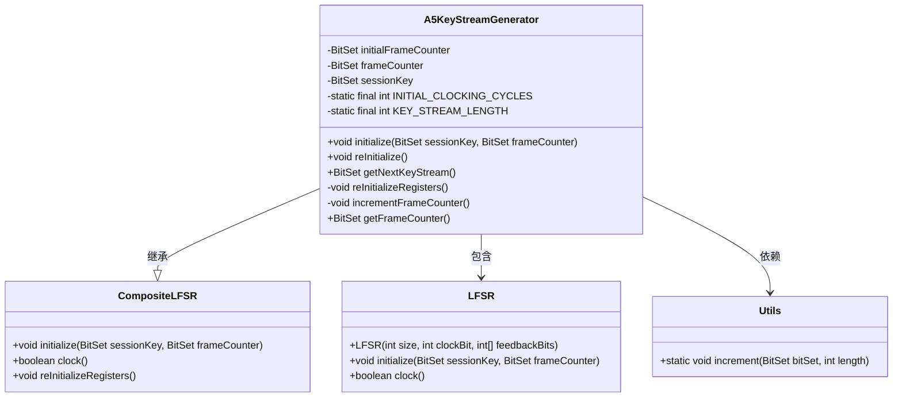
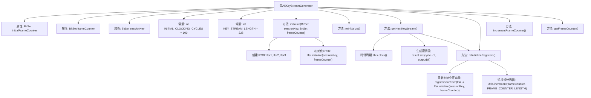

# 基础信息

|      |      |
|------|------|
| 名称 | A5KeyStreamGenerator |
| 编码语言 | .java |
| 代码路径 | Java/src/main/java/com/thealgorithms/ciphers/a5/A5KeyStreamGenerator.java |
| 包名 | com.thealgorithms.ciphers.a5 |
| 依赖项 | ['java.util.BitSet'] |
| 概述说明 | A5密钥流生成器类，支持LFSR初始化、密钥流生成、重置及帧计数器操作。 |

# 说明

A5密钥流生成器类是一个用于生成密钥流的工具，它通过初始化线性反馈移位寄存器（LFSR）来实现密钥流的生成。该类支持重置操作，允许用户在需要时重新初始化LFSR，确保密钥流生成过程的灵活性。此外，该类还支持帧计数器操作，可以管理和跟踪密钥流生成的帧数，确保生成的密钥流与特定帧相关联。这些功能使得A5密钥流生成器类在需要高效、灵活的密钥流生成场景中具有重要应用价值。

# 类列表 Class Summary

| 名称   | 类型  | 说明 |
|-------|------|-------------|
| A5KeyStreamGenerator | class | A5密钥流生成器类，初始化LFSR，生成密钥流，支持重置和帧计数器操作。 |

## 类 A5KeyStreamGenerator

|      |      |
|------|------|
| 访问范围 | public |
| 类型 | class |
| 名称 | A5KeyStreamGenerator |
| 说明 | A5密钥流生成器类，初始化LFSR，生成密钥流，支持重置和帧计数器操作。 |

### UML类图

### 描述
`A5KeyStreamGenerator` 类继承自 `CompositeLFSR`，用于生成密钥流。它包含三个 `LFSR` 实例，并通过 `initialize` 方法初始化这些寄存器。`getNextKeyStream` 方法生成指定长度的密钥流，并在生成后重新初始化寄存器。`reInitialize` 方法用于恢复生成器的初始状态。`Utils` 类提供了工具方法，用于递增帧计数器。整个类图展示了 `A5KeyStreamGenerator` 如何通过组合和继承来实现密钥流生成的功能。

### 内部方法调用关系图

这段代码定义了一个名为 `A5KeyStreamGenerator` 的类，用于生成密钥流。类中包含了多个方法，用于初始化、重新初始化、生成密钥流、重新初始化寄存器、递增帧计数器以及获取当前帧计数器。流程图中展示了类中各方法之间的调用关系，以及方法内部的详细步骤。通过初始化LFSR、执行时钟周期、生成密钥流、重新初始化寄存器和递增帧计数器等步骤，最终生成所需的密钥流。

### 字段列表 Field List

| 名称  | 类型  | 说明 |
|-------|-------|------|
| initialFrameCounter | BitSet | 私有BitSet类型变量initialFrameCounter。 |
| KEY_STREAM_LENGTH = 228 | int | 定义常量KEY_STREAM_LENGTH，值为228。 |
| sessionKey | BitSet | 声明了一个私有BitSet类型的sessionKey变量。 |
| INITIAL_CLOCKING_CYCLES = 100 | int | 私有静态常量初始时钟周期设为100。 |
| frameCounter | BitSet | 私有BitSet类型变量frameCounter用于帧计数。 |

### 方法列表 Method List

| 名称  | 类型  | 说明 |
|-------|-------|------|
| reInitializeRegisters | void | 重新初始化寄存器并递增帧计数器。 |
| incrementFrameCounter | void | 私有方法用于递增帧计数器。 |
| getFrameCounter | BitSet | 方法返回名为frameCounter的BitSet对象。 |
| reInitialize | void | 重新初始化方法，调用初始化函数并传入会话密钥和初始帧计数器。 |
| getNextKeyStream | BitSet | 方法生成密钥流，先初始化时钟周期，再生成比特集，最后重置寄存器。 |
| initialize | void | 初始化方法设置会话密钥、帧计数器，并创建三个LFSR寄存器进行初始化。 |

