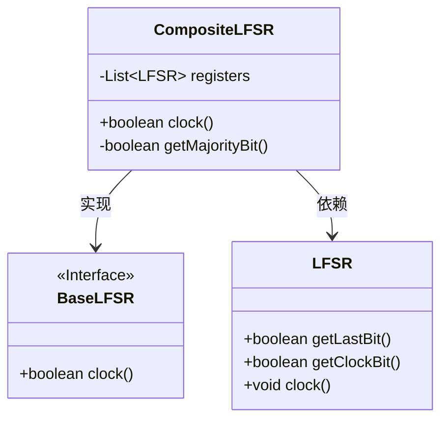
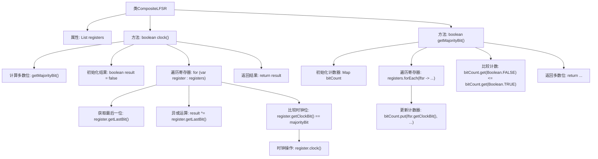

# 基础信息

|      |      |
|------|------|
| 名称 | CompositeLFSR |
| 编码语言 | .java |
| 代码路径 | Java/src/main/java/com/thealgorithms/ciphers/a5/CompositeLFSR.java |
| 包名 | com.thealgorithms.ciphers.a5 |
| 依赖项 | ['java.util.ArrayList', 'java.util.List', 'java.util.Map', 'java.util.TreeMap'] |
| 概述说明 | CompositeLFSR类执行LFSR时钟操作，计算多数位并返回寄存器末位异或值。 |

# 说明

CompositeLFSR类实现了线性反馈移位寄存器（LFSR）的时钟操作。该类通过计算多数位来确定反馈位，并返回所有寄存器末位的异或值。这一过程确保了LFSR的伪随机序列生成功能，适用于需要高效随机数生成的场景。

# 类列表 Class Summary

| 名称   | 类型  | 说明 |
|-------|------|-------------|
| CompositeLFSR | class | CompositeLFSR类实现LFSR时钟操作，计算多数位并返回所有寄存器末位异或值。 |

## 类 CompositeLFSR

|      |      |
|------|------|
| 访问范围 | public abstract |
| 类型 | class |
| 名称 | CompositeLFSR |
| 说明 | CompositeLFSR类实现LFSR时钟操作，计算多数位并返回所有寄存器末位异或值。 |

### UML类图

类图描述：
`CompositeLFSR` 是一个抽象类，实现了 `BaseLFSR` 接口。它包含一个 `LFSR` 类型的列表 `registers`，并通过 `clock` 方法对所有寄存器进行时钟操作。`getMajorityBit` 方法用于计算所有寄存器的时钟位的多数值。`LFSR` 类提供了获取最后一位、时钟位以及执行时钟操作的方法。`CompositeLFSR` 依赖于 `LFSR` 类来实现其功能。

### 内部方法调用关系图

这段代码定义了一个抽象类 `CompositeLFSR`，该类实现了 `BaseLFSR` 接口。类中包含一个 `List<LFSR>` 类型的属性 `registers`，用于存储多个线性反馈移位寄存器（LFSR）。`clock()` 方法通过计算所有寄存器的多数位来决定是否对每个寄存器进行时钟操作，并返回所有寄存器最后一位的异或值。`getMajorityBit()` 方法用于计算所有寄存器时钟位的多数位，返回布尔值表示多数位是否为真。

### 字段列表 Field List

| 名称  | 类型  | 说明 |
|-------|-------|------|
| registers = new ArrayList<>() | List<LFSR> | 保护性声明创建并初始化一个LFSR类型的列表。 |

### 方法列表 Method List

| 名称  | 类型  | 说明 |
|-------|-------|------|
| getMajorityBit | boolean | 方法统计寄存器中时钟位的多数值，返回布尔结果。 |
| clock | boolean | 方法clock计算寄存器多数位并更新寄存器，返回异或结果。 |

