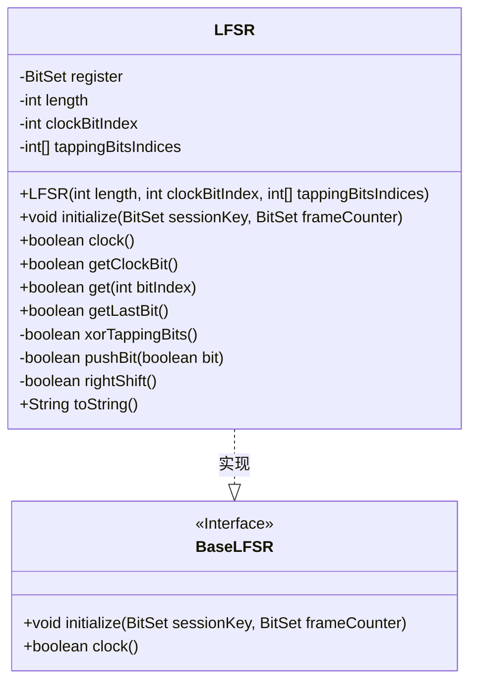
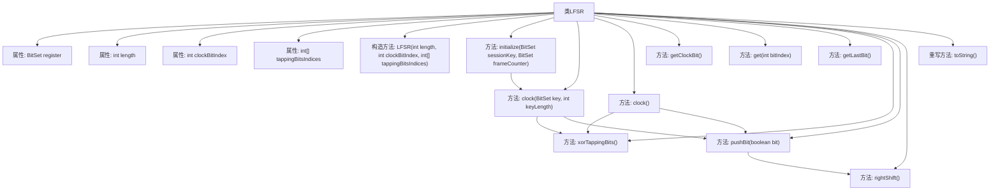

# 基础信息

|      |      |
|------|------|
| 名称 | LFSR |
| 编码语言 | .java |
| 代码路径 | Java/src/main/java/com/thealgorithms/ciphers/a5/LFSR.java |
| 包名 | com.thealgorithms.ciphers.a5 |
| 依赖项 | ['java.util.BitSet'] |
| 概述说明 | LFSR类实现线性反馈移位寄存器，支持初始化、时钟操作和位操作。 |

# 说明

LFSR类实现了线性反馈移位寄存器，具备初始化功能，可以设置寄存器的初始状态。支持时钟操作，即通过时钟信号推动寄存器状态的更新。同时，该类还提供位操作功能，允许对寄存器中的特定位进行读取或修改。这些功能共同实现了线性反馈移位寄存器的核心操作，适用于需要伪随机序列生成的场景。

# 类列表 Class Summary

| 名称   | 类型  | 说明 |
|-------|------|-------------|
| LFSR | class | LFSR类实现线性反馈移位寄存器，支持初始化、时钟操作和位操作。 |

## 类 LFSR

|      |      |
|------|------|
| 访问范围 | public |
| 类型 | class |
| 名称 | LFSR |
| 说明 | LFSR类实现线性反馈移位寄存器，支持初始化、时钟操作和位操作。 |

### UML类图

**描述：**  
`LFSR` 类实现了 `BaseLFSR` 接口，用于表示线性反馈移位寄存器（LFSR）。该类包含一个 `BitSet` 类型的寄存器，用于存储状态，并提供了初始化、时钟操作、获取特定位等方法。`LFSR` 通过 `xorTappingBits` 方法计算反馈位，并通过 `pushBit` 和 `rightShift` 方法实现位移操作。`initialize` 方法用于初始化寄存器，`clock` 方法用于执行一次时钟操作。该类还提供了获取特定位状态的方法，如 `getClockBit`、`get` 和 `getLastBit`。

### 内部方法调用关系图

这段代码定义了一个线性反馈移位寄存器（LFSR）类，用于实现伪随机数生成。类中包含多个方法，用于初始化寄存器、时钟操作、获取特定位状态以及执行位操作。流程图中展示了类的主要属性、构造方法以及各方法之间的调用关系，清晰地描述了LFSR的工作流程。

### 字段列表 Field List

| 名称  | 类型  | 说明 |
|-------|-------|------|
| register | BitSet | 私有不可变的BitSet类型变量register。 |
| clockBitIndex | int | 私有整型变量clockBitIndex用于存储时钟位索引。 |
| length | int | 私有整型变量length声明为final不可修改。 |
| tappingBitsIndices | int[] | 私有整型数组用于存储点击位索引。 |

### 方法列表 Method List

| 名称  | 类型  | 说明 |
|-------|-------|------|
| getClockBit | boolean | 获取时钟位状态的方法，返回寄存器中指定索引位的布尔值。 |
| get | boolean | 获取指定位索引的布尔值。 |
| clock | boolean | 重写clock方法，返回xorTappingBits与pushBit的结果。 |
| xorTappingBits | boolean | 该方法通过异或操作计算寄存器特定位的结果。 |
| pushBit | boolean | 方法`pushBit`将位右移并设置新位，返回被丢弃的位。 |
| toString | String | 重写toString方法，返回register对象的字符串表示。 |
| clock | void | 反向遍历密钥位，异或生成新位并推入。 |
| rightShift | boolean | 私有方法rightShift执行右移操作，返回丢弃的位。 |
| initialize | void | 初始化方法清空寄存器并加载会话密钥和帧计数器。 |
| getLastBit | boolean | 获取寄存器最后一位的布尔值。 |

