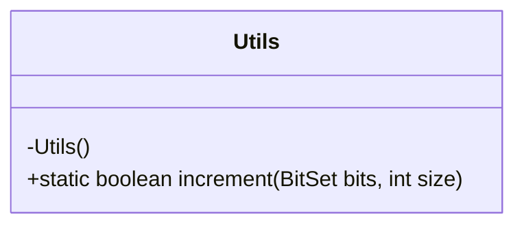
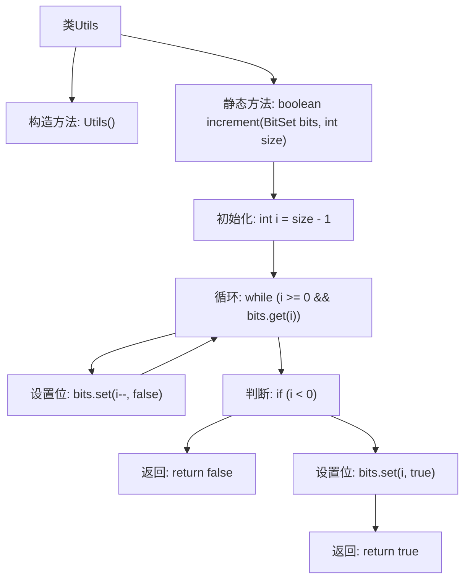

# 基础信息

|      |      |
|------|------|
| 名称 | Utils |
| 编码语言 | .java |
| 代码路径 | Java/src/main/java/com/thealgorithms/ciphers/a5/Utils.java |
| 包名 | com.thealgorithms.ciphers.a5 |
| 依赖项 | ['java.util.BitSet'] |
| 概述说明 | Utils类的静态方法increment用于递增BitSet并返回成功状态。 |

# 说明

Utils类中定义了一个名为increment的静态方法，该方法用于对BitSet进行递增操作，并返回一个布尔值表示操作是否成功。该方法的核心功能是处理BitSet的递增逻辑，确保在递增过程中能够正确判断并返回操作结果。

# 类列表 Class Summary

| 名称   | 类型  | 说明 |
|-------|------|-------------|
| Utils | class | Utils类包含静态方法increment，用于递增BitSet并返回是否成功。 |

## 类 Utils

|      |      |
|------|------|
| 访问范围 | public final |
| 类型 | class |
| 名称 | Utils |
| 说明 | Utils类包含静态方法increment，用于递增BitSet并返回是否成功。 |

### UML类图

这段代码定义了一个名为 `Utils` 的工具类，该类包含一个私有的构造函数和一个静态方法 `increment`。`increment` 方法接收一个 `BitSet` 对象和一个整数 `size` 作为参数，并返回一个布尔值。该方法的主要功能是对 `BitSet` 进行递增操作，类似于二进制数的递增。如果递增成功，返回 `true`；如果 `BitSet` 已经达到最大值（即所有位都为 `1`），则返回 `false`。这个工具类适用于需要处理位集递增的场景。

### 内部方法调用关系图

这段代码定义了一个`Utils`类，包含一个私有的构造方法和一个静态的`increment`方法。`increment`方法用于对`BitSet`对象进行递增操作，从最高位开始查找第一个为`false`的位，将其设置为`true`，并将其后的所有位设置为`false`。如果所有位都为`true`，则返回`false`，否则返回`true`。流程图展示了方法内部的逻辑流程，包括循环、条件判断和位操作。

### 字段列表 Field List

| 名称  | 类型  | 说明 |
|-------|-------|------|

### 方法列表 Method List

| 名称  | 类型  | 说明 |
|-------|-------|------|
| increment | boolean | Java方法increment用于递增BitSet，返回是否成功。 |

