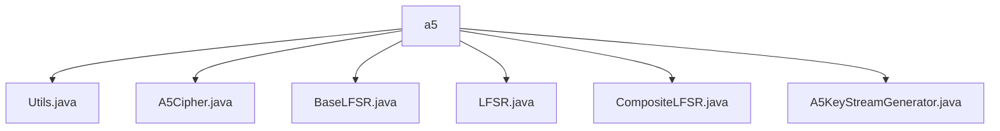

# 基础信息

|      |      |
|------|------|
| 名称 | a5 |
| 编码语言 | .java |
| 代码路径 | Java/src/main/java/com/thealgorithms/ciphers/a5 |
| 包名 | Java.src.main.java.com.thealgorithms.ciphers.a5 |
| 概述说明 | Utils类实现BitSet递增，A5Cipher类实现A5/1加密，LFSR类实现线性反馈移位寄存器，CompositeLFSR类实现时钟操作，A5KeyStreamGenerator类生成密钥流。 |

# 说明

## 概述
该代码模块主要实现了一个基于A5/1加密算法的密钥流生成系统。A5/1是一种流密码算法，广泛应用于通信领域，特别是GSM网络中，用于保护语音和数据传输的机密性。模块中的各个类协同工作，通过线性反馈移位寄存器（LFSR）生成伪随机序列，并结合会话密钥和帧计数器动态生成密钥流，最终实现对明文的加密。

## 主要业务场景
1. **密钥流生成**：通过`A5KeyStreamGenerator`类初始化和管理线性反馈移位寄存器（LFSR），生成与特定帧相关联的密钥流。该过程支持重置操作，确保密钥流生成的灵活性。
2. **加密与解密**：`A5Cipher`类利用生成的密钥流对明文进行加密，确保数据的安全性。该算法通过结合会话密钥和帧计数器，增强了加密的强度和灵活性。
3. **线性反馈移位寄存器操作**：`LFSR`类实现了线性反馈移位寄存器的核心功能，包括初始化、时钟操作和位操作。`CompositeLFSR`类进一步扩展了LFSR的功能，通过计算多数位来确定反馈位，并返回所有寄存器末位的异或值，确保伪随机序列的生成。
4. **BitSet操作**：`Utils`类提供了对`BitSet`的递增操作，确保在递增过程中能够正确判断并返回操作结果，为密钥流生成过程中的位操作提供了支持。

该模块适用于需要高效、灵活的密钥流生成和加密的场景，特别是在通信领域中对数据机密性要求较高的应用中。

### 包内部结构视图

该流程图展示了在`a5`文件夹下的文件层级关系。`a5`作为根节点，包含了多个Java文件，如`Utils.java`、`A5Cipher.java`、`BaseLFSR.java`、`LFSR.java`、`CompositeLFSR.java`和`A5KeyStreamGenerator.java`。这些文件都与A5加密算法相关，分别用于不同的功能实现，如密钥流生成、线性反馈移位寄存器等。

# 文件列表 File List

| 名称   | 类型  | 说明 |
|-------|------|-------------|
| [BaseLFSR.java](BaseLFSR.md) | file | 无内容提供，无法生成概要描述。 |
| [Utils.java](Utils.md) | file | Utils类的静态方法increment用于递增BitSet并返回成功状态。 |
| [A5KeyStreamGenerator.java](A5KeyStreamGenerator.md) | file | A5密钥流生成器类，支持LFSR初始化、密钥流生成、重置及帧计数器操作。 |
| [CompositeLFSR.java](CompositeLFSR.md) | file | CompositeLFSR类执行LFSR时钟操作，计算多数位并返回寄存器末位异或值。 |
| [LFSR.java](LFSR.md) | file | LFSR类实现线性反馈移位寄存器，支持初始化、时钟操作和位操作。 |
| [A5Cipher.java](A5Cipher.md) | file | A5Cipher类实现A5/1算法，使用会话密钥和帧计数器生成密钥流，加密明文。 |

