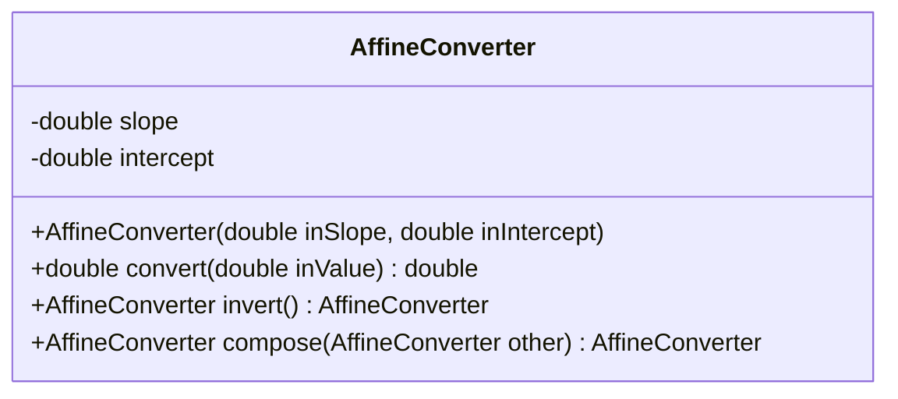
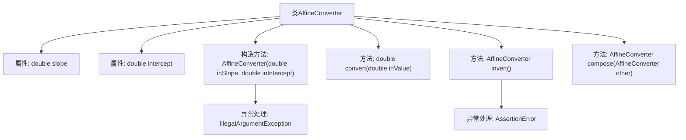

# 基础信息

|      |      |
|------|------|
| 名称 | AffineConverter |
| 编码语言 | .java |
| 代码路径 | Java/src/main/java/com/thealgorithms/conversions/AffineConverter.java |
| 包名 | com.thealgorithms.conversions |
| 依赖项 | [] |
| 概述说明 | AffineConverter类提供仿射变换功能，支持构造、转换、求逆和组合操作。 |

# 说明

AffineConverter类是一个用于实现仿射变换的工具，提供了构造、转换、求逆和组合功能。构造功能用于创建仿射变换的实例，转换功能用于将输入数据应用仿射变换，求逆功能用于获取当前变换的逆变换，组合功能用于将多个仿射变换合并为一个变换。该类旨在处理复杂的几何变换需求，适用于需要精确控制变换参数的场景。

# 类列表 Class Summary

| 名称   | 类型  | 说明 |
|-------|------|-------------|
| AffineConverter | class | AffineConverter类实现仿射变换，包含构造、转换、求逆和组合功能。 |

## 类 AffineConverter

|      |      |
|------|------|
| 访问范围 | public final |
| 类型 | class |
| 名称 | AffineConverter |
| 说明 | AffineConverter类实现仿射变换，包含构造、转换、求逆和组合功能。 |

### UML类图

这段代码定义了一个名为 `AffineConverter` 的不可变类，用于表示和执行仿射变换。仿射变换是一种线性变换，形式为 `y = slope * x + intercept`。该类提供了构造函数来初始化斜率和截距，并包含三个主要方法：`convert` 用于执行变换，`invert` 用于计算逆变换，`compose` 用于将两个仿射变换组合成一个新的变换。类中还包含对输入参数的校验，确保斜率和截距为有效数值，并在斜率为零时抛出断言错误。

### 内部方法调用关系图

这段代码定义了一个名为 `AffineConverter` 的类，用于实现仿射变换。类中包含两个私有属性 `slope` 和 `intercept`，分别表示仿射变换的斜率和截距。构造方法 `AffineConverter` 用于初始化这两个属性，并在输入参数为 `NaN` 时抛出 `IllegalArgumentException` 异常。`convert` 方法用于根据输入的 `inValue` 计算仿射变换的结果。`invert` 方法返回当前仿射变换的逆变换，并在斜率为零时抛出 `AssertionError`。`compose` 方法用于将当前仿射变换与另一个仿射变换组合，返回一个新的 `AffineConverter` 对象。

### 字段列表 Field List

| 名称  | 类型  | 说明 |
|-------|-------|------|
| intercept | double | 私有常量intercept为双精度类型。 |
| slope | double | 定义了一个私有的不可变双精度浮点数变量slope。 |

### 方法列表 Method List

| 名称  | 类型  | 说明 |
|-------|-------|------|
| invert | AffineConverter | AffineConverter反转方法，斜率非零时返回新实例。 |
| compose | AffineConverter | 组合两个仿射转换器，返回新斜率和截距的转换器。 |
| convert | double | 该方法通过斜率和截距将输入值转换为输出值。 |

