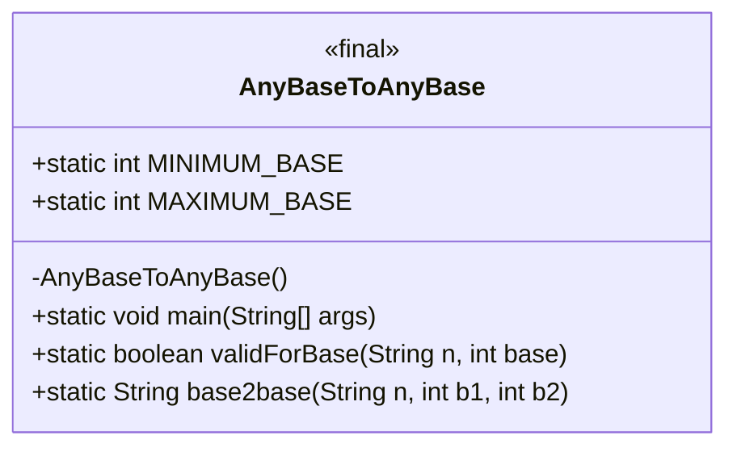
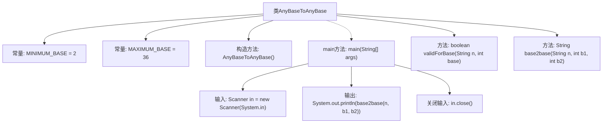
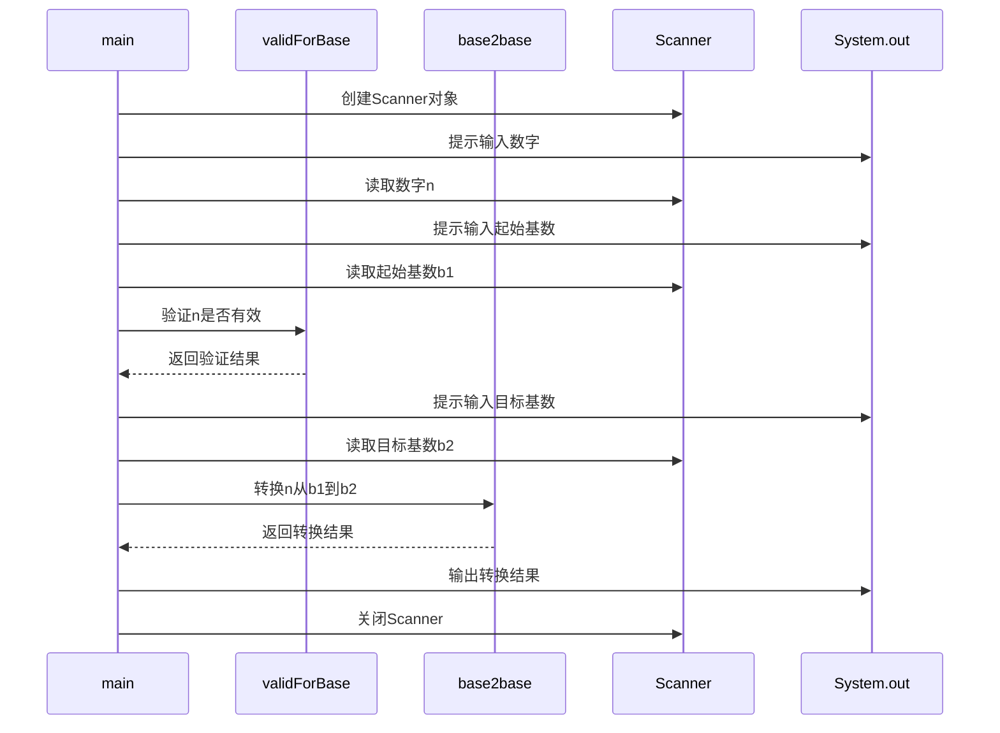

# 基础信息

|      |      |
|------|------|
| 名称 | AnyBaseToAnyBase |
| 编码语言 | .java |
| 代码路径 | Java/src/main/java/com/thealgorithms/conversions/AnyBaseToAnyBase.java |
| 包名 | com.thealgorithms.conversions |
| 依赖项 | ['java.util.Arrays', 'java.util.HashSet', 'java.util.InputMismatchException', 'java.util.Scanner'] |
| 概述说明 | Java类实现2到36进制转换，验证输入并执行。 |

# 说明

Java类实现了任意进制转换功能，支持2到36进制之间的转换。该功能首先验证输入的有效性，确保输入的数值和进制符合要求，然后执行具体的转换操作。通过这一实现，用户可以将一个进制的数值转换为另一个进制的数值，涵盖广泛的进制范围，确保灵活性和实用性。

# 类列表 Class Summary

| 名称   | 类型  | 说明 |
|-------|------|-------------|
| AnyBaseToAnyBase | class | Java类实现任意进制转换，支持2到36进制，验证输入有效性并执行转换。 |

## 类 AnyBaseToAnyBase

|      |      |
|------|------|
| 访问范围 | public final |
| 类型 | class |
| 名称 | AnyBaseToAnyBase |
| 说明 | Java类实现任意进制转换，支持2到36进制，验证输入有效性并执行转换。 |

### UML类图

### 类图描述
`AnyBaseToAnyBase` 是一个工具类，用于将任意进制的数字转换为另一个进制的数字。该类包含两个静态常量 `MINIMUM_BASE` 和 `MAXIMUM_BASE`，分别表示允许的最小和最大进制。`main` 方法负责用户交互，获取输入并调用 `validForBase` 和 `base2base` 方法进行验证和转换。`validForBase` 方法用于检查输入的数字是否适用于给定的进制，而 `base2base` 方法则实现了进制转换的核心逻辑。

### 内部方法调用关系图

这段代码实现了一个任意进制转换的工具类 `AnyBaseToAnyBase`。它允许用户输入一个数字和两个基数，将数字从起始基数转换为目标基数。代码首先验证输入的数字是否有效，然后通过 `base2base` 方法进行转换。流程图展示了类的结构和方法的调用关系，时序图则详细描述了 `main` 方法与其他组件之间的交互过程。

### 字段列表 Field List

| 名称  | 类型  | 说明 |
|-------|-------|------|
| MINIMUM_BASE = 2 | int | 定义静态常量MINIMUM_BASE，值为2。 |
| MAXIMUM_BASE = 36 | int | 最大基数为36的静态整型常量。 |

### 方法列表 Method List

| 名称  | 类型  | 说明 |
|-------|-------|------|
| main | void | Java程序读取用户输入的数字和基数，验证后转换并输出结果。 |
| validForBase | boolean | 该方法验证字符串n中的字符是否在给定进制base的有效字符范围内。 |
| base2base | String | 该方法将数字从基数b1转换为基数b2，支持字母表示大于9的值。 |

