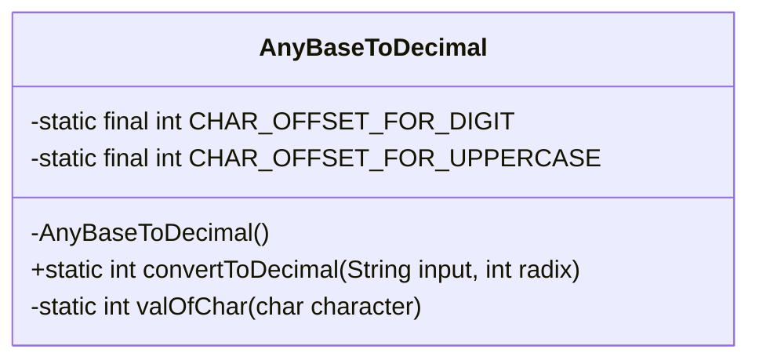
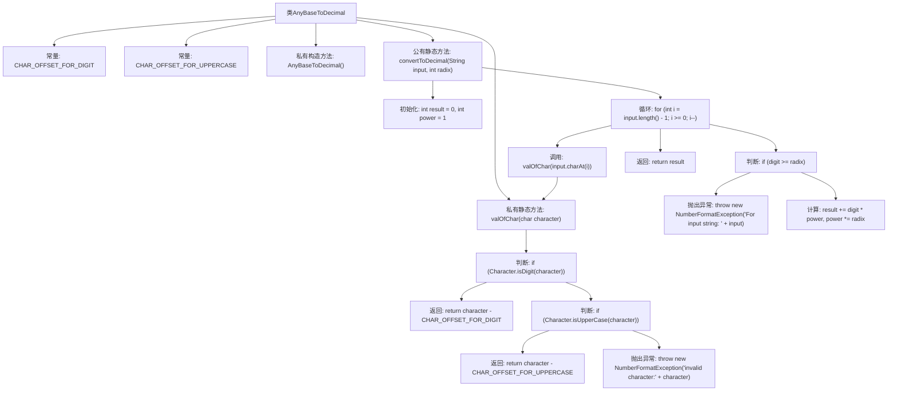

# 基础信息

|      |      |
|------|------|
| 名称 | AnyBaseToDecimal |
| 编码语言 | .java |
| 代码路径 | Java/src/main/java/com/thealgorithms/conversions/AnyBaseToDecimal.java |
| 包名 | com.thealgorithms.conversions |
| 依赖项 | [] |
| 概述说明 | AnyBaseToDecimal类实现任意进制字符串转十进制整数，支持数字和大写字母。 |

# 说明

AnyBaseToDecimal类设计用于将任意进制的字符串转换为十进制整数。该类支持处理包含数字和大写字母的字符串，能够识别并转换这些字符为对应的数值。通过这一功能，用户可以轻松地将不同进制的数值表示转换为标准的十进制整数，适用于需要跨进制计算或数据处理的场景。

# 类列表 Class Summary

| 名称   | 类型  | 说明 |
|-------|------|-------------|
| AnyBaseToDecimal | class | AnyBaseToDecimal类实现任意进制字符串转十进制整数，支持数字和大写字母。 |

## 类 AnyBaseToDecimal

|      |      |
|------|------|
| 访问范围 | public final |
| 类型 | class |
| 名称 | AnyBaseToDecimal |
| 说明 | AnyBaseToDecimal类实现任意进制字符串转十进制整数，支持数字和大写字母。 |

### UML类图

**描述：**  
`AnyBaseToDecimal` 类是一个工具类，用于将任意进制的字符串转换为十进制整数。它包含两个私有静态常量 `CHAR_OFFSET_FOR_DIGIT` 和 `CHAR_OFFSET_FOR_UPPERCASE`，用于字符到数字的转换。类中提供了 `convertToDecimal` 方法，该方法接收一个字符串和其进制作为参数，并返回对应的十进制值。`valOfChar` 方法用于将字符转换为对应的整数值，支持数字和大写字母。如果输入字符或进制无效，将抛出 `NumberFormatException` 异常。

### 内部方法调用关系图

这段代码定义了一个名为 `AnyBaseToDecimal` 的类，用于将任意进制的字符串转换为十进制数。类中包含两个常量 `CHAR_OFFSET_FOR_DIGIT` 和 `CHAR_OFFSET_FOR_UPPERCASE`，分别用于计算数字和大写字母的数值。`convertToDecimal` 方法通过遍历输入字符串的每个字符，调用 `valOfChar` 方法将字符转换为对应的数值，并根据进制进行计算，最终返回十进制结果。`valOfChar` 方法负责将字符转换为整数，若字符无效则抛出异常。

### 字段列表 Field List

| 名称  | 类型  | 说明 |
|-------|-------|------|
| CHAR_OFFSET_FOR_DIGIT = '0' | int | 定义常量CHAR_OFFSET_FOR_DIGIT，值为字符'0'的ASCII码。 |
| CHAR_OFFSET_FOR_UPPERCASE = 'A' - 10 | int | 定义常量CHAR_OFFSET_FOR_UPPERCASE，值为'A'减10。 |

### 方法列表 Method List

| 名称  | 类型  | 说明 |
|-------|-------|------|
| convertToDecimal | int | 将字符串按指定进制转换为十进制整数，并处理异常情况。 |
| valOfChar | int | 静态方法根据字符类型返回相应数值，否则抛出异常。 |

