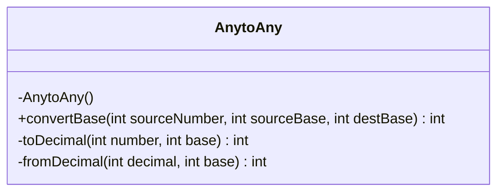
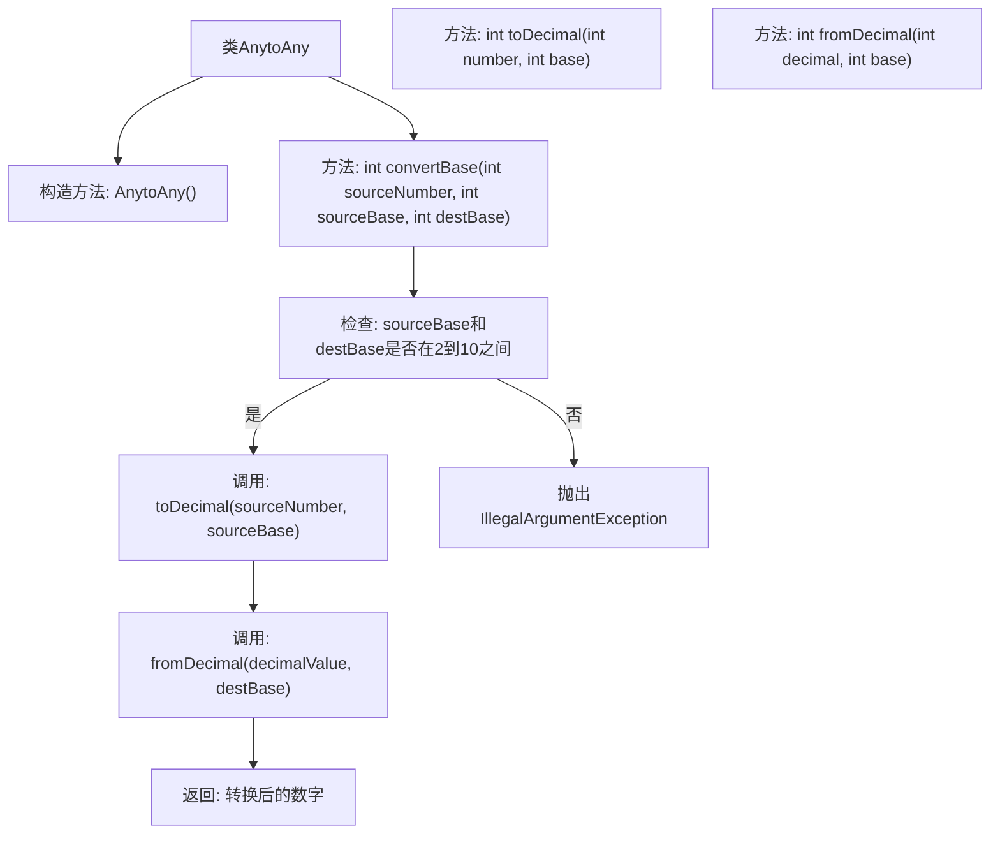

# 基础信息

|      |      |
|------|------|
| 名称 | AnytoAny |
| 编码语言 | .java |
| 代码路径 | Java/src/main/java/com/thealgorithms/conversions/AnytoAny.java |
| 包名 | com.thealgorithms.conversions |
| 依赖项 | [] |
| 概述说明 | AnytoAny类支持2到10进制数字转换。 |

# 说明

AnytoAny类是一个用于在不同进制之间进行数字转换的工具，支持从2进制到10进制的转换。该类的主要功能是将一个数字从一种进制表示转换为另一种进制表示，涵盖了二进制、三进制、四进制、五进制、六进制、七进制、八进制、九进制和十进制。通过使用AnytoAny类，用户可以方便地将数字在各种进制之间进行转换，满足不同场景下的需求。该类设计简洁，功能明确，适用于需要频繁进行进制转换的应用程序或系统。

# 类列表 Class Summary

| 名称   | 类型  | 说明 |
|-------|------|-------------|
| AnytoAny | class | AnytoAny类提供数字在不同进制间的转换功能，支持2到10进制。 |

## 类 AnytoAny

|      |      |
|------|------|
| 访问范围 | public final |
| 类型 | class |
| 名称 | AnytoAny |
| 说明 | AnytoAny类提供数字在不同进制间的转换功能，支持2到10进制。 |

### UML类图

**描述：**  
`AnytoAny` 类是一个工具类，用于将数字从一个基数转换为另一个基数。它包含一个私有的构造函数，确保不能被实例化。类中的 `convertBase` 方法接受源数字、源基数和目标基数作为参数，并返回转换后的数字。`toDecimal` 方法将给定基数的数字转换为十进制，而 `fromDecimal` 方法将十进制数字转换为指定基数的数字。该类通过静态方法实现功能，适用于基数在2到10之间的转换。

### 内部方法调用关系图

这段代码定义了一个名为 `AnytoAny` 的类，用于将数字从一个进制转换为另一个进制。`convertBase` 方法首先检查源进制和目标进制是否在2到10之间，然后调用 `toDecimal` 方法将源数字转换为十进制，再调用 `fromDecimal` 方法将十进制数字转换为目标进制。如果进制不在2到10之间，将抛出 `IllegalArgumentException`。流程图展示了类的结构和方法之间的调用关系。

### 字段列表 Field List

| 名称  | 类型  | 说明 |
|-------|-------|------|

### 方法列表 Method List

| 名称  | 类型  | 说明 |
|-------|-------|------|
| toDecimal | int | 将给定基数下的整数转换为十进制值。 |
| fromDecimal | int | 将十进制数转换为指定进制的整数。 |
| convertBase | int | 将数字从源进制转换为目标进制，支持2到10进制。 |

