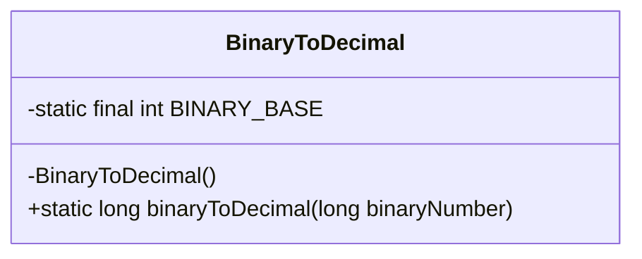
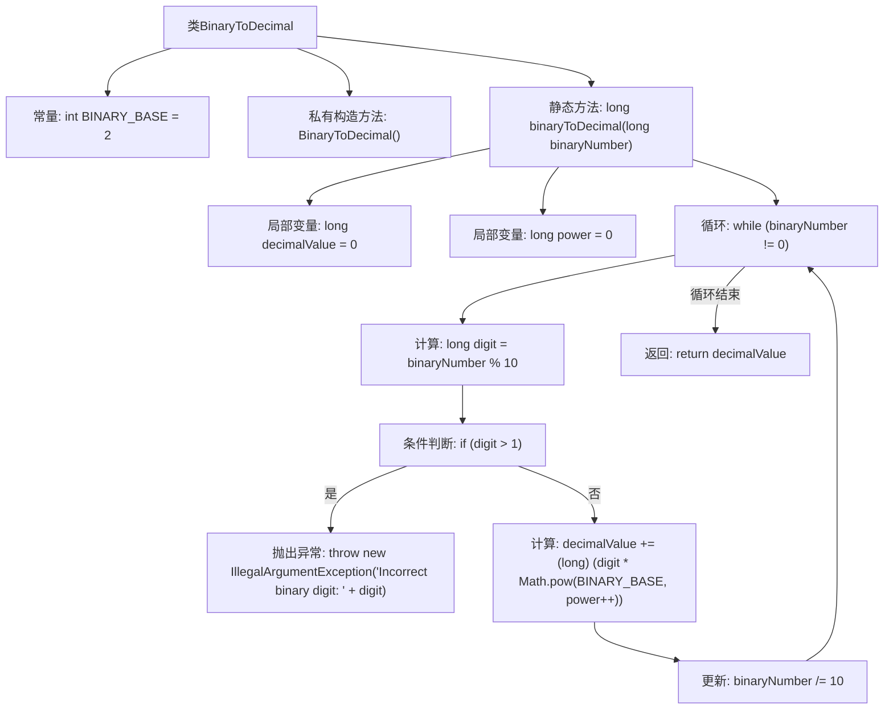

# 基础信息

|      |      |
|------|------|
| 名称 | BinaryToDecimal |
| 编码语言 | .java |
| 代码路径 | Java/src/main/java/com/thealgorithms/conversions/BinaryToDecimal.java |
| 包名 | com.thealgorithms.conversions |
| 依赖项 | [] |
| 概述说明 | 将二进制数（仅含0和1）转换为十进制数。 |

# 说明

将二进制数转换为十进制数的过程，要求输入仅包含数字0和1。转换时，从二进制数的最低位开始，每一位的值乘以2的相应次方，然后将所有结果相加，得到最终的十进制数。确保输入字符串中不包含其他字符，以避免转换错误。

# 类列表 Class Summary

| 名称   | 类型  | 说明 |
|-------|------|-------------|
| BinaryToDecimal | class | 将二进制数转换为十进制数，确保输入仅含0和1。 |

## 类 BinaryToDecimal

|      |      |
|------|------|
| 访问范围 | final |
| 类型 | class |
| 名称 | BinaryToDecimal |
| 说明 | 将二进制数转换为十进制数，确保输入仅含0和1。 |

### UML类图

这段代码定义了一个名为 `BinaryToDecimal` 的类，该类包含一个私有构造函数和一个静态方法 `binaryToDecimal`，用于将二进制数转换为十进制数。类中包含一个常量 `BINARY_BASE`，表示二进制的基数。`binaryToDecimal` 方法通过逐位检查二进制数的每一位，确保其只包含0和1，并将其转换为十进制数。如果二进制数包含其他数字，则会抛出 `IllegalArgumentException` 异常。

### 内部方法调用关系图

这段代码定义了一个`BinaryToDecimal`类，包含一个静态方法`binaryToDecimal`，用于将二进制数转换为十进制数。方法通过循环逐位处理二进制数，计算每位对应的十进制值并累加。如果二进制数包含非0或1的位，则抛出`IllegalArgumentException`异常。流程图展示了方法的主要逻辑流程，包括初始化、循环处理、条件判断和异常抛出。

### 字段列表 Field List

| 名称  | 类型  | 说明 |
|-------|-------|------|
| BINARY_BASE = 2 | int | 定义了一个私有的静态常量BINARY_BASE，其值为2。 |

### 方法列表 Method List

| 名称  | 类型  | 说明 |
|-------|-------|------|
| binaryToDecimal | long | 将二进制数转换为十进制数的Java方法。 |

