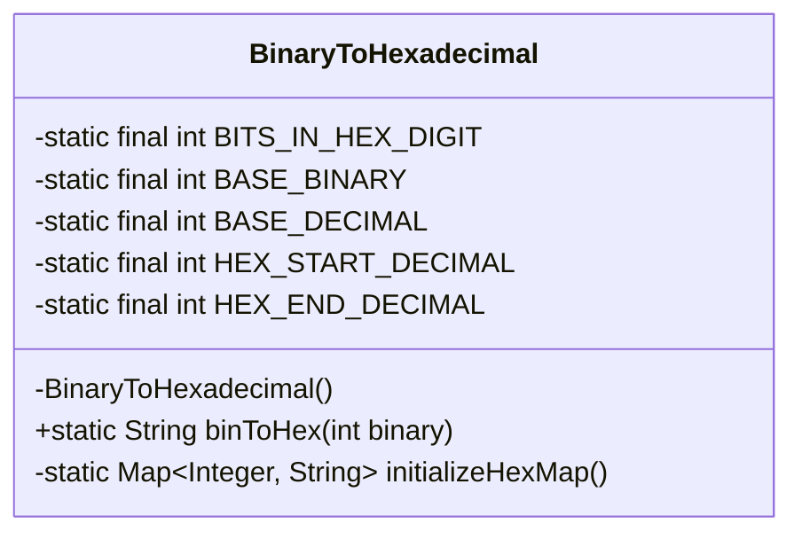
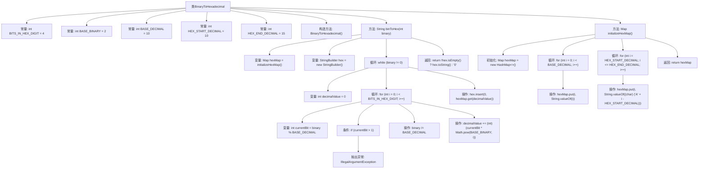

# 基础信息

|      |      |
|------|------|
| 名称 | BinaryToHexadecimal |
| 编码语言 | .java |
| 代码路径 | Java/src/main/java/com/thealgorithms/conversions/BinaryToHexadecimal.java |
| 包名 | com.thealgorithms.conversions |
| 依赖项 | ['java.util.HashMap', 'java.util.Map'] |
| 概述说明 | 二进制转十六进制工具类，含映射初始化和转换方法，支持错误检测。 |

# 说明

该工具类专注于二进制到十六进制的转换，提供了初始化映射和转换方法。初始化映射用于建立二进制与十六进制之间的对应关系，确保转换过程的准确性和高效性。转换方法实现了从二进制到十六进制的实际转换，支持对输入数据的错误检测，确保输入格式的正确性。该工具类设计简洁，功能明确，适用于需要二进制与十六进制互转的场景。

# 类列表 Class Summary

| 名称   | 类型  | 说明 |
|-------|------|-------------|
| BinaryToHexadecimal | class | 二进制转十六进制工具类，包含初始化映射和转换方法，支持错误检测。 |

## 类 BinaryToHexadecimal

|      |      |
|------|------|
| 访问范围 | public final |
| 类型 | class |
| 名称 | BinaryToHexadecimal |
| 说明 | 二进制转十六进制工具类，包含初始化映射和转换方法，支持错误检测。 |

### UML类图

**描述：**  
`BinaryToHexadecimal` 类是一个工具类，用于将二进制数转换为十六进制数。它包含一个私有的构造函数，确保无法实例化该类。`binToHex` 方法接受一个整数形式的二进制数，并将其转换为十六进制字符串。如果输入包含非二进制数字（即非0或1），则抛出 `IllegalArgumentException` 异常。`initializeHexMap` 方法初始化一个映射表，将十进制数字映射到对应的十六进制字符。该类通过静态方法和常量实现功能，确保了代码的简洁性和可重用性。

### 内部方法调用关系图

这段代码定义了一个`BinaryToHexadecimal`类，用于将二进制数转换为十六进制数。代码首先初始化了一个包含十进制到十六进制映射的哈希表，然后通过循环将二进制数逐位转换为十进制，再从哈希表中查找对应的十六进制字符，最终拼接成完整的十六进制字符串。如果输入的二进制数包含非0或1的字符，则会抛出异常。

### 字段列表 Field List

| 名称  | 类型  | 说明 |
|-------|-------|------|
| BASE_DECIMAL = 10 | int | 定义私有静态常量BASE_DECIMAL，值为10。 |
| HEX_END_DECIMAL = 15 | int | 定义了一个私有静态常量HEX_END_DECIMAL，值为15。 |
| BASE_BINARY = 2 | int | 定义私有静态常量BASE_BINARY，值为2。 |
| BITS_IN_HEX_DIGIT = 4 | int | 私有静态常量，表示十六进制数字的位数为4。 |
| HEX_START_DECIMAL = 10 | int | 定义私有静态常量HEX_START_DECIMAL，值为10。 |

### 方法列表 Method List

| 名称  | 类型  | 说明 |
|-------|-------|------|
| binToHex | String | 将二进制数转换为十六进制字符串的函数。 |
| initializeHexMap | Map<Integer, String> | 初始化十六进制映射表，包含数字和字母。 |

