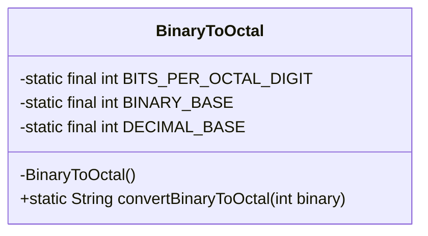
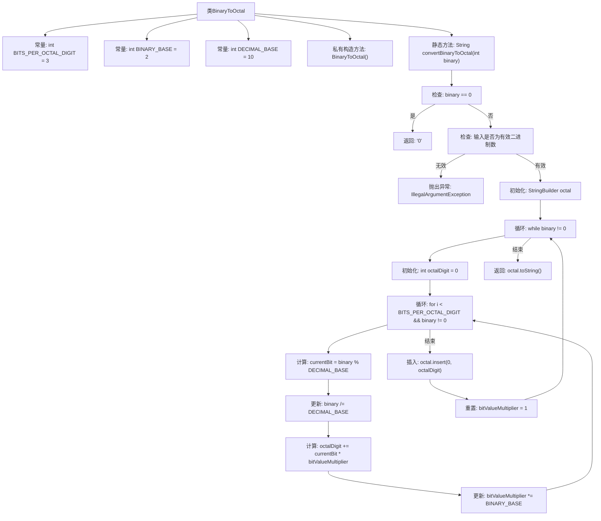

# 基础信息

|      |      |
|------|------|
| 名称 | BinaryToOctal |
| 编码语言 | .java |
| 代码路径 | Java/src/main/java/com/thealgorithms/conversions/BinaryToOctal.java |
| 包名 | com.thealgorithms.conversions |
| 依赖项 | [] |
| 概述说明 | Java工具类实现二进制到八进制转换及验证功能。 |

# 说明

该Java工具类专注于二进制到八进制的转换，具备完整的验证和转换逻辑。工具类首先验证输入的二进制字符串是否有效，确保仅包含0和1，且长度符合要求。随后，通过将二进制字符串按每三位分组，将每组转换为对应的八进制数字，最终拼接成完整的八进制结果。该工具类设计简洁高效，适用于需要处理二进制到八进制转换的场景。

# 类列表 Class Summary

| 名称   | 类型  | 说明 |
|-------|------|-------------|
| BinaryToOctal | class | 二进制转八进制的Java工具类，包含验证和转换逻辑。 |

## 类 BinaryToOctal

|      |      |
|------|------|
| 访问范围 | public final |
| 类型 | class |
| 名称 | BinaryToOctal |
| 说明 | 二进制转八进制的Java工具类，包含验证和转换逻辑。 |

### UML类图

这段代码定义了一个名为 `BinaryToOctal` 的类，该类包含一个私有构造函数和三个静态常量。`convertBinaryToOctal` 方法用于将二进制数转换为八进制数。方法首先检查输入是否为有效的二进制数，然后通过逐位计算将二进制数转换为八进制数，并将结果以字符串形式返回。如果输入无效，方法会抛出 `IllegalArgumentException` 异常。

### 内部方法调用关系图

这段代码定义了一个`BinaryToOctal`类，用于将二进制数转换为八进制数。代码首先检查输入是否为0或有效二进制数，然后通过循环逐位计算八进制数，并将结果存储在`StringBuilder`中。最后，返回转换后的八进制字符串。代码通过逐位处理和重置乘数的方式，确保转换的准确性。

### 字段列表 Field List

| 名称  | 类型  | 说明 |
|-------|-------|------|
| BITS_PER_OCTAL_DIGIT = 3 | int | 定义常量BITS_PER_OCTAL_DIGIT，表示每个八进制数字的位数，值为3。 |
| BINARY_BASE = 2 | int | 定义了一个私有静态常量BINARY_BASE，值为2。 |
| DECIMAL_BASE = 10 | int | 定义私有静态常量DECIMAL_BASE，值为10。 |

### 方法列表 Method List

| 名称  | 类型  | 说明 |
|-------|-------|------|
| convertBinaryToOctal | String | 将二进制数转换为八进制数，验证输入有效性，分组计算并拼接结果。 |

