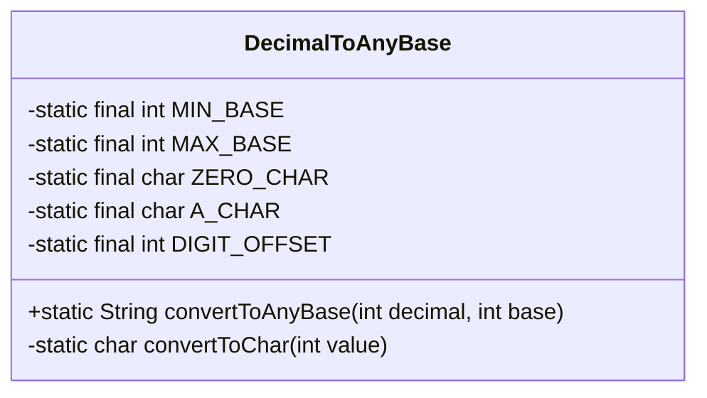
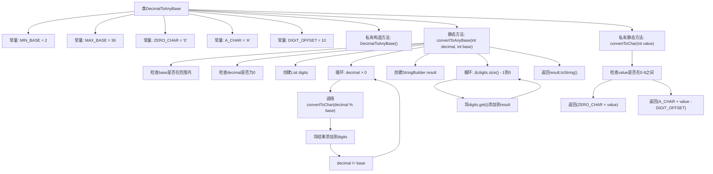

# 基础信息

|      |      |
|------|------|
| 名称 | DecimalToAnyBase |
| 编码语言 | .java |
| 代码路径 | Java/src/main/java/com/thealgorithms/conversions/DecimalToAnyBase.java |
| 包名 | com.thealgorithms.conversions |
| 依赖项 | ['java.util.ArrayList', 'java.util.List'] |
| 概述说明 | 将十进制数转换为2至36进制字符串。 |

# 说明

该功能用于将十进制数转换为指定进制的字符串表示，支持的进制范围从2到36。通过输入一个十进制数和一个目标进制值，函数会将该数转换为相应进制的字符串形式。这一转换过程涵盖了从二进制到三十六进制的所有可能进制，确保了广泛的适用性和灵活性。该功能适用于需要在不同进制之间进行转换的场景，如计算机科学、数学计算和数据处理等领域。

# 类列表 Class Summary

| 名称   | 类型  | 说明 |
|-------|------|-------------|
| DecimalToAnyBase | class | 将十进制数转换为指定进制的字符串表示，支持2到36进制。 |

## 类 DecimalToAnyBase

|      |      |
|------|------|
| 访问范围 | public final |
| 类型 | class |
| 名称 | DecimalToAnyBase |
| 说明 | 将十进制数转换为指定进制的字符串表示，支持2到36进制。 |

### UML类图

这段代码定义了一个名为 `DecimalToAnyBase` 的类，该类包含两个静态方法：`convertToAnyBase` 和 `convertToChar`。`convertToAnyBase` 方法用于将十进制整数转换为指定基数的字符串表示，支持基数范围在2到36之间。`convertToChar` 方法用于将整数值转换为对应的字符表示，其中0-9对应字符 '0'-'9'，10-35对应字符 'A'-'Z'。该类通过私有构造函数确保不可实例化，所有方法均为静态方法，适用于工具类的设计模式。

### 内部方法调用关系图

这段代码实现了一个将十进制数转换为任意进制字符串表示的功能。类`DecimalToAnyBase`包含两个主要方法：`convertToAnyBase`用于将十进制数转换为指定进制的字符串，`convertToChar`用于将数值转换为对应的字符。流程图展示了代码的执行流程，包括参数检查、循环处理、字符转换和结果构建等步骤。

### 字段列表 Field List

| 名称  | 类型  | 说明 |
|-------|-------|------|
| MIN_BASE = 2 | int | 定义常量MIN_BASE，值为2。 |
| MAX_BASE = 36 | int | 定义私有静态常量MAX_BASE，值为36。 |
| A_CHAR = 'A' | char | 定义私有静态常量字符A，值为'A'。 |
| DIGIT_OFFSET = 10 | int | 私有静态常量DIGIT_OFFSET值为10。 |
| ZERO_CHAR = '0' | char | 定义私有静态常量ZERO_CHAR，值为字符'0'。 |

### 方法列表 Method List

| 名称  | 类型  | 说明 |
|-------|-------|------|
| convertToChar | char | 将整数值转换为对应字符，0-9为数字，其他为字母。 |
| convertToAnyBase | String | 将十进制数转换为任意进制字符串，支持进制范围校验。 |

