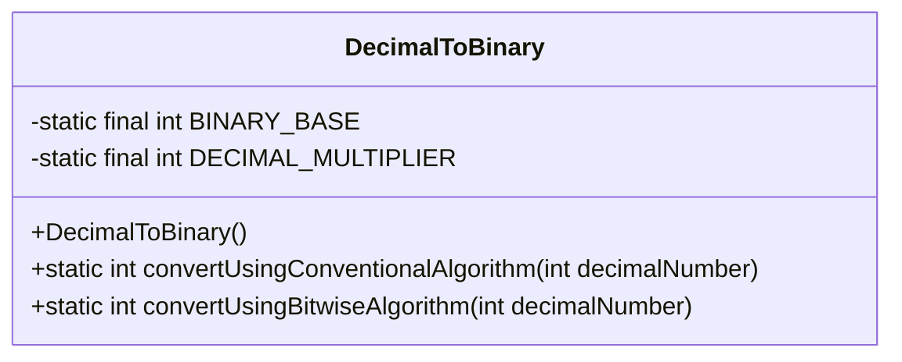
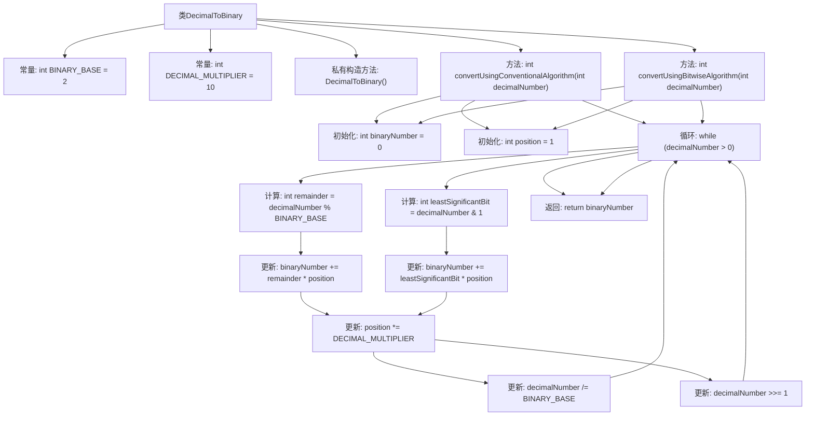

# 基础信息

|      |      |
|------|------|
| 名称 | DecimalToBinary |
| 编码语言 | .java |
| 代码路径 | Java/src/main/java/com/thealgorithms/conversions/DecimalToBinary.java |
| 包名 | com.thealgorithms.conversions |
| 依赖项 | [] |
| 概述说明 | DecimalToBinary类提供两种十进制转二进制方法：常规算法和位运算。 |

# 说明

DecimalToBinary类提供了两种将十进制数转换为二进制数的方法：常规算法和位运算算法。常规算法通过逐步除以二并记录余数来实现转换，而位运算算法则利用位操作直接处理二进制位，以提高效率。这两种方法各有优势，适用于不同的应用场景。

# 类列表 Class Summary

| 名称   | 类型  | 说明 |
|-------|------|-------------|
| DecimalToBinary | class | DecimalToBinary类提供两种方法将十进制数转换为二进制数：常规算法和位运算算法。 |

## 类 DecimalToBinary

|      |      |
|------|------|
| 访问范围 | final |
| 类型 | class |
| 名称 | DecimalToBinary |
| 说明 | DecimalToBinary类提供两种方法将十进制数转换为二进制数：常规算法和位运算算法。 |

### UML类图

这段代码定义了一个名为 `DecimalToBinary` 的 final 类，该类包含两个静态方法，用于将十进制数转换为二进制数。`convertUsingConventionalAlgorithm` 方法使用传统的取余和除法算法进行转换，而 `convertUsingBitwiseAlgorithm` 方法则使用位运算进行转换。类中还定义了两个常量 `BINARY_BASE` 和 `DECIMAL_MULTIPLIER`，分别表示二进制基数和十进制乘数。类的构造函数被声明为私有，以防止实例化。整体设计简洁且功能明确，适用于需要将十进制数转换为二进制数的场景。

### 内部方法调用关系图

这段代码定义了一个名为 `DecimalToBinary` 的类，包含两个静态方法 `convertUsingConventionalAlgorithm` 和 `convertUsingBitwiseAlgorithm`，分别用于将十进制数转换为二进制数。`convertUsingConventionalAlgorithm` 使用传统的取余和除法方法，而 `convertUsingBitwiseAlgorithm` 使用位运算方法。两个方法都通过循环逐步计算二进制数，并在循环结束后返回结果。

### 字段列表 Field List

| 名称  | 类型  | 说明 |
|-------|-------|------|
| BINARY_BASE = 2 | int | 定义常量BINARY_BASE，值为2。 |
| DECIMAL_MULTIPLIER = 10 | int | 定义一个静态整型常量DECIMAL_MULTIPLIER，值为10。 |

### 方法列表 Method List

| 名称  | 类型  | 说明 |
|-------|-------|------|
| convertUsingBitwiseAlgorithm | int | 该方法通过位运算将十进制数转换为二进制数。 |
| convertUsingConventionalAlgorithm | int | 将十进制数转换为二进制数的常规算法实现。 |

