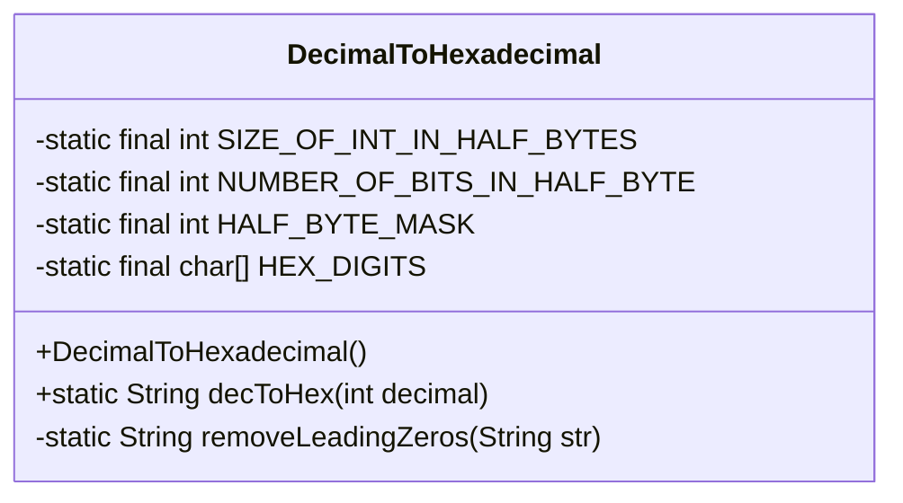
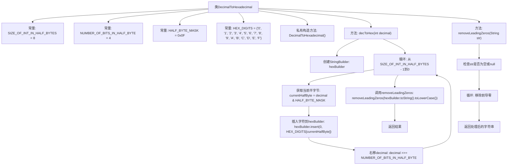

# 基础信息

|      |      |
|------|------|
| 名称 | DecimalToHexadecimal |
| 编码语言 | .java |
| 代码路径 | Java/src/main/java/com/thealgorithms/conversions/DecimalToHexadecimal.java |
| 包名 | com.thealgorithms.conversions |
| 依赖项 | [] |
| 概述说明 | 将十进制数转十六进制字符串并去前导零。 |

# 说明

该任务要求将给定的十进制数转换为十六进制字符串，并在转换后的结果中去除所有前导零。具体步骤包括首先将十进制数转换为十六进制表示形式，然后检查并移除字符串开头多余的零字符，确保最终结果简洁且符合预期格式。这一过程适用于需要优化十六进制字符串输出的场景。

# 类列表 Class Summary

| 名称   | 类型  | 说明 |
|-------|------|-------------|
| DecimalToHexadecimal | class | 将十进制数转换为十六进制字符串并去除前导零。 |

## 类 DecimalToHexadecimal

|      |      |
|------|------|
| 访问范围 | final |
| 类型 | class |
| 名称 | DecimalToHexadecimal |
| 说明 | 将十进制数转换为十六进制字符串并去除前导零。 |

### UML类图

**描述：**  
`DecimalToHexadecimal` 类是一个工具类，用于将十进制整数转换为十六进制字符串。该类包含私有常量用于定义转换过程中的参数，如半字节的大小和掩码。`decToHex` 方法是核心方法，它通过逐位处理十进制数并将其转换为十六进制字符，最终返回转换后的字符串。`removeLeadingZeros` 方法用于去除结果字符串中的前导零，确保输出格式简洁。该类设计为不可实例化，所有方法均为静态方法，适合作为工具类使用。

### 内部方法调用关系图

这段代码定义了一个`DecimalToHexadecimal`类，用于将十进制整数转换为十六进制字符串。类中包含两个主要方法：`decToHex`和`removeLeadingZeros`。`decToHex`方法通过循环处理每个半字节，将其转换为对应的十六进制字符，并最终移除前导零。`removeLeadingZeros`方法用于移除字符串中的前导零，确保输出的十六进制字符串简洁易读。整个流程通过循环和位操作实现高效的转换。

### 字段列表 Field List

| 名称  | 类型  | 说明 |
|-------|-------|------|
| NUMBER_OF_BITS_IN_HALF_BYTE = 4 | int | 定义常量表示半字节的位数。 |
| HEX_DIGITS = {'0', '1', '2', '3', '4', '5', '6', '7', '8', '9', 'A', 'B', 'C', 'D', 'E', 'F'} | char[] | 定义了一个包含十六进制字符的静态字符数组。 |
| SIZE_OF_INT_IN_HALF_BYTES = 8 | int | 定义私有静态常量，表示半字节中整数的长度为8。 |
| HALF_BYTE_MASK = 0x0F | int | 定义常量HALF_BYTE_MASK，值为0x0F。 |

### 方法列表 Method List

| 名称  | 类型  | 说明 |
|-------|-------|------|
| removeLeadingZeros | String | 该方法移除字符串前导零，空或null字符串直接返回。 |
| decToHex | String | 将十进制数转换为十六进制字符串并去除前导零。 |

