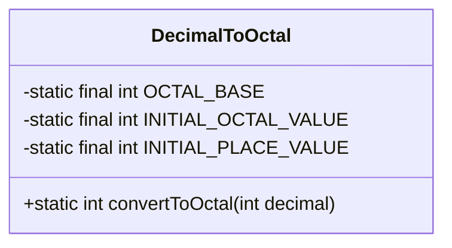
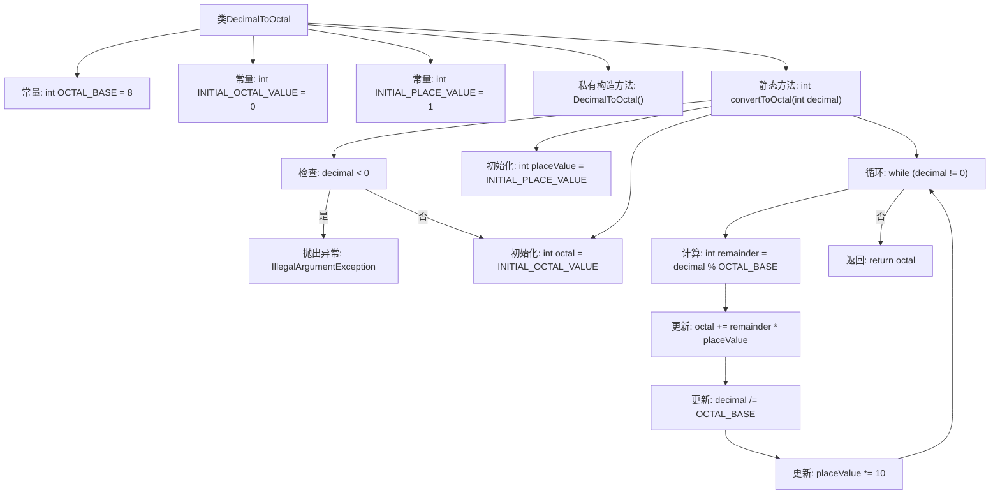

# 基础信息

|      |      |
|------|------|
| 名称 | DecimalToOctal |
| 编码语言 | .java |
| 代码路径 | Java/src/main/java/com/thealgorithms/conversions/DecimalToOctal.java |
| 包名 | com.thealgorithms.conversions |
| 依赖项 | [] |
| 概述说明 | 将十进制数转换为八进制数的静态方法。 |

# 说明

该方法是一个静态方法，用于将十进制数转换为八进制数。它接收一个十进制数作为输入，经过内部处理，最终返回对应的八进制数。该方法不涉及任何代码示例，仅描述其功能和用途。通过调用此方法，用户可以方便地将十进制数转换为八进制数，适用于需要处理不同进制转换的场景。

# 类列表 Class Summary

| 名称   | 类型  | 说明 |
|-------|------|-------------|
| DecimalToOctal | class | 将十进制数转换为八进制数的静态方法。 |

## 类 DecimalToOctal

|      |      |
|------|------|
| 访问范围 | public final |
| 类型 | class |
| 名称 | DecimalToOctal |
| 说明 | 将十进制数转换为八进制数的静态方法。 |

### UML类图

**描述：**
`DecimalToOctal` 类是一个工具类，用于将十进制数转换为八进制数。它包含三个静态常量：`OCTAL_BASE` 表示八进制的基数，`INITIAL_OCTAL_VALUE` 和 `INITIAL_PLACE_VALUE` 分别表示初始的八进制值和位值。`convertToOctal` 方法是该类的核心功能，它接收一个十进制整数作为输入，并返回其对应的八进制整数。如果输入的十进制数为负数，该方法会抛出 `IllegalArgumentException` 异常。

### 内部方法调用关系图

这段代码定义了一个名为`DecimalToOctal`的类，用于将十进制数转换为八进制数。类中包含三个常量和一个私有构造方法，确保类不能被实例化。`convertToOctal`方法接受一个十进制整数作为输入，首先检查输入是否为负数，如果是则抛出异常。否则，通过循环计算将十进制数逐步转换为八进制数，并返回结果。流程图清晰地展示了这一转换过程，包括初始化、循环计算和返回结果的步骤。

### 字段列表 Field List

| 名称  | 类型  | 说明 |
|-------|-------|------|
| INITIAL_OCTAL_VALUE = 0 | int | 定义私有静态常量INITIAL_OCTAL_VALUE，初始值为0。 |
| INITIAL_PLACE_VALUE = 1 | int | 私有静态常量INITIAL_PLACE_VALUE初始值为1。 |
| OCTAL_BASE = 8 | int | 定义了一个静态常量OCTAL_BASE，其值为8，表示八进制基数。 |

### 方法列表 Method List

| 名称  | 类型  | 说明 |
|-------|-------|------|
| convertToOctal | int | 将十进制数转换为八进制，处理负数异常，通过循环计算。 |

