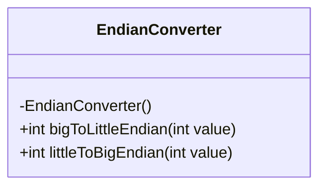
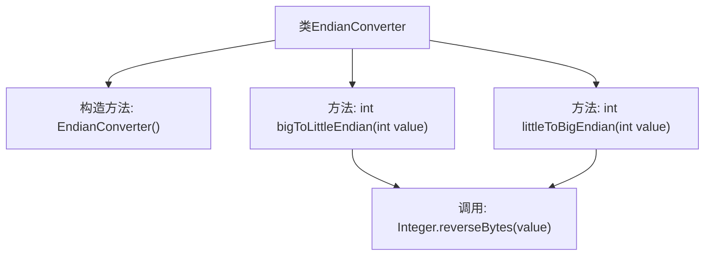

# 基础信息

|      |      |
|------|------|
| 名称 | EndianConverter |
| 编码语言 | .java |
| 代码路径 | Java/src/main/java/com/thealgorithms/conversions/EndianConverter.java |
| 包名 | com.thealgorithms.conversions |
| 依赖项 | [] |
| 概述说明 | EndianConverter类实现32位整数大端小端互转。 |

# 说明

EndianConverter类是一个专门用于处理32位整数大端（Big-Endian）和小端（Little-Endian）格式相互转换的工具。它提供了高效且精确的方法，使得开发者能够轻松地在不同字节序之间进行转换，确保数据在不同系统或平台间的兼容性和一致性。该类的设计简洁明了，专注于解决字节序转换这一特定问题，适用于需要处理底层数据格式的场景。

# 类列表 Class Summary

| 名称   | 类型  | 说明 |
|-------|------|-------------|
| EndianConverter | class | EndianConverter类提供32位整数的大端与小端格式互转功能。 |

## 类 EndianConverter

|      |      |
|------|------|
| 访问范围 | public final |
| 类型 | class |
| 名称 | EndianConverter |
| 说明 | EndianConverter类提供32位整数的大端与小端格式互转功能。 |

### UML类图

类图描述：`EndianConverter` 是一个工具类，用于处理大端序和小端序之间的转换。它包含两个静态方法：`bigToLittleEndian` 和 `littleToBigEndian`，分别用于将32位整数从大端序转换为小端序，以及从小端序转换为大端序。由于该类是工具类，因此其构造函数被私有化，防止实例化。

### 内部方法调用关系图

这段代码定义了一个名为 `EndianConverter` 的类，该类包含两个静态方法 `bigToLittleEndian` 和 `littleToBigEndian`，用于将32位整数在大端序和小端序之间进行转换。这两个方法都调用了 `Integer.reverseBytes` 方法来实现字节顺序的翻转。由于 `EndianConverter` 类的构造方法是私有的，因此该类不能被实例化，只能通过静态方法直接调用。

### 字段列表 Field List

| 名称  | 类型  | 说明 |
|-------|-------|------|

### 方法列表 Method List

| 名称  | 类型  | 说明 |
|-------|-------|------|
| bigToLittleEndian | int | 将大端序整数转换为小端序整数。 |
| littleToBigEndian | int | 将整数值从小端序转换为大端序。 |

