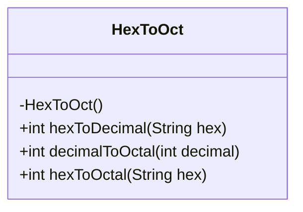
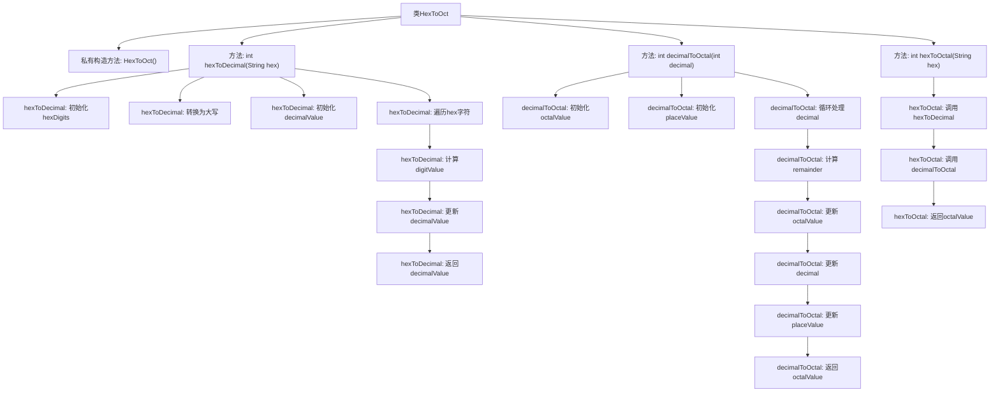

# 基础信息

|      |      |
|------|------|
| 名称 | HexToOct |
| 编码语言 | .java |
| 代码路径 | Java/src/main/java/com/thealgorithms/conversions/HexToOct.java |
| 包名 | com.thealgorithms.conversions |
| 依赖项 | [] |
| 概述说明 | HexToOct类实现十六进制与十进制、八进制之间的转换功能。 |

# 说明

HexToOct类是一个功能模块，提供三种数值转换功能。首先，它可以将十六进制数转换为十进制数，适用于需要将十六进制数据转换为更常见的十进制表示的场景。其次，它支持将十进制数转换为八进制数，方便在需要八进制表示的场景中使用。最后，它还提供了将十六进制数直接转换为八进制数的功能，简化了从十六进制到八进制的转换过程。这些功能可以广泛应用于数据处理、编程和计算等领域，帮助用户高效完成数值转换任务。

# 类列表 Class Summary

| 名称   | 类型  | 说明 |
|-------|------|-------------|
| HexToOct | class | HexToOct类提供十六进制转十进制、十进制转八进制及十六进制转八进制功能。 |

## 类 HexToOct

|      |      |
|------|------|
| 访问范围 | public final |
| 类型 | class |
| 名称 | HexToOct |
| 说明 | HexToOct类提供十六进制转十进制、十进制转八进制及十六进制转八进制功能。 |

### UML类图

**描述：**  
`HexToOct` 是一个工具类，提供了将十六进制数转换为八进制数的功能。该类包含三个静态方法：`hexToDecimal` 将十六进制字符串转换为十进制整数，`decimalToOctal` 将十进制整数转换为八进制整数，`hexToOctal` 则通过调用前两个方法将十六进制字符串直接转换为八进制整数。该类为不可继承类，且构造函数为私有，确保无法实例化。

### 内部方法调用关系图

这段代码定义了一个名为`HexToOct`的类，包含三个静态方法：`hexToDecimal`、`decimalToOctal`和`hexToOctal`。`hexToDecimal`方法将十六进制字符串转换为十进制整数，`decimalToOctal`方法将十进制整数转换为八进制整数，`hexToOctal`方法则通过调用前两个方法将十六进制字符串转换为八进制整数。流程图清晰地展示了各个方法的调用关系和内部处理步骤。

### 字段列表 Field List

| 名称  | 类型  | 说明 |
|-------|-------|------|

### 方法列表 Method List

| 名称  | 类型  | 说明 |
|-------|-------|------|
| hexToDecimal | int | 将十六进制字符串转换为十进制整数。 |
| decimalToOctal | int | 将十进制数转换为八进制数的静态方法。 |
| hexToOctal | int | 将十六进制字符串转换为八进制数。 |

