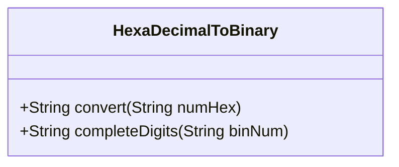
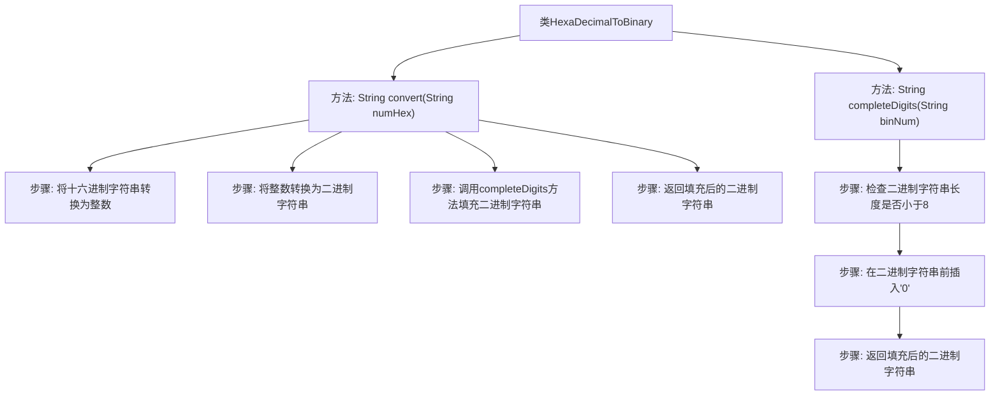

# 基础信息

|      |      |
|------|------|
| 名称 | HexaDecimalToBinary |
| 编码语言 | .java |
| 代码路径 | Java/src/main/java/com/thealgorithms/conversions/HexaDecimalToBinary.java |
| 包名 | com.thealgorithms.conversions |
| 依赖项 | [] |
| 概述说明 | 将十六进制字符串转为至少8位二进制字符串。 |

# 说明

将给定的十六进制字符串转换为至少8位的二进制字符串。转换过程需要确保生成的二进制字符串长度不少于8位，以满足特定需求或格式要求。此操作通常用于数据处理、编码转换或特定算法的实现中，确保二进制表示的完整性和一致性。

# 类列表 Class Summary

| 名称   | 类型  | 说明 |
|-------|------|-------------|
| HexaDecimalToBinary | class | 将十六进制字符串转换为至少8位的二进制字符串。 |

## 类 HexaDecimalToBinary

|      |      |
|------|------|
| 访问范围 | public |
| 类型 | class |
| 名称 | HexaDecimalToBinary |
| 说明 | 将十六进制字符串转换为至少8位的二进制字符串。 |

### UML类图

**描述：**
`HexaDecimalToBinary` 类提供了将十六进制字符串转换为二进制字符串的功能。`convert` 方法首先将输入的十六进制字符串转换为整数，然后将该整数转换为二进制字符串。`completeDigits` 方法确保二进制字符串至少为8位，如果不足则在前补零。该类的主要用途是将十六进制数转换为二进制数，并确保输出格式的完整性。

### 内部方法调用关系图

这段代码定义了一个名为`HexaDecimalToBinary`的类，其中包含两个方法：`convert`和`completeDigits`。`convert`方法将输入的十六进制字符串转换为整数，再将其转换为二进制字符串，最后调用`completeDigits`方法确保二进制字符串至少为8位。`completeDigits`方法通过在前端插入'0'来填充二进制字符串，直到其长度达到8位。流程图展示了这两个方法的调用关系和内部步骤。

### 字段列表 Field List

| 名称  | 类型  | 说明 |
|-------|-------|------|

### 方法列表 Method List

| 名称  | 类型  | 说明 |
|-------|-------|------|
| completeDigits | String | 方法completeDigits将二进制字符串补全至8位，不足时前面补零。 |
| convert | String | 将十六进制字符串转换为二进制字符串并补齐位数。 |

