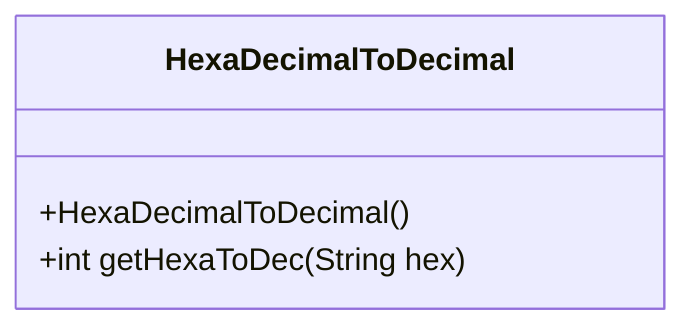
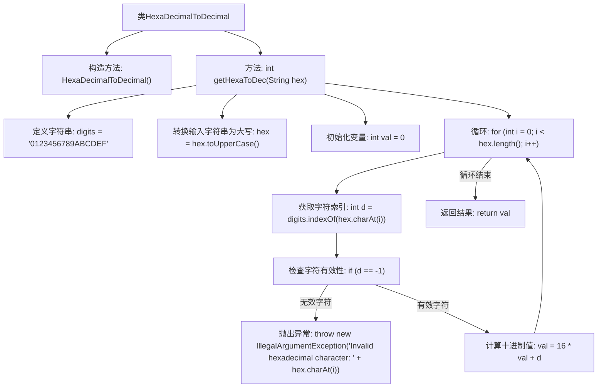

# 基础信息

|      |      |
|------|------|
| 名称 | HexaDecimalToDecimal |
| 编码语言 | .java |
| 代码路径 | Java/src/main/java/com/thealgorithms/conversions/HexaDecimalToDecimal.java |
| 包名 | com.thealgorithms.conversions |
| 依赖项 | [] |
| 概述说明 | 将十六进制字符串转为十进制整数，支持大小写，无效字符抛出异常。 |

# 说明

该功能将十六进制字符串转换为十进制整数，支持处理大写和小写字母。如果输入字符串包含无效字符，系统会抛出异常以确保数据的准确性和安全性。

# 类列表 Class Summary

| 名称   | 类型  | 说明 |
|-------|------|-------------|
| HexaDecimalToDecimal | class | 将十六进制字符串转换为十进制整数，支持大小写，无效字符抛出异常。 |

## 类 HexaDecimalToDecimal

|      |      |
|------|------|
| 访问范围 | public final |
| 类型 | class |
| 名称 | HexaDecimalToDecimal |
| 说明 | 将十六进制字符串转换为十进制整数，支持大小写，无效字符抛出异常。 |

### UML类图

类图描述：`HexaDecimalToDecimal` 是一个工具类，用于将十六进制字符串转换为十进制整数。该类包含一个私有的构造函数，防止实例化，以及一个公有的静态方法 `getHexaToDec`，该方法接受一个十六进制字符串作为输入，并返回其对应的十进制整数。如果输入字符串包含无效字符，该方法会抛出 `IllegalArgumentException` 异常。

### 内部方法调用关系图

这段代码定义了一个名为 `HexaDecimalToDecimal` 的类，其中包含一个静态方法 `getHexaToDec`，用于将十六进制字符串转换为十进制整数。方法首先将输入字符串转换为大写，然后逐个字符检查其有效性，并计算对应的十进制值。如果遇到无效字符，方法会抛出 `IllegalArgumentException` 异常。最终，方法返回计算得到的十进制整数。

### 字段列表 Field List

| 名称  | 类型  | 说明 |
|-------|-------|------|

### 方法列表 Method List

| 名称  | 类型  | 说明 |
|-------|-------|------|
| getHexaToDec | int | 将十六进制字符串转换为十进制整数的静态方法。 |

