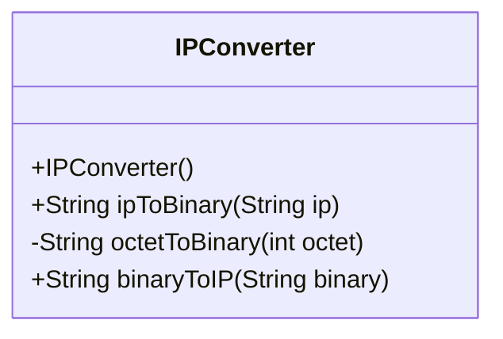
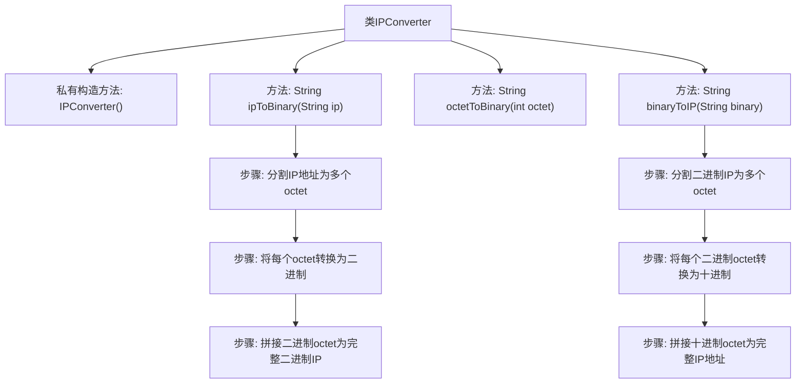

# 基础信息

|      |      |
|------|------|
| 名称 | IPConverter |
| 编码语言 | .java |
| 代码路径 | Java/src/main/java/com/thealgorithms/conversions/IPConverter.java |
| 包名 | com.thealgorithms.conversions |
| 依赖项 | [] |
| 概述说明 | IPConverter类实现IPv4地址与二进制互转。 |

# 说明

IPConverter类实现了IPv4地址与二进制之间的互相转换功能。该类能够将标准的IPv4地址转换为对应的二进制形式，同时也支持将二进制数据转换回IPv4地址。这一功能在网络编程和数据处理中非常有用，特别是在需要处理或分析IP地址的场景中。通过该类，用户可以方便地在两种表示形式之间进行转换，确保数据的准确性和一致性。

# 类列表 Class Summary

| 名称   | 类型  | 说明 |
|-------|------|-------------|
| IPConverter | class | IPConverter类实现IPv4地址与二进制互相转换。 |

## 类 IPConverter

|      |      |
|------|------|
| 访问范围 | public final |
| 类型 | class |
| 名称 | IPConverter |
| 说明 | IPConverter类实现IPv4地址与二进制互相转换。 |

### UML类图

这段代码定义了一个 `IPConverter` 类，用于在IPv4地址和其二进制表示之间进行转换。`IPConverter` 类包含三个方法：`ipToBinary` 用于将IPv4地址转换为二进制字符串，`octetToBinary` 用于将单个八位字节转换为8位二进制字符串，`binaryToIP` 用于将二进制字符串转换回IPv4地址。该类是 `final` 的，并且构造函数是私有的，表明该类不能被继承或实例化，主要用于提供静态工具方法。

### 内部方法调用关系图

这段代码定义了一个`IPConverter`类，用于在IPv4地址和其二进制表示之间进行转换。`ipToBinary`方法将IPv4地址转换为二进制表示，`binaryToIP`方法则将二进制表示转换回IPv4地址。`octetToBinary`是一个辅助方法，用于将单个八位字节（octet）转换为8位二进制字符串。流程图展示了从输入到输出的完整转换过程，包括分割、转换和拼接步骤。

### 字段列表 Field List

| 名称  | 类型  | 说明 |
|-------|-------|------|

### 方法列表 Method List

| 名称  | 类型  | 说明 |
|-------|-------|------|
| ipToBinary | String | 将IP地址转换为二进制字符串，去掉末尾点号。 |
| binaryToIP | String | 将二进制字符串转换为点分十进制IP地址。 |
| octetToBinary | String | 将整数转换为8位二进制字符串。 |

