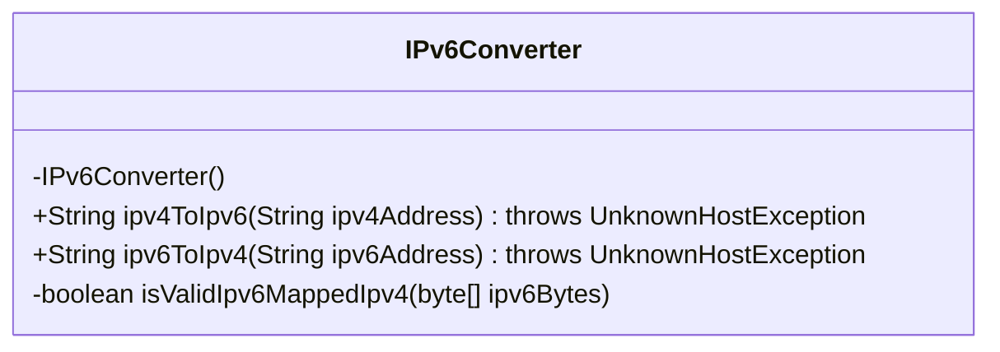
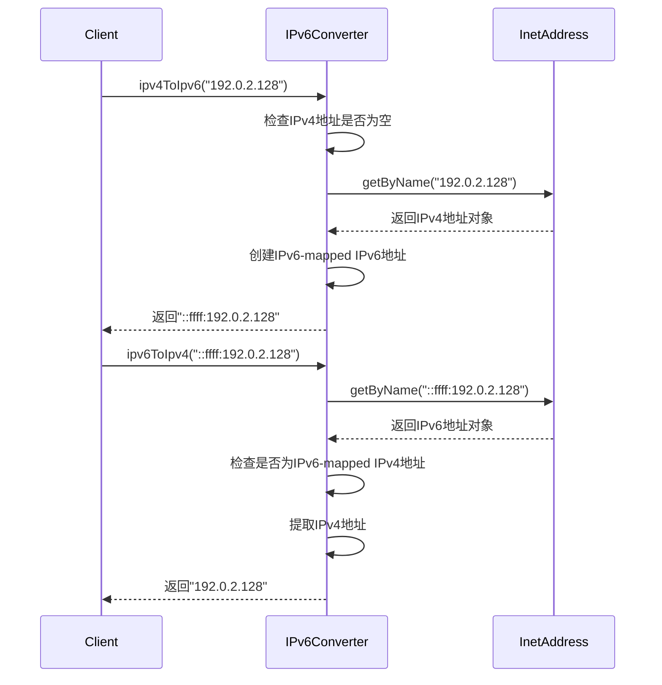
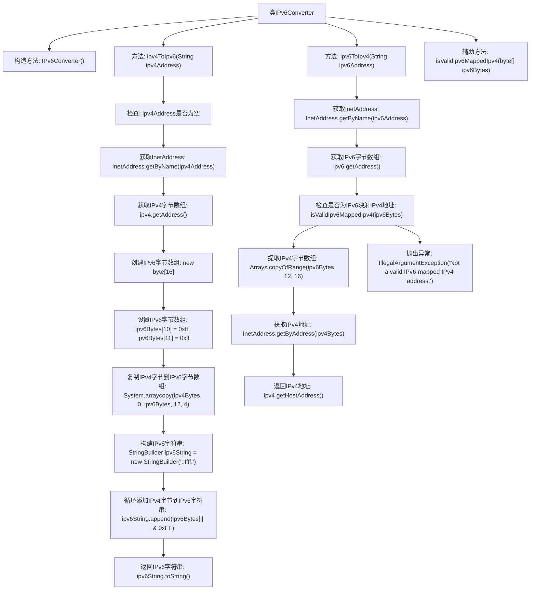

# 基础信息

|      |      |
|------|------|
| 名称 | IPv6Converter |
| 编码语言 | .java |
| 代码路径 | Java/src/main/java/com/thealgorithms/conversions/IPv6Converter.java |
| 包名 | com.thealgorithms.conversions |
| 依赖项 | ['java.net.InetAddress', 'java.net.UnknownHostException', 'java.util.Arrays'] |
| 概述说明 | IPv6Converter类提供IPv4与IPv6地址双向转换功能。 |

# 说明

IPv6Converter类的主要功能是实现IPv4与IPv6地址之间的相互转换。该类提供了一种机制，能够将传统的IPv4地址转换为IPv6格式，同时也能将IPv6地址还原为IPv4格式。这种转换在网络协议兼容性和地址扩展性方面具有重要意义，特别是在IPv6逐渐普及的背景下，确保不同网络协议之间的互操作性。通过该类，用户可以方便地在两种地址格式之间进行切换，从而满足不同应用场景的需求。

# 类列表 Class Summary

| 名称   | 类型  | 说明 |
|-------|------|-------------|
| IPv6Converter | class | IPv6Converter类实现IPv4与IPv6地址相互转换功能。 |

## 类 IPv6Converter

|      |      |
|------|------|
| 访问范围 | public final |
| 类型 | class |
| 名称 | IPv6Converter |
| 说明 | IPv6Converter类实现IPv4与IPv6地址相互转换功能。 |

### UML类图

这段代码定义了一个`IPv6Converter`类，提供了将IPv4地址转换为IPv6-mapped IPv6地址以及从IPv6-mapped IPv6地址中提取IPv4地址的功能。类中包含两个公有方法`ipv4ToIpv6`和`ipv6ToIpv4`，分别用于执行这两种转换。此外，类中还有一个私有方法`isValidIpv6MappedIpv4`，用于检查给定的IPv6地址是否为IPv6-mapped IPv4地址。代码通过`InetAddress`类来处理IP地址的解析和转换，确保地址的有效性。

### 内部方法调用关系图

**描述：**  
该流程图展示了`IPv6Converter`类的主要功能，包括将IPv4地址转换为IPv6映射的IPv6地址，以及从IPv6映射的IPv6地址中提取IPv4地址。流程从检查输入地址的有效性开始，逐步进行地址转换和提取，最终返回转换后的地址或抛出异常。辅助方法`isValidIpv6MappedIpv4`用于验证IPv6地址是否为IPv6映射的IPv4地址。

### 字段列表 Field List

| 名称  | 类型  | 说明 |
|-------|-------|------|

### 方法列表 Method List

| 名称  | 类型  | 说明 |
|-------|-------|------|
| ipv4ToIpv6 | String | 将IPv4地址转换为IPv6格式，生成::ffff:x.x.x.x形式。 |
| isValidIpv6MappedIpv4 | boolean | 验证IPv6映射IPv4地址的格式正确性。 |
| ipv6ToIpv4 | String | 将IPv6映射的IPv4地址转换为IPv4地址，否则抛出异常。 |

