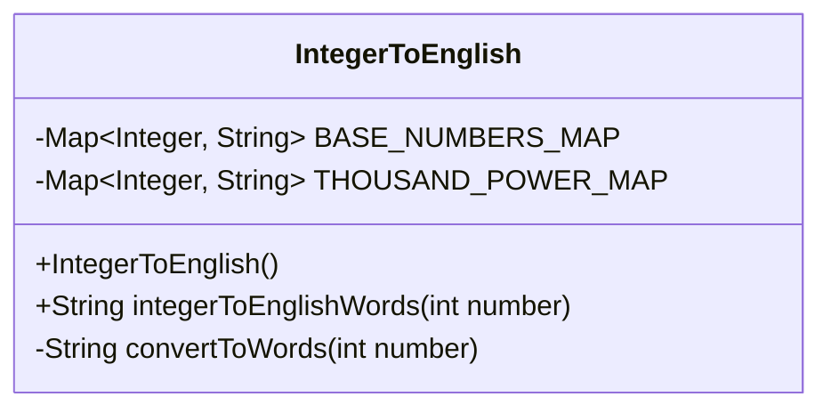
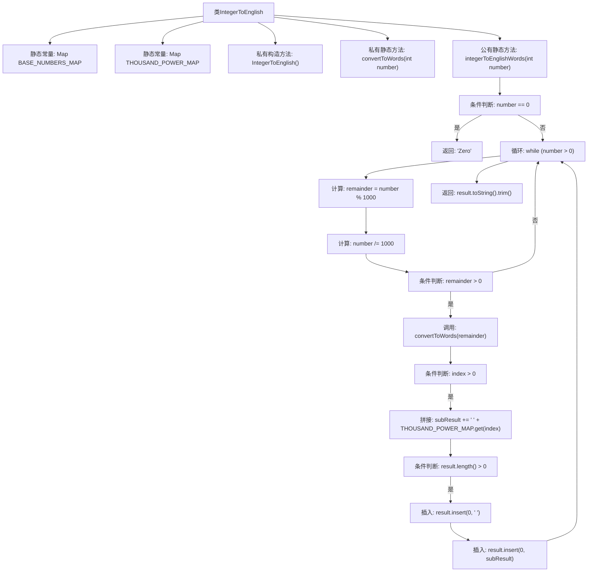

# 基础信息

|      |      |
|------|------|
| 名称 | IntegerToEnglish |
| 编码语言 | .java |
| 代码路径 | Java/src/main/java/com/thealgorithms/conversions/IntegerToEnglish.java |
| 包名 | com.thealgorithms.conversions |
| 依赖项 | ['java.util.Map'] |
| 概述说明 | Java工具类用于将整数转换为英文单词。 |

# 说明

该Java工具类旨在将整数转换为对应的英文单词表示。它通过处理不同位数的数字，将整数分解为个位、十位、百位等部分，并分别映射到相应的英文单词。工具类支持处理较大范围的整数，并能正确生成包含连字符和“and”等语法规则的英文表达。该工具类适用于需要将数字以英文单词形式输出的场景，如生成财务报告或处理国际化文本。

# 类列表 Class Summary

| 名称   | 类型  | 说明 |
|-------|------|-------------|
| IntegerToEnglish | class | 将整数转换为英文单词的Java工具类。 |

## 类 IntegerToEnglish

|      |      |
|------|------|
| 访问范围 | public final |
| 类型 | class |
| 名称 | IntegerToEnglish |
| 说明 | 将整数转换为英文单词的Java工具类。 |

### UML类图

**描述：**  
`IntegerToEnglish` 类用于将整数转换为英文单词表示。它包含两个私有静态映射 `BASE_NUMBERS_MAP` 和 `THOUSAND_POWER_MAP`，分别存储基础数字和千位单位的英文单词。类中的 `convertToWords` 方法负责将小于1000的数字转换为英文单词，而 `integerToEnglishWords` 方法则处理更大的数字，通过递归调用 `convertToWords` 并添加适当的千位单位来生成完整的英文单词表示。

### 内部方法调用关系图

**描述：**  
这段代码定义了一个`IntegerToEnglish`类，用于将整数转换为英文单词表示。类中包含两个静态常量映射表`BASE_NUMBERS_MAP`和`THOUSAND_POWER_MAP`，分别存储基础数字和千位单位的英文单词。`convertToWords`方法将小于1000的数字转换为英文单词，而`integerToEnglishWords`方法则通过循环处理更大范围的数字，并调用`convertToWords`方法进行转换，最终返回完整的英文单词表示。

### 字段列表 Field List

| 名称  | 类型  | 说明 |
|-------|-------|------|
| THOUSAND_POWER_MAP = Map.ofEntries(Map.entry(1, "Thousand"), Map.entry(2, "Million"), Map.entry(3, "Billion")) | Map<Integer, String> | 定义映射整数对应千、百万、十亿的字符串。 |
| BASE_NUMBERS_MAP = Map.ofEntries(Map.entry(0, ""), Map.entry(1, "One"), Map.entry(2, "Two"), Map.entry(3, "Three"), Map.entry(4, "Four"), Map.entry(5, "Five"), Map.entry(6, "Six"), Map.entry(7, "Seven"), Map.entry(8, "Eight"), Map.entry(9, "Nine"),        Map.entry(10, "Ten"), Map.entry(11, "Eleven"), Map.entry(12, "Twelve"), Map.entry(13, "Thirteen"), Map.entry(14, "Fourteen"), Map.entry(15, "Fifteen"), Map.entry(16, "Sixteen"), Map.entry(17, "Seventeen"), Map.entry(18, "Eighteen"), Map.entry(19, "Nineteen"), Map.entry(20, "Twenty"),        Map.entry(30, "Thirty"), Map.entry(40, "Forty"), Map.entry(50, "Fifty"), Map.entry(60, "Sixty"), Map.entry(70, "Seventy"), Map.entry(80, "Eighty"), Map.entry(90, "Ninety"), Map.entry(100, "Hundred")) | Map<Integer, String> | 定义数字与英文单词的映射表，包含0到100的整十数。 |

### 方法列表 Method List

| 名称  | 类型  | 说明 |
|-------|-------|------|
| integerToEnglishWords | String | 将整数转换为英文单词的Java方法。 |
| convertToWords | String | 将数字转换为英文单词的Java方法，处理个位、十位和百位。 |

