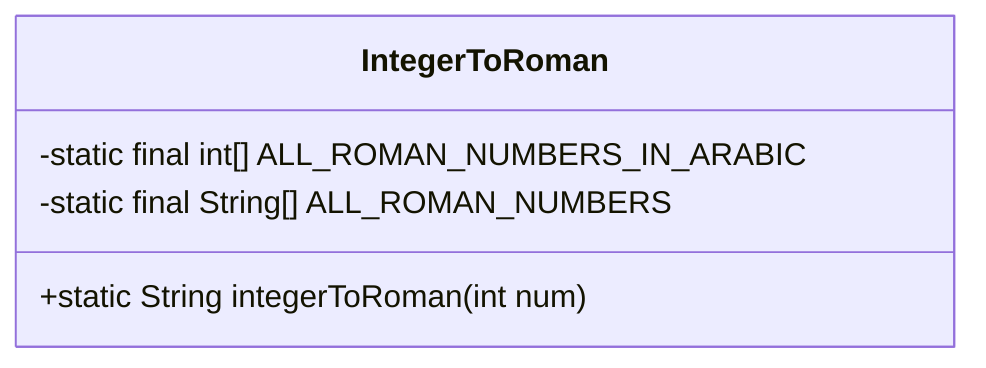
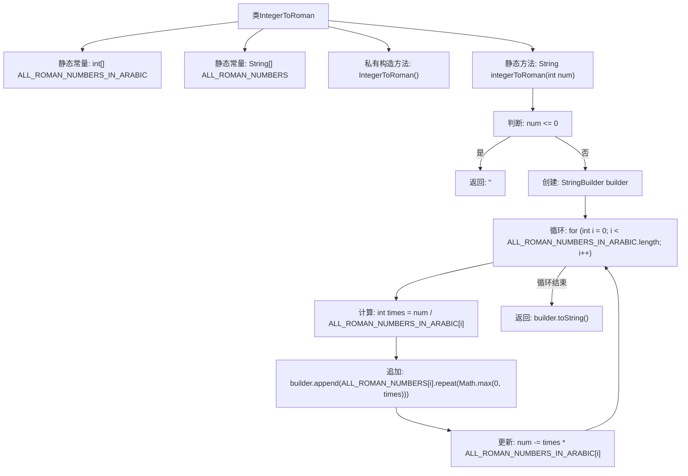

# 基础信息

|      |      |
|------|------|
| 名称 | IntegerToRoman |
| 编码语言 | .java |
| 代码路径 | Java/src/main/java/com/thealgorithms/conversions/IntegerToRoman.java |
| 包名 | com.thealgorithms.conversions |
| 依赖项 | [] |
| 概述说明 | 整数转罗马数字工具类，通过数组映射和循环实现转换。 |

# 说明

该工具类用于将整数转换为罗马数字，采用数组映射和循环的方式实现转换功能。通过预定义的数组存储罗马数字与整数的对应关系，利用循环遍历数组，逐步将整数转换为相应的罗马数字表示。该方法确保了转换过程的简洁性和高效性，适用于各种整数到罗马数字的转换需求。

# 类列表 Class Summary

| 名称   | 类型  | 说明 |
|-------|------|-------------|
| IntegerToRoman | class | 整数转罗马数字工具类，使用数组映射和循环实现转换。 |

## 类 IntegerToRoman

|      |      |
|------|------|
| 访问范围 | public final |
| 类型 | class |
| 名称 | IntegerToRoman |
| 说明 | 整数转罗马数字工具类，使用数组映射和循环实现转换。 |

### UML类图

**描述：**  
`IntegerToRoman` 类是一个工具类，用于将整数转换为罗马数字表示。它包含两个静态数组：`ALL_ROMAN_NUMBERS_IN_ARABIC` 和 `ALL_ROMAN_NUMBERS`，分别存储罗马数字对应的阿拉伯数值和符号。`integerToRoman` 方法通过迭代这些数组，将输入的整数逐步转换为罗马数字，并返回结果。如果输入的数字小于或等于0，则返回空字符串。该类是 `final` 的，表示不可继承，且构造函数为私有，确保不能实例化。

### 内部方法调用关系图

该流程图描述了`IntegerToRoman`类的结构及其核心方法`integerToRoman`的执行流程。首先，类中定义了两个静态常量数组，分别存储罗马数字对应的阿拉伯数值和符号。`integerToRoman`方法首先检查输入是否为正数，若非正数则返回空字符串。否则，通过循环遍历罗马数字数组，计算每个罗马数字符号在输入数值中出现的次数，并将其追加到结果字符串中，最后返回生成的罗马数字字符串。

### 字段列表 Field List

| 名称  | 类型  | 说明 |
|-------|-------|------|
| ALL_ROMAN_NUMBERS_IN_ARABIC = {1000, 900, 500, 400, 100, 90, 50, 40, 10, 9, 5, 4, 1} | int[] | 定义罗马数字对应的阿拉伯数字常量数组。 |
| ALL_ROMAN_NUMBERS = {"M", "CM", "D", "CD", "C", "XC", "L", "XL", "X", "IX", "V", "IV", "I"} | String[] | 定义罗马数字常量数组。 |

### 方法列表 Method List

| 名称  | 类型  | 说明 |
|-------|-------|------|
| integerToRoman | String | 将整数转换为罗马数字的静态方法。 |

